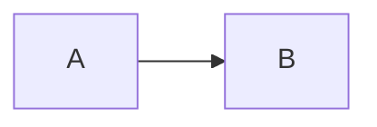

<!-- generated from articles/dev/2026-07-23-astro-bilingual-blog-implementation.md by scripts/import-articles.ts - do not edit -->

Greetings from the island nation of Japan.

There is a peculiar kind of hubris in deciding to build your own blog from scratch in 2026, when perfectly serviceable platforms exist for precisely this purpose. It's the digital equivalent of insisting on hand-grinding your coffee beans while the office Nespresso machine sits there, judging you silently. Yet here I am, having built a fully static, bilingual, zero-JS personal site with Astro, and I find myself oddly pleased with the result (the site, not the mass of config files haunting my dreams). This article documents the patterns that survived contact with reality, so you can skip the part where you stare at a blank terminal wondering why your OGP images are rendering in hieroglyphics.

## Introduction

As a prelude, I wrote about [why I chose Astro + GitHub Pages](https://akari-iku.github.io/en/blog/why-i-chose-astro-and-github-pages/). The thinking behind choosing a stack for a personal site, including comparisons with Cloudflare Pages and the PSL cold-start story.

This is the follow-up: the **implementation edition**.

### What Is Astro?

**[Astro](https://astro.build/)** is a static site generator designed for content-driven websites. It converts Markdown into HTML, same as Hugo or Jekyll.
The difference is its design philosophy: **zero client-side JavaScript by default**.

At the core of this design is the **island architecture**.
Pages are output as static HTML, and only the parts that need interactivity are embedded as React or Vue "islands".
If you don't add islands, you get pure static HTML.
TypeScript-first, with powerful build-time data fetching and content type validation.
Blogs, documentation sites, and portfolios are its sweet spot.

Its v1.0 was released in August 2022.
As a latecomer to the static site generator space, Astro neatly sidestepped the mines that Hugo (2013) and Gatsby (2015) stepped on.
Where Gatsby made GraphQL mandatory and raised the barrier to entry, Astro lets you use plain `fetch` or file reads. Where Hugo confined you to its template language, Astro lets you write ordinary TypeScript inside `.astro` files.

It also plays well with AI-assisted coding.
An `.astro` file packs frontmatter (logic), template (HTML), and styles into a single-purpose component, so **the context you hand to a coding agent is small**.
Most components on my site are around 100 lines, and "change this file like so" just works.

### What This Article Covers

I built a Japanese-English bilingual tech blog + personal site.
Fully static, near-zero runtime JS.

I've distilled the implementation into 5 patterns that I think are broadly reusable. Hopefully useful if you're evaluating Astro as a candidate for your next project.

## 1. Content Collections Schema Design

Astro's Content Collections let you **attach a Zod schema to Markdown frontmatter**. This is incredibly effective when developing TypeScript-first. A real help.

```ts
// src/content.config.ts
import { defineCollection, z } from 'astro:content';
import { glob } from 'astro/loaders';

const blog = defineCollection({
  loader: glob({ pattern: '**/*.md', base: './src/content/blog' }),
  schema: z.object({
    title: z.string(),
    description: z.string(),
    date: z.coerce.date(),
    tags: z.array(z.string()),
    lang: z.enum(['ja', 'en']),
    pair: z.string().optional(),
    source: z.enum(['zenn', 'dev', 'original']),
    accent: z.string().default('#E5007F'),
  }),
});
```

A few key points.

**`lang` as an `enum`**.
Split Japanese and English into directories (`blog/ja/`, `blog/en/`) and also declare the language in the schema. On the page side, `getCollection('blog', p => p.data.lang === 'ja')` gives you a language-filtered list. No i18n library (translation management framework) needed.

**`pair` to link translations**.
Just store the partner article's slug. At build time, show an EN badge if `pair` exists, hide it otherwise. Making it nullable is crucial. If you assume every article has a pair, the workflow breaks down fast.
I have strong opinions about translation quality, so I'm not keen on automatic or machine translation. The EN versions get quite a bit of manual reworking. (I turned off [Zenn's auto-translation feature](https://akari-iku.github.io/en/blog/zenn-auto-translation/) immediately.)

**`date` with `z.coerce.date()`**.
Automatically converts the frontmatter string `'2026-07-23'` into a Date object. Small thing, but saves you from writing `new Date()` everywhere.

**`accent` for category colour**.
An accent colour determined by the article's tags is baked into the frontmatter (auto-assigned by the import script, covered later). The page just passes this value straight to `style`.

If any Markdown doesn't match the schema, **the build fails**. This is a good thing. When I bulk-imported 44 articles, every frontmatter issue surfaced as a compile error. No need to visually inspect each one.

## 2. Article Conversion Pipeline

When migrating existing articles from platforms like Zenn or Dev.to, you need a step to **convert platform-specific syntax**. The same applies when migrating from Hatena Blog, Medium, WordPress, or any other platform.

On my site, a TypeScript import script (`scripts/import-articles.ts`) handles this. It never modifies the source files; it only outputs converted results to `src/content/blog/`.

### Conversion Catalogue

Here's what needs converting.

**Zenn (Japanese articles)**:

| Syntax | Converts to |
| ---- | ---- |
| `:::message` / `:::message alert` | `<aside class="callout">` |
| `:::details title` | `<details><summary>` |
| `@[card](URL)` / bare URL auto-cards | Link card (HTML) |
| `@[tweet](URL)` | Static tweet quote or link |
| ` ```js:filename.js ` (with filename) | Bold filename prefix + code block |
| ` ```diff js ` | Normalised to `diff` only |

**Dev.to (English articles)**:

| Syntax | Converts to |
| ---- | ---- |
| `[URL](URL)` and other Liquid Tags | Markdown links |
| `...` | `<details><summary>` |
| `` | `$$` block |
| Manual Table of Contents + `<a name>` anchors | Detected and removed |

I've only listed Zenn and Dev.to here, but Hatena Blog (`[~~]` notation, `[:contents]` auto-ToC), Medium (exports as HTML), WordPress (shortcodes), and others all follow the same structure with different conversion targets.

Mermaid support, table syntax differences, maths notation: "what's proprietary and what's standard Markdown" varies quite a bit between platforms. Checking the source site's syntax documentation before migration helps prevent display breakage from missed conversions.

### Implementation Tips

Line-by-line stream processing makes things clear.

```ts
function convertBody(body: string): string {
  const out: string[] = [];
  let inCode = false;

  for (const line of body.split('\n')) {
    // Skip conversion inside code blocks
    if (/^```/.test(line)) {
      inCode = !inCode;
      out.push(line);
      continue;
    }
    if (inCode) {
      out.push(line);
      continue;
    }
    // Apply platform-specific conversions
    out.push(convertLine(line));
  }
  return out.join('\n');
}
```

**Skipping code block interiors** is the single most important thing. Forget this, and you'll convert `:::` or `` inside sample code.

**Link cards** detect standalone-line links and convert them to HTML. At build time, `og:title` and `og:image` are fetched and cached in JSON; subsequent runs only fetch new URLs.

For X status links, the syndication API provides the tweet text, which gets rendered as a **static quote card**. Zero client-side JS for tweet-embed-equivalent functionality. It's the same endpoint that react-tweet uses internally.

### site-only / devto-only Markers

To serve different versions from the same source, I use HTML comment markers.

````markdown
<!-- site-only -->

<!-- /site-only -->

<!-- devto-only -->
(Text explanation for platforms that don't render Mermaid)
A → B relationship.
<!-- /devto-only -->
````

The import script strips blocks for the other target and removes the markers themselves. Zenn ignores HTML comments (they pass through on the platform side), so markers left in the Japanese source don't affect display.

## 3. Build-Time OGP Image Generation

I generate OGP images (1200x630) at build time using **[satori](https://github.com/vercel/satori) + [@resvg/resvg-js](https://github.com/nicolo-ribaudo/resvg-js)**.

satori converts React-like JSX to SVG, and it **requires font binaries**. This is where things get tricky with glyph-heavy fonts.

### The Font Size Trap

Noto Sans JP's full set is roughly 5MB. This isn't a Japanese-only problem: any CJK font or glyph-heavy typeface hits the same issue. With 50 articles, that's 50 × 5MB of processing. The build dies.

More builds running means more tokens burning, if you're using AI-assisted coding. A relevant concern these days.

The solution: **Google Fonts' subsetting feature**.
Thank you Google.

```ts
// Specify a legacy UA to get woff/TTF (satori can't parse woff2)
const LEGACY_UA = 'Mozilla/5.0 (Windows NT 6.1; rv:10.0) Gecko/20100101 Firefox/10.0';

async function fetchGoogleFont(spec: string, text: string): Promise<ArrayBuffer[]> {
  const chars = [...new Set(text)];
  // &text= parameter fetches a subset containing only the needed glyphs
  const cssUrl = `https://fonts.googleapis.com/css2?family=${spec}&text=${encodeURIComponent(chars.join(''))}`;
  const css = await (await fetch(cssUrl, { headers: { 'User-Agent': LEGACY_UA } })).text();
  const url = css.match(/src:\s*url\((.+?)\)\s*format\('(?:woff|opentype|truetype)'\)/)?.[1];
  return (await fetch(url)).arrayBuffer();
}
```

**Concatenate all article titles and fetch a subset font containing only the characters that appear, once**. This brings it down to tens of KB. Faster builds, no garbled text.

Another trap: satori **cannot parse woff2**. Google Fonts returns woff2 to modern browsers, so you need to spoof the User-Agent as an old browser to get woff/TTF. If you don't know this, you'll hit "I'm passing a font but nothing renders" and waste hours debugging.

### Serving via Astro Endpoints

OGP images are implemented as Astro static endpoints (`.png.ts`).

```ts
// src/pages/og/blog/[slug].png.ts
export async function getStaticPaths() {
  // Generate paths from article list
}

export async function GET({ props }) {
  const png = await renderOgImage({ /* ... */ });
  return new Response(png, { headers: { 'Content-Type': 'image/png' } });
}
```

At build time, PNGs for every article are written to `dist/og/blog/slug.png`. Works as-is on GitHub Pages, Cloudflare Pages, Netlify, or any static hosting.

## 4. Dark Mode via Tailwind Token Redefinition

Whether to implement dark mode is a matter of preference, at least domestically in Japan. Personally I add it by reflex, but following OS settings, toggle-based switching, or simply not supporting it are all valid choices. This section is about **how to implement it once you've decided to**.

My first idea was adding `dark:` prefixes to every element. I gave up. Too tedious.

Instead, I adopted **wholesale redefinition of Tailwind colour tokens**.

```css
/* Light mode: use defaults as-is */

/* Dark mode: remap tokens */
html[data-theme="dark"] {
  color-scheme: dark;
  --color-white: #010101;
  --color-neutral-200: #262626;
  --color-neutral-300: #404040;
  --color-neutral-400: #525252;
  --color-neutral-600: #a3a3a3;
  --color-neutral-700: #d4d4d4;
  --color-neutral-900: #ededed;
}
```

Write `bg-white`, and it's white in light mode, black in dark mode. **Dark mode is complete without changing a single existing class**.

However, some elements need to **stay fixed regardless of theme** (fullscreen menu, article heroes, footer, etc.). These get a `.theme-fixed` class that restores the original tokens.

```css
html[data-theme="dark"] .theme-fixed {
  color-scheme: light;
  --color-white: #ffffff;
  --color-neutral-200: #e5e5e5;
  /* ... restore original values */
}
```

The design rule: **accent colours don't change with the theme**. Only black and white invert; accent colours stay as they are. With a monochrome + accent colour design, this fits naturally.

### Preventing White Flash

The problem where dark mode users see a white flash when a page loads. Place an inline script in `<head>` to apply the theme before rendering.

```html
<script is:inline>
  try {
    if (localStorage.getItem('theme') === 'dark')
      document.documentElement.dataset.theme = 'dark';
  } catch {}
</script>
```

`is:inline` excludes it from Astro's bundling. Without this, the script won't execute in time.
A funny phenomenon where being too fast is what makes it too late.

### The Contrast Ratio Pitfall

Don't assume you're safe just because you inverted the tokens. **In dark mode, colours that passed WCAG AA contrast ratios (4.5:1 for normal text, 3:1 for large text) can fall below the threshold**.

On my site, `neutral-500` (`#737373`) was fine in light mode but only had a 4.40:1 ratio against the dark mode background (`#010101`), failing the AA standard.
Adjusted to `#7a7a7a` for 4.86:1. A tiny numerical difference, but you can't catch it without tools.
And honestly, AI-generated code tends to miss this perspective entirely. Had to catch it myself. A classic blind spot when you're doing AI-assisted coding.

Token redefinition is convenient, but **you need to re-verify contrast ratios for all combinations after inversion**. Frankly, plenty of sites ignore this entirely, but if you're going to do it, do it properly. Use Chrome DevTools' accessibility panel or [WebAIM Contrast Checker](https://webaim.org/resources/contrastchecker/).

### Accessibility Standards and the Temperature Gap Between Countries

This isn't specific to dark mode, but the legal treatment of web accessibility varies significantly by country.

- **EU**: The European Accessibility Act (EAA) took effect in June 2025. WCAG 2.1 AA compliance is now mandatory for commercial sites and apps
- **US**: Court precedents applying the ADA (Americans with Disabilities Act) to websites have been piling up. Litigation risk is real
- **Japan**: JIS X 8341-3 (WCAG-based) exists, but it's only a non-binding effort for public institutions. Legal force on the private sector is weak

Whether legal risk applies to a personal site or one primarily targeting a Japanese audience is a separate question, but **if you're publishing content for an English-speaking audience, it's better to treat this as a "standard" rather than a "nice-to-have"**. I developed the habit of caring about this because I was publishing in both Japanese and English, but anyone building a site with English articles should keep it in mind.

References:

- [WCAG 2.2 — Success Criterion 1.4.3 (Contrast)](https://www.w3.org/WAI/WCAG22/Understanding/contrast-minimum.html)
- [European Accessibility Act (EAA)](https://ec.europa.eu/social/main.jsp?catId=1202)
- [Tailwind CSS — Dark Mode](https://tailwindcss.com/docs/dark-mode)

## 5. Island Architecture and Zero-JS Patterns

Astro's "island architecture" keeps most of the page as static HTML, with only interactive parts becoming React or Vue "islands".
I'd heard the concept before, but actually implementing it, I found it **good as a philosophy** and **good as code**.

As a philosophy, I like that it's an **additive design**. SPA frameworks start with everything in JS and then optimise away the static parts (subtraction). Astro starts with everything static and you add JS only where needed (addition). The default is on the lightweight side, so if you do nothing, nothing breaks.

As code, it was interesting that **most islands turned out to be unnecessary**. I'd originally planned React islands for text animations, but the menu, dark mode toggle, copy button: all done with vanilla JS. Mermaid was handled with dynamic import. The moment you're forced to decide "should this be an island?", you reconsider whether JS is truly needed. Result: my site has zero React dependencies.

This is a performance story, but it's also a **maintainability story**.
If there's no client-side JS, there's no state management needed, no hydration mismatches.
The parts that can break physically don't exist.

So how do you handle interactivity? Here are a few patterns where vanilla JS was more than enough.

### Fullscreen Menu: Trapping Focus with inert

Building a focus trap in JS is tedious, but the `inert` attribute handles it in one go.

```js
const setOpen = (open) => {
  menu.classList.toggle('hidden', !open);
  // Make everything except the menu inert
  for (const el of document.body.children) {
    if (el !== menu) el.toggleAttribute('inert', open);
  }
  if (open) closeBtn.focus();
};
```

Elements with `inert` are completely skipped by Tab navigation and screen readers. You can build an accessible modal without `<dialog>`.

### Mermaid: Lazy Loading

Mermaid.js has a large bundle size (600KB+). Loading it on every page is out of the question.
Painful on multiple levels.

```js
// Only when a mermaid block exists in the article,
// use IntersectionObserver to dynamically import from CDN
// when the diagram approaches the viewport
const io = new IntersectionObserver((entries) => {
  if (entries.some((e) => e.isIntersecting)) {
    io.disconnect();
    const { default: mermaid } = await import(
      'https://cdn.jsdelivr.net/npm/mermaid@11/dist/mermaid.esm.min.mjs'
    );
    mermaid.initialize({ startOnLoad: false, theme: 'neutral' });
    // Replace pre[data-language="mermaid"] with <div class="mermaid"> and run
    await mermaid.run();
  }
}, { rootMargin: '400px' });
```

Articles without Mermaid load zero scripts. Even articles with Mermaid delay loading until a diagram is 400px from the viewport.

### Fonts: Async Loading

Loading Google Fonts CSS synchronously blocks rendering.

```html
<!-- Load as print media, switch to all on completion -->
<link rel="stylesheet" href={fontsHref} media="print" onload="this.media='all'" />
<noscript>
  <link rel="stylesheet" href={fontsHref} />
</noscript>
```

The `media="print"` + `onload` trick. Browsers don't render-block print CSS, so the font loads asynchronously. `<noscript>` is the fallback for JS-disabled environments.

## Wrapping Up

Zenn is fine. Dev.to is fine. There's no shortage of blogging platforms and tech writing services out there, and there never has been.
But sometimes the product changes out from under you, the features shift, the rules shift, and you get tired of being at someone else's mercy.
Having your own little playground, a space you control, is worth something. Especially now, when AI-assisted tooling makes spinning up a site genuinely trivial.
So this isn't a "everyone should go back to personal sites" manifesto. More like: having a playground of your own turns out to be useful sometimes.
Particularly when you want to understand architecture or design philosophies, there's no substitute for actually building something with them.

Looking back at the five patterns, the common thread is "**if you can do it at build time, do it at build time**".

OGP images, link cards, tweet quotes: generate them at build time and you don't need client-side JS. Dark mode is just CSS custom property redefinition. Massive libraries like Mermaid are loaded only on the pages that need them, at the moment they're needed.

Astro's "zero JS by default" isn't a constraint, it's a design compass. Follow it, and your site naturally ends up lightweight.

I wrote about the technology selection process in [my previous article](https://akari-iku.github.io/en/blog/why-i-chose-astro-and-github-pages/), if you're interested.

All source code is published on [GitHub](https://github.com/akari-iku/akari-iku.github.io/blob/main/README.en.md).
