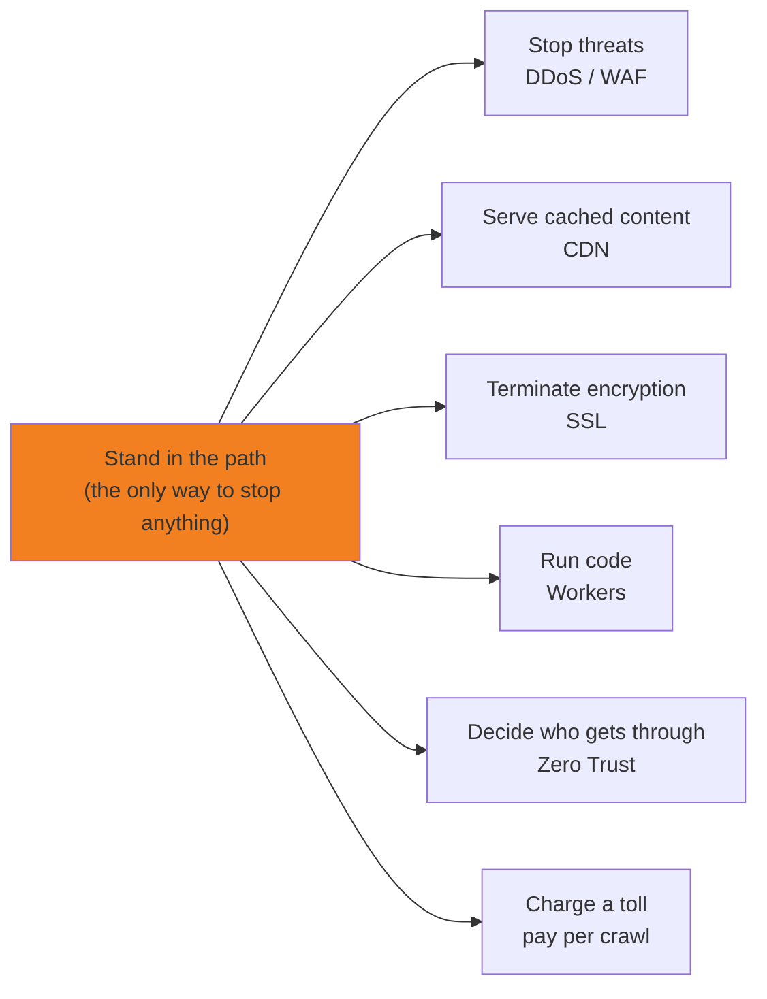

<!-- generated from articles/source/en/2026-08-10-cloudflare-design-philosophy.md by scripts/import-articles.ts - do not edit -->

There is an old understanding in this country, as old as the toll gates on our medieval highways: one need not make anything at all, provided one stands where everyone else must walk. Not a glamorous line of business; it has, however, never once failed. Cloudflare, I suspect, has spent sixteen years on this observation: **stand where the traffic must pass, and everything else follows**. This is my fourth article about a single company, which I am told is a lot. By the end, a dashboard of a thousand settings should feel less like a fortress and more like a toll road with one rule. Quite.

## Introduction

I've written three pieces about Cloudflare OS: a write-up of my struggle to get a local LLM through five rounds of tic-tac-toe, a look at how to design hand-offs between models, and a discussion of security and governance.

<a class="link-card" href="https://akari-iku.github.io/en/blog/cloudflare-os-local-llm-five-rounds/" target="_blank" rel="noopener">

akari-iku.github.io
Running Cloudflare OS on a Local LLM, and Why One Tic-Tac-Toe Took Five Rounds | akari.log

</a>

<a class="link-card" href="https://akari-iku.github.io/en/blog/multi-model-handoff/" target="_blank" rel="noopener">

akari-iku.github.io
Developing with Multiple Models? Make Sure You Design the Handoff | akari.log

</a>

<a class="link-card" href="https://akari-iku.github.io/en/blog/cloudflare-os-security-design/" target="_blank" rel="noopener">

akari-iku.github.io
Cloudflare OS Lets an AI Agent Run Wild Without Letting It Leak | akari.log

</a>

In the third piece, I wrote: "Once you've got the philosophy, this environment isn't frightening."

But what exactly is that philosophy?

I wrote that myself and then never actually explained it. Bit unfair, really.
Sorry about that. I'll explain it properly this time. Thanks for bearing with me.
So here we are with the fourth piece. Four articles about a single product. I'm completely down the rabbit hole now.
This really is the last one.

This time, though, this isn't an article about Cloudflare OS. It's about **Cloudflare's design philosophy as a company**. The more I read about Cloudflare OS and worked with it, the more I started to think: "Hang on, isn't this exactly what the company has been doing for the past 16 years?"

This isn't a guide to operating the product. It's about **making that initial sense of intimidation and reluctance, when you first approach Cloudflare's products, just a little less daunting**. Before you even open the dashboard, all you need is a single principle to use as a guide. It makes a surprisingly big difference. Probably.

Let's start with the conclusion.

> **Cloudflare does just one thing: it stands in the path of traffic and handles everything there.**

That's it. CDN, DNS, WAF, Workers, Zero Trust, charging AI crawlers, Cloudflare OS: they can all be derived from this single idea.

And this isn't just some hallucination of mine or a peculiar interpretation. I looked into it, and the official sources say it all themselves. So let's follow the primary sources and see for ourselves.

## The Company's Name Tells You Everything

It all began in 2004, before Cloudflare was even called Cloudflare. Matthew Prince and Lee Holloway launched a project called **Project Honey Pot**.

The question was simple: "Where does email spam come from?" The project gave website operators a way to **track** how spammers collected email addresses. It grew to the point where thousands of websites across 185 countries were taking part.

Before long, users kept coming back with the same request:

> Forget the tracking. **Make it stop.**

That was the turning point. You can track something by observing it from the outside. But to **stop it, you have to stand in its path**. The moment they tried to respond to that request, there was only one architectural choice: get in the middle.

In 2009, Matthew met Michelle Zatlyn at Harvard Business School and told her about the project. Michelle immediately said they should move into the business of stopping threats, and the two began writing a business plan. They won HBS's business plan competition in April that year and incorporated the company in July.
Too fast. Idea to incorporated company in three months is just too fast.

Then there was the name. The first business plan was called "Project Web Wall", but it did not exactly roll off the tongue. A friend suggested, "You're building a **firewall in the cloud**, so why not call it Cloudflare?", and the name stuck.

In other words, from the very beginning, the company's name has meant **a wall standing in the path**. It is not a CDN company, nor a DNS company. The name itself declares its philosophy.

The story so far is laid out as a timeline in the official [Our Story](https://www.cloudflare.com/our-story/). Genuinely a fun read; recommended.

## The CDN Was Just a Bonus

This is the part that floored me most.

When the company was founded, the biggest concern raised by investors and advisers was this:

> If you put yourselves in the middle, **won't that increase latency?**

It was a perfectly reasonable concern. If a third party stands between the user and the origin, surely that will make things slower. Were they really going to sacrifice speed for security?

Cloudflare's response to that concern is described in the official story like this:

> the team became obsessed with stamping out latency anywhere in the system
>
> Source: [Our Story](https://www.cloudflare.com/our-story/)

Then, in June 2010, came the private beta for the Project Honey Pot community. The feedback from users was:

> Not only were we protected, but pages **loaded 30% faster on average**.

The order is backwards.

The usual assumption is that "Cloudflare was a CDN company that later moved into security".
In fact, I used to think it started with security too.
But the reality was the other way round: **they stood in the path for security → once they were there, they could serve cached content as well → and things got faster as a result**. The CDN was not the goal. It emerged as a by-product of standing in the path.

On 27 September that same year, Cloudflare officially launched at TechCrunch Disrupt.

Once you understand this sequence, all of Cloudflare's later products start to look different. Cloudflare decided first that it would **stand in the path**, and has spent the past **16 years figuring out what else it can do now that it is there**.

There is something wonderfully reminiscent of a coming-of-age manga about that, I have to admit.

Everything simply radiates out from that one point. This is not a diagram built by linking separate services together horizontally. So the question "Why does this company do CDN, DNS and security as well?" is not really a valid question in the first place. They are all doing the same thing.

## Turning the Path Into a Single Computer

Once you have decided to stand in the path, the next question is: "How do you build that path?"

In a conventional infrastructure design, you would naturally want to assign different functions to different sites. This site would be dedicated to the WAF, that one to Zero Trust, and another to optimisation. It looks efficient.

Cloudflare does not do this.

> Anycast allows us to keep the networking setup uniform across all edge data centers. We applied the same design inside our data centers - our software stack is uniform across the edge servers. **All software pieces are running on all the servers.**
>
> Source: [Cloudflare architecture and how BPF eats the world](https://blog.cloudflare.com/cloudflare-architecture-and-how-bpf-eats-the-world/)

Every server runs every piece of software. The [article](https://blog.cloudflare.com/cloudflares-gen-x-servers-for-an-accelerated-future) about the "Gen X" servers Cloudflare designed in-house and announced in 2020 even has the subtitle **"Every server can run every service"**, quite literally.

Why do this? **To keep the path a single, continuous line.**

If you split sites up by function, a single request ends up bouncing around the network: stopping at the WAF site, then the Zero Trust site, and so on. It hairpins through the network. In other words, the path branches into multiple lines, increasing latency and making it harder to see what happened where.

If every server supports every function, then wherever a packet lands, **all the necessary processing can be completed there in a single pass**. The path remains a single line.

The founding-era obsession with "eliminating latency" has taken concrete form in the architecture itself. The design for security and the design for performance both stem from the same decision.

Then, in 2019, Cloudflare [picked up and registered](https://www.cloudflare.com/press-releases/2019/cloudflare-registers-trademark-for-the-network-is-the-computer/) a trademark originally coined by Sun Microsystems in 1984, which had lapsed after Oracle acquired the company.

> **The Network is the Computer**

The network is the computer. Matthew Prince's comment about "standing on the shoulders of giants" is a nice touch, but what is even more striking is that Cloudflare chose to declare, in the form of a trademark, the idea of **treating the path itself as one vast computer**. This is not just poetic language; it is a description of the architecture.

Today, Cloudflare operates in more than 330 cities around the world and carries roughly 20% of web traffic. At this scale, the path is no longer simply somewhere to stand. It's terrain.

## Running Code on the Path

2017: Workers. I imagine quite a few of you use it regularly.

Lately, I have also been seeing more and more people around me saying, "This is really the way to go for personal projects these days."

This is where control of the path is **opened up to developers**.

I love how refreshingly straightforward the reason for building it was. The source is the launch announcement, [Code Everywhere: Why We Built Cloudflare Workers](https://blog.cloudflare.com/code-everywhere-cloudflare-workers/). All the quotations in this section come from that post.

> **It all comes down to the speed of light.**

If your code is hosted in a single data centre, users on the other side of the world are inevitably held up by the physical distance. You cannot change the speed of light. So the only answer is to **put the code closer to the users**. For Cloudflare, which already had the path deployed across the globe, this was simply a matter of finding a use for what it already had.

What is interesting is that Cloudflare considered the existing approaches, then rejected them.

Deciding what not to build is always difficult.

One possibility was to give developers access to nginx configuration files or Varnish VCL. But:

> they are much too restrictive to really unleash the power of code at the edge

Configuration files simply did not offer enough expressive power.

The conclusion that follows is probably the most important phrase in the entire article:

> **code turns Cloudflare from a service to a platform**

In other words, Workers is not simply "an edge-computing product". It represents a decision to **hand users some control over the path**. Cloudflare is saying: you can run your code on the path we control.

The choice of isolates as the key implementation technology, answering the question "What comes after containers?" with a browser sandboxing technology, is consistent with this approach. A homogeneous network where every server runs every service cannot support anything too heavyweight. If it is not lightweight, it cannot be deployed at every point along the path. **The architecture determines the choice of runtime.**

This is also why the 128 MB memory limit **cannot be increased, even if you upgrade to a paid plan**. It is a requirement for running code on the path, not a limitation imposed by the pricing structure.

Cloud limitations can usually be overcome by throwing more money at them, but not this one. **Constraints rooted in the underlying philosophy do not go away when you move to a higher-tier plan.** Knowing this can save you from wasting time trying to increase limits that are never going to change.

At this point, some of you may have started wondering about something else. In June 2025, Cloudflare released **[Containers](https://blog.cloudflare.com/containers-are-available-in-public-beta-for-simple-global-and-programmable/)** as a public beta. The company that had spent years insisting that it used isolates, not containers, had now introduced containers.

Does that look like a reversal of its earlier position? I thought so for a moment too, but once you look under the bonnet, it turns out to be nothing of the sort.

Containers are built on top of Durable Objects, and **Workers sits in front of them**. Workers handles routing, authentication and rate limiting first, then passes the request on to the container. In other words, the container has been placed **downstream on the path**.

Cloudflare has made it possible to run heavier workloads, but it has **not given up even a millimetre of control over the path**. It is still doing exactly the same thing.

From here on, every product can be understood as an extension of this same idea.

| Product | What it does |
| --- | --- |
| Workers | Runs code on the path |
| Durable Objects | Maintains state along the path |
| Hyperdrive | Connects to external databases from the path with near-path latency |
| R2 | Stores data along the path, without charging egress fees |
| Containers | Runs heavy workloads downstream on the path, with Workers in front |
| Cloudflare One / Magic | Turns the path itself into a virtual network |

The names are all different, and the products appear to belong to completely different categories. But what they are all doing is simply "adding one more thing that can be done on the path". Whether you think, "Here is yet another thing I need to learn," or, "This is just another variation on the same idea," depends on whether you understand this one point.

Once you understand the product philosophy, new products start to feel more like: "Oh, they have carried out another bit of construction and added another checkpoint. I wonder what this one does."

## Redrawing the Boundary Onto the Path

Zero Trust follows the same basic pattern.

Traditional network security was built around the "[castle-and-moat](https://www.cloudflare.com/learning/access-management/castle-and-moat-network-security/)" model: outside the perimeter was dangerous, while inside was safe. Anyone who crossed the moat via a VPN was trusted. That assumption completely broke down with remote working and SaaS. The things that needed protecting were no longer inside the castle, and the people who needed access were no longer inside it either.

Zero Trust is based on the principle of "never trust, always verify": even the inside is not trusted. So far, that is standard thinking across the industry.

What is interesting about Cloudflare's approach is that it **did not get rid of the boundary**.

It **moved the boundary onto its own path**. Rather than tearing down the castle walls and leaving everything open, Cloudflare redrew the boundary across its own network. That means it can verify, for every request, who is allowed to cross the line.

In January 2020, Cloudflare brought together Access, its access-control product, and Gateway, which filters outbound traffic, under the name Cloudflare for Teams. In October that year, the two were integrated into [Cloudflare One](https://blog.cloudflare.com/introducing-cloudflare-one/). It was labelled as belonging to the SASE category, but from Cloudflare's perspective, this was not even a new business.

**It already had a homogeneous network spanning the globe, with every function running across it.** If employees' traffic was routed through that network, it would automatically become a Zero Trust platform. It was simply another way to use an asset Cloudflare already had.

While other companies were thinking, "Let's build a security product. Now how do we distribute it?", Cloudflare could start from the assumption that distribution was already taken care of: "It is already everywhere. Now we just need to decide what to put on it." That asymmetry is brutal.

Their marketing to this island nation of ours is honestly not their strong suit, but the substance? The substance is all there.

## Charging Tolls on the Path

On 1 July 2025, Cloudflare declared **[Content Independence Day](https://blog.cloudflare.com/content-independence-day-no-ai-crawl-without-compensation/)**.

AI crawlers are **blocked by default** on new domains. Then there is **[pay per crawl](https://blog.cloudflare.com/introducing-pay-per-crawl/)**, which allows site operators to charge crawlers for access.

Technically, Cloudflare did this by **bringing HTTP 402 Payment Required back to life**. The status code has been part of the specification since the 1990s, but has remained almost entirely unused. Cloudflare dug up a specification that was effectively dead and put it into practice.

Matthew Prince's argument is that the Web is being "stripmined" by crawlers, while neither traffic nor compensation is making its way back to the people who create the content.

What made me stop and think was not whether the argument was right or wrong, but **who is actually in a position to do this**.

I imagine plenty of companies would like to charge AI crawlers.

It would make them more money, after all.

But the only companies that can actually do it are **the ones standing where those requests physically pass through**. Because 20% of web traffic flows through Cloudflare, returning a 402 is a real option for Cloudflare. Without that position, the idea could not even get off the ground.

For Cloudflare, stopping a DDoS attack and charging AI crawlers are exactly the same kind of operation. **Look at what is passing along the path, then decide whether to let it through, block it or impose conditions.** The decision-making logic is different, but the underlying mechanism has not changed by a millimetre since 2010.

A passage from the [2025 founders' letter](https://blog.cloudflare.com/cloudflare-2025-annual-founders-letter/) becomes even clearer in this context:

> Our mission is not to "build a better Internet" but to "**help** build a better Internet."

Cloudflare explains its insistence on "help" as an expression of humility: it cannot do this alone. That is certainly true, but I also think it reflects **the self-image of an organisation that stands in the path**. The path may belong to Cloudflare, but the content flowing through it and the services it connects to belong to other people. This is the kind of language that can only come from a position of controlling passage rather than ownership.

That reminds me: when Cloudflare launched [Universal SSL](https://blog.cloudflare.com/introducing-universal-ssl/) in 2014, providing free HTTPS to every customer and doubling the proportion of the Web encrypted overnight, Matthew wrote:

> **The Internet is a belief system**

That line appeared alongside the story of how every member of the board supported the decision to give up short-term revenue. The organisation that controlled the path encrypted the entire path. It makes you realise what becomes possible when an organisation's principles and its business are aligned.

In most organisations, the focus inevitably turns to recouping the investment in the short term. Longer-term proposals may be taken into account, but they tend to remain just that: proposals.

The fact that every member of the board supported the decision is remarkable. You do not come across writing like this very often.

## And Then There Was Cloudflare OS

And then, in August 2026, came [Cloudflare OS](https://blog.cloudflare.com/cloudflare-os/).

In my third article, the component I called hardcore was **Gatekeeper**.

<a class="link-card" href="https://akari-iku.github.io/en/blog/cloudflare-os-security-design/" target="_blank" rel="noopener">

akari-iku.github.io
Cloudflare OS Lets an AI Agent Run Wild Without Letting It Leak | akari.log

</a>

It gives AI agents no credentials at all. Access to external services is mediated by a separate Worker wrapper for each service. Every operation is logged, and any operation with side effects must go through an approval queue. Even automatic hooks are required to pass through it, without exception.

The more I look at it, the more **familiar the underlying structure** seems.

| | 2010 | 2026 |
| --- | --- | --- |
| What it stands between | User ⇄ Origin | Agent ⇄ External API |
| What it stops | DDoS attacks and malicious requests | Credential leaks and unintended side effects |
| How it works | Sits between them as a reverse proxy | Sits between them as a reverse proxy (Worker) |
| What it leaves behind | A log of every request | Logs of every operation and its approval history |

In short, **Gatekeeper is a reverse proxy for AI agents**. The only new thing is the name.

Actually, even the name is familiar. **A gatekeeper is the one who stands in the path and decides who passes.** It is exactly the same metaphor behind Cloudflare's name: "a firewall in the cloud". Sixteen years after the company was founded, a component in one of its new products is still using the same metaphor.

The same naming habit appears elsewhere: **Observer**, **Blueprint**, **Gadget**, and **Durable Objects**. They all use ordinary words to explain what they do. If you hear "Blueprint", you can immediately guess that what is being shared is the design, not the contents. If you hear "Observer", you understand that someone is watching. **They do not obscure things behind made-up terminology.**

As a result, you can understand half of what something is before you even read the documentation. It may seem like a small detail, but I think that, too, is part of making the underlying philosophy easy to read.

And there is another principle that remains completely consistent: **keep the path single**.

At the network level, Cloudflare makes every server run every service so that processing can be completed in a single pass. It is doing exactly the same thing inside the software. Gadget code is not given network access, so Gatekeeper is its only way out. Sub-agents are given just two tools. Even automatic hooks have to pass through the approval queue. **There are no branches and no back doors.**

This may look like a set of constraints designed to make the system restrictive, but the logic actually works the other way round. **Because there is only one path, everything can be seen, logged and stopped.**

That has been Cloudflare's approach all along.

The Observer mechanism I described in the third article, where permissions do not leak even when the mechanism is shared, works for the same reason: every read performed by a Gadget goes through that one path. The moment even a single loophole existed, that verification would become meaningless.

The clearest example is **Blueprint**.

A Gadget can be exported as a `.gadget` file. But once you hand over a file, you can no longer track where it goes. It is **outside the path**.

So is that where the vulnerability lies? No, quite the opposite. **The file does not contain anything that would be a problem if it were taken out of the system.** What gets shared is only the shape of the code. It contains no credentials, database contents or chat history. The recipient cannot make it do anything until they connect it to services using their own permissions.

If a path cannot be tracked, do not send anything through it that needs to be tracked. The answer to the hardest-to-control format of all, the file, is not to ban it, but to **make it useless on its own**.

And it is not empty or worthless. It still has real value as a design. **It is worth sharing, but harmless if it leaks.** The construction of that asymmetry is deft. You are free to take it out of the system, but nothing comes with it that gives you more than your own permissions.

I find it beautiful. At least I do.

At first, I thought "keep the path single" was a design principle aimed at reducing latency. But it is also **a design principle for keeping things controllable**. The architecture of the edge and the governance of AI agents can be explained in the same sentence.

In my third article, I wrote that "don't let them hold it, don't hand it over, don't let them bypass it" runs through all seven layers. I think that is possible because Cloudflare **does not do things any other way than by controlling the path**. From Cloudflare's perspective, giving an agent an API key and saying, "Just be careful with it," would be unthinkable. That would mean allowing things to happen outside the path.

The same is true of the Observer mechanism, where permissions do not leak even when it is shared. The design of "restricting what a Gadget can read to the permissions shared by everyone watching it" only works because **every read passes through the path and can be checked there, every time**.

If Cloudflare OS appears to have emerged out of nowhere as an "AI agent platform", that is only because of the name. What it is actually doing is much simpler: **a new kind of traffic has emerged, so Cloudflare has taken up a position in its path as well**.

AI agents calling external systems: a new form of communication that has grown rapidly in 2026. Cloudflare's first move is already clear. **It stands in the middle.** That is what it has been doing for sixteen years.

So, does it feel at least a little less frightening now?

There are quirks in the way permissions, integrations and detailed settings work, but once you understand what they are trying to achieve, you can at least look at it and think, "Ah, right. Of course that is how they would do it."

## Bonus: A Redemption Arc, Ten Years in the Making

There is one postscript to the launch of Cloudflare OS that really struck a chord with me.

**Kenton Varda**, the person behind Workers, wrote this about Cloudflare OS:

> This is a remake of Sandstorm.io, my startup from 10 years ago
>
> Source: [Kenton Varda's own post](https://x.com/KentonVarda/status/2084990137180590572)

[Sandstorm.io](https://sandstorm.io/about) is a platform for self-hosting web applications. Its main selling point was **capability-based security**: applications were isolated from one another at a fine-grained level, and permissions were strictly controlled based on whether a capability was present. The RPC system Varda built for this purpose was Cap'n Proto.

Incidentally, while he was at Google, he was one of the main people behind Protocol Buffers v2, and he also worked on sharing and access control for Google Drive. **He has been working on the same fundamental problem throughout his career.**

Sandstorm, however, **failed commercially**.

The reason was painfully simple: applications had to be adapted specifically for the platform before they could run on it. It could not break out of the classic chicken-and-egg cycle: without more supported applications, there were no more users; without more users, there was no reason to support more applications.

Around 2017, the development team was brought into Cloudflare, where Varda started working on Workers. Oasis, the hosting service, was shut down in 2019. Varda has written that the company itself could not be wound up until 2022, and even that they should have let Cloudflare buy it for $0 and make it Cloudflare's problem. You can feel how painful the whole experience was.

And then, in 2026, came Cloudflare OS. **Apparently, Gadget is the return of Sandstorm's Grain.**

What really struck me was seeing what had been missing from Sandstorm ten years earlier. The problem that killed Sandstorm was: who was going to provide the applications? With Cloudflare OS, **the AI writes them on the spot**. The chicken-and-egg cycle is broken by an outside force.

What is more, the Observer mechanism I described in the third article as the most hardcore, which prevents permissions from leaking even when it is shared and addresses the confused deputy problem, goes right to the heart of capability-based security. Something that the creator of Cap'n Proto has been working on for more than a decade has now emerged as a product.

A company has been pursuing the same idea for sixteen years, and one of the people within it has been pursuing the same idea for more than ten. **Behind products built on a consistent philosophy, there is often someone with a consistent body of work.**

## Cloudflare and Apple: A World Apart

A brief detour.

If you look only at vertical integration, Cloudflare and Apple seem quite similar. Both control everything from hardware to software and avoid relying on other companies. Cloudflare even designs its own servers.

But their underlying philosophies are almost complete opposites.

Apple's vertical integration exists **to hide all complexity from the user**. It creates a closed world that can be controlled down to the last detail, delivering an experience that is beautiful, intuitive and almost magical. It does not ask users to understand how anything works.

Cloudflare's vertical integration exists **to keep the path single**. It then opens up a substantial part of that control to users through products such as Workers. Its attitude is: "We will absorb the complexity internally, but we expect you to understand the thinking behind it."

That is why the two offer such different experiences. Apple aims to make things "work beautifully without you having to think about them". Cloudflare is **at its most beautiful for people who understand its design philosophy**. It is the kind of product that asks the user to bring their own sense of aesthetics to the table.

So, by all means, use Cloudflare because it is popular, cost-effective or convenient. But I also think it is perfectly fine to try it and decide that it is not for you.

At least, that is how I see it.

I suspect that if Jobs had looked at Cloudflare's dashboard, he would have said, "There are far too many settings." That would have been a fair criticism.

When you are new to it, there really is a lot to do and a lot to take in, and it can be overwhelming.

Even so, I have a feeling he might not have disliked the uncompromising idea at its core: **taking complete control of the path**. In its refusal to compromise, at least, it is cut from the same cloth.

My point here is not that one is better than the other. It is that **products have philosophies, and understanding those philosophies has real practical value**. And every philosophy has its supporters and its detractors. It is perfectly healthy to understand Cloudflare and still decide that you prefer Apple. That is very different from simply saying, "Cloudflare is too complicated," without understanding why it was designed that way.

## A Decision Rule for When You're Stuck

It is probably time to bring everything together.

In my third article, I mentioned people who were struggling with external integrations because they were such beginners with Cloudflare. My answer at the time was, "The difficult part is not operating the tools; it is deciding what to do." Having worked through all of this, I can now put it a little more precisely.

**Whenever you are unsure about Cloudflare, ask yourself where the thing in question sits on the path.**

That will answer most questions. Here is how the products fit into that picture:

- **WAF / DDoS protection**: Why do you not need to buy a dedicated appliance and install it in your own network? Because it is already there at the entrance to the path. The request is dealt with before it ever reaches the origin. (The precise features vary by plan, but none of them require you to provide the hardware.)
- **Workers**: Why can the 128 MB memory limit not be increased, even on a paid plan? And why are native modules not supported? Because Workers has to run at every point along the path. You cannot deploy heavyweight components everywhere in the world. These constraints are not compromises; they are fundamental requirements.
- **Durable Objects**: Why is there only one instance of a given ID anywhere in the world? Because if you want to maintain state in the middle of the path, you have to choose a single place to keep it.
- **Cloudflare One**: Why can it replace a VPN? Because the boundary has moved from the castle walls onto the path.
- **Gatekeeper (Cloudflare OS)**: Why are agents not given API keys? Because the moment you hand one over, the operation moves outside the path. Once it is outside, you can no longer stop it.
- **Administrator revocation**: Why can an administrator not take away capabilities already held by an existing Gadget? Because control of the path applies to future traffic; it cannot reach back into the past.

And finally, there is one distinction that applies to all of them:

- **How far should you allow something to connect?** Everything that passes through the path can be seen, logged and stopped. Put the other way round: **the moment you design something to happen outside the path, all of Cloudflare's guarantees disappear**.

"Does this design keep things inside Cloudflare, or does it send them outside?" In practice, I think that is the most important question.

It draws the line around **where the product's guarantees actually apply**, so at the very least, it gives you a clear starting point for the discussion. I am not saying it will settle the review for you. Keeping things inside the path does not mean someone else will assess whether the design itself is sound; as I wrote in the third article, that responsibility remains with you.

The same way of thinking also works when you are building something.

**Where on the path does the thing I want to do actually happen?** Once you have answered that, the components you need will usually become clear.

- I want to process a request as soon as it arrives → Run it on the path → **Workers**
- I want that process to retain state → Keep the state in the middle of the path → **Durable Objects**
- I want somewhere to store a large amount of data → Store it in the middle of the path as well → **R2**
- I want to connect to a database I already have → Connect from the path to the outside world → **Hyperdrive**
- I want to run a heavy workload that requires a full Linux environment → Put it downstream on the path → **Containers**
- I want to route employees' traffic through it as well → Turn the path into a virtual network → **Cloudflare One**

If you start with the product names, you quickly get stuck on, "What is the difference between this and that?" But **if you start with where each product sits, the options do not overlap in the first place**. Cloudflare has not designed two different products to do the same thing at the same point in the path.

The same applies when a new product is announced. Once you understand "So, where on the path does this sit?", you can decide on the spot whether you actually need it.

It is perfectly natural to think, "Cloudflare has far too many products. I cannot make sense of them." There really are a lot. But **you do not need to understand all of them**. When you need something, identify the relevant component by where it sits. This is not the sort of work that requires memorising the entire catalogue.

In my third article, I wrote that "being secure" and "being buildable" live on different axes. That has not changed. Deciding where to draw the boundary, when to stop something, and what counts as finished will always remain human decisions.

But **the philosophy that informs those decisions is surprisingly simple**. The principle running through sixteen years of products can be stated in a single line:

> Stand in the path of traffic and handle everything there.

If you keep hold of that idea, I do not think you will need to panic the next time Cloudflare announces something new. It will probably just be "one more thing you can do on the path".

It is almost too simple, which is what makes it beautiful.

## And Then You Just Have to Touch It

Let me wrap this up with a rather unglamorous conclusion.

We have traced Cloudflare's history over the past sixteen years, but **reading this alone will not teach you how to use Cloudflare**. In the end, you simply have to touch it yourself.

There is one thing you can change before you start, though: **how intimidating that first step feels**.

It is what you feel when you open the dashboard and are hit by the sheer number of settings. When a new product is announced and you think, "Oh great, something else I have to learn." Or when you are setting up an external integration, think, "Is it really safe to connect this?", and find yourself hesitating.

That hesitation is not really caused by the number of settings. You stop because **you do not know what to use as a basis for making decisions**.

Once you have a single guiding principle, things become much easier. Ask yourself, "Where on the path does this sit?" If you keep that question in mind as you start exploring, you may still make mistakes, but at least you will not lose your way. More importantly, **you will notice when you have made a mistake**. I think that is a pretty big deal.

And once you start touching the products, the process works in reverse. **The underlying philosophy gradually starts to reveal itself.**

This is not unique to Cloudflare. With a good product, the thinking behind the design becomes visible in all sorts of places as you get used to it. Something that initially makes you wonder, "Why does it behave like this?" eventually turns into, "Ah, this is based on the same idea as that other thing." Once you reach that point, the product suddenly becomes much easier to understand. There are quite a few products like that.

As an example from a completely different industry, I think the same applies to Keyence's [KI](https://analytics.keyence.com/), its data analytics platform. Once you use it, you can see **the company's philosophy running right through the product**.

It makes you drill down to the root cause using a cause-and-effect tree, is designed without assuming specialist expertise, and comes with hands-on support that provides not just instructions for using the tool, but the know-how behind them. All of that is a reflection of what Keyence has done in the field itself. The company describes KI as "a product that embodies Keyence's expertise in using data", which feels exactly right: **it is less a data analytics tool than Keyence's own way of working turned into a product**.

The structure is the same as with Cloudflare. **They have taken what they themselves have always done and turned it into a product for others to use.** That is why the thinking behind the design becomes visible once you start using it.

On the other hand, some products reveal **their pain points** as you use them. That does not necessarily mean they have no underlying philosophy. Often, it means **several different philosophies are living side by side**. A product with no clear philosophy may be easier to deal with, but when different philosophies collide, the burden falls on the user. The screens here and there may be based on fundamentally different ways of looking at the world.

Product portfolios built through large-scale M&A often end up this way. Salesforce has made major acquisitions including MuleSoft, Tableau and Slack, but it explicitly chose to let the companies it acquired operate with a high degree of autonomy. When Slack was acquired, for example, Stewart Butterfield remained CEO and the business continued as a separate division. As a way of preserving what was good about the companies it bought, I think that was the right decision.

But the result is that multiple philosophies end up existing side by side. Investors have repeatedly criticised the slow pace of integration, but this is less a problem with the products themselves than **an inevitable consequence of the way Salesforce has chosen to grow**.

That is not to say Cloudflare does not make acquisitions. It certainly does. Area 1 Security, for email security; Nefeli Networks, for multi-cloud networking; and BastionZero, for Zero Trust access to infrastructure. But all of them are **folded into Cloudflare One's single path before being presented as products**. Cloudflare does not simply line up the acquired brands on a shelf as separate products.

Neither approach is inherently right or wrong. It is a trade-off. Salesforce chose to preserve the strengths of what it acquired; Cloudflare chose consistency. The difference in how the products feel to use largely comes from that choice.

Google is an interesting middle ground. Products that make it all the way to general availability tend to be fairly consistent, while research releases and lab projects often reflect their creators' individual philosophies much more directly. The process of reaching GA probably acts as **a filter for philosophy**.

In any case, I suspect that **whether you can read a product's underlying philosophy is itself a fairly good measure of its quality**.

Consistency also has a practical benefit: **what you learn carries over**.

When a company offers several products, learning one means you already understand much of the next. It is not quite the same as a product simply becoming familiar. It is more fundamental than that: the next product is easier to understand. With Cloudflare, someone who has grasped the constraints of Workers will not struggle to understand where Durable Objects fit, and someone who understands Gatekeeper will not be surprised by the design of Zero Trust. **You do not have to start from scratch every time.**

When the philosophies are all over the place, that benefit disappears. You have to replace your assumptions for each product, so ten products mean learning ten times over, despite all carrying the same company name.

Whether having lots of products becomes **a liability or an asset** probably comes down to this. Cloudflare's product list is remarkably long, but it does not leave you gasping for air because what is growing is the number of products, not the number of principles you need to remember.

In that sense, Cloudflare is an ecosystem that rewards close attention. It has remained consistent enough for you to draw a single line through sixteen years of products.

So, when it comes to engaging with products, I think it is less about meeting them halfway and more about **exploration**.

Meeting a product halfway means passively adapting yourself to its way of doing things. Exploration is active: you go out and study the terrain for yourself.

And whether what you find is "This is remarkably consistent and elegant" or "So this is where the boundary lies", **either way, you have learned something**. Even with a product you fail to make sense of, the moment you understand that you cannot make sense of it, the exploration has still been worthwhile.

I am not going to pretend that this makes the frustration disappear. It does not. But if "intimidating" can come down to "a bit of a faff", and "a bit of a faff" can come down to "all right, I suppose I can manage this", then I will feel that this article has done its job.

And, just to be clear, **I am not a Cloudflare vendor, employee or partner**. I am simply an ordinary user who got carried away and ended up writing four articles. Sorry if this has sounded too complimentary. I just happen to be the sort of person who gets excited when a design is elegant.

I will probably write some proper complaints at some point too.

Probably.

---

## Primary Sources Consulted

- [Our Story | Cloudflare](https://www.cloudflare.com/our-story/): Cloudflare's official timeline, from Project Honey Pot to the present
- [Code Everywhere: Why We Built Cloudflare Workers](https://blog.cloudflare.com/code-everywhere-cloudflare-workers/): The motivation behind the design of Workers
- [Cloudflare architecture and how BPF eats the world](https://blog.cloudflare.com/cloudflare-architecture-and-how-bpf-eats-the-world/): The homogeneous architecture and how request processing works in practice
- [Cloudflare's Gen X: Servers for an Accelerated Future](https://blog.cloudflare.com/cloudflares-gen-x-servers-for-an-accelerated-future): "Every server can run every service"
- [Cloudflare Registers Trademark for The Network is the Computer®](https://www.cloudflare.com/press-releases/2019/cloudflare-registers-trademark-for-the-network-is-the-computer/): The announcement of the trademark registration
- [Introducing Universal SSL](https://blog.cloudflare.com/introducing-universal-ssl/): "The Internet is a belief system"
- [Introducing Cloudflare One](https://blog.cloudflare.com/introducing-cloudflare-one/): The integration of the Zero Trust platform
- [Content Independence Day: no AI crawl without compensation!](https://blog.cloudflare.com/content-independence-day-no-ai-crawl-without-compensation/): Blocking AI crawlers by default
- [Introducing pay per crawl](https://blog.cloudflare.com/introducing-pay-per-crawl/): Bringing HTTP 402 back to life
- [Cloudflare's 2025 Annual Founders' Letter](https://blog.cloudflare.com/cloudflare-2025-annual-founders-letter/): "help" build a better Internet
- [What is the castle-and-moat network security model?](https://www.cloudflare.com/learning/access-management/castle-and-moat-network-security/): A comparison of the traditional model with Zero Trust

## Addendum

The Japanese version of this article travelled rather further than I expected. Along the way, it was picked up by Yusuke Wada (@yusukebe): Developer Advocate at Cloudflare, and the creator of Hono.

<blockquote class="tweet-card">

うおお、正座して読め！  Cloudflareは16年間ずっと同じことをしている。「通り道を支配する」という設計思想を知る

<footer class="tweet-card-meta">Yusuke Wada @yusukebe<a href="https://x.com/yusukebe/status/2088199983946416510" target="_blank" rel="noopener">2026-08-14 · x.com →</a></footer>
</blockquote>

> Whoa. Sit seiza and read this!
>
> Cloudflare has been doing the same thing for 16 years. On "owning the path": the design philosophy
>
> (The post was in Japanese; translated for readability. Seiza is the formal kneeling posture: the one you adopt when something deserves your undivided attention.)

To be clear, that is a share, not an endorsement, and not a single penny changed hands. But an article that claims to read Cloudflare's design philosophy, passed along by someone who builds at Cloudflare? I will take that as a sign I was not entirely hallucinating. Thank you!
