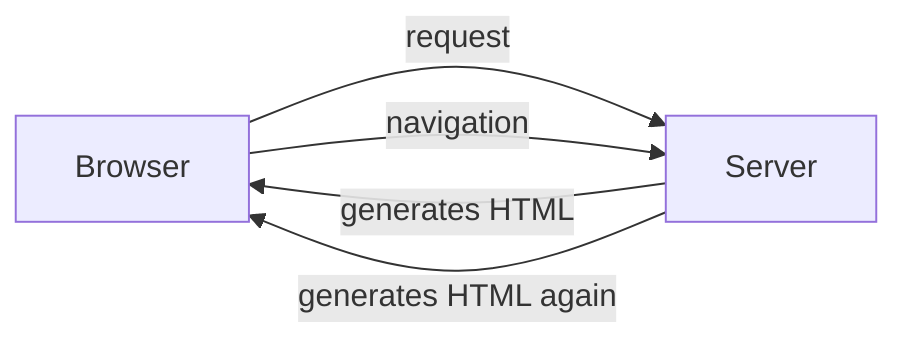
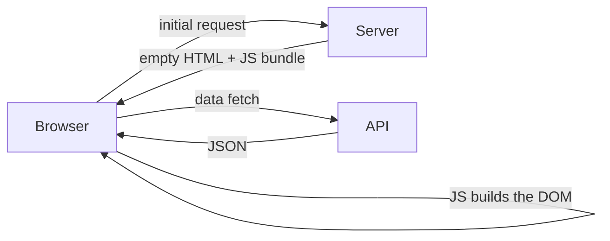
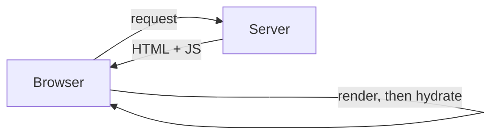
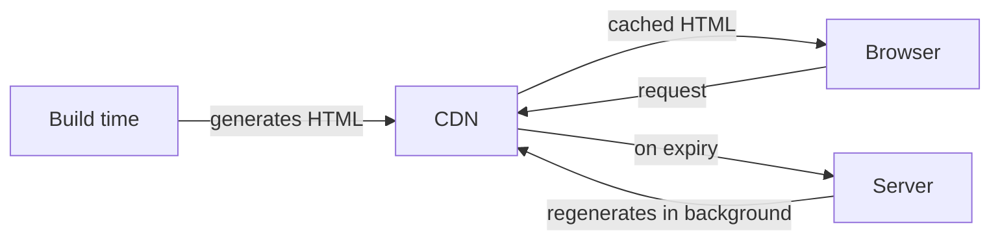
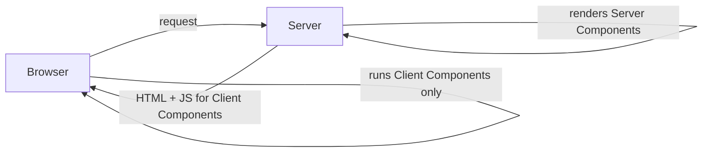
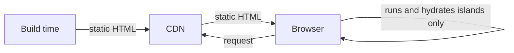
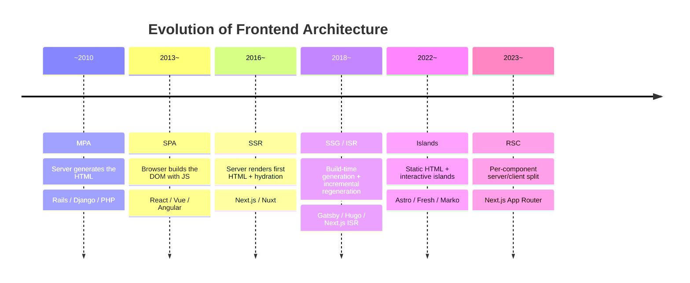

<!-- generated from articles/dev/2026-07-25-frontend-architecture-mpa-to-islands.md by scripts/import-articles.ts - do not edit -->

## Introduction

Greetings from the island nation of Japan.

Speaking of islands, I recently went looking for one in my own codebase and came back empty-handed. I had built a personal site with Astro specifically to try Islands Architecture, understood it properly, and then shipped without a single island.

All sea, no land.

There is a joke in there about an island nation somewhere, and I intend to make it later in this article.

Frontend architecture has too many options, wouldn't you say? MPA, SPA, SSR, SSG, ISR, RSC, Islands.

Seven acronyms before you have written a line of code, each with a framework insisting it is the optimal answer, and every comparison article you read leaves you slightly more confused than before.

By the end of this piece you will know how we got from server-rendered HTML to islands, what each generation solved and what it broke, and which variables actually decide your choice.

I wrote about why I picked Astro in the tech selection piece, and the implementation patterns in the bilingual blog piece.


<a class="link-card" href="https://akari-iku.github.io/en/blog/why-i-chose-astro-and-github-pages/" target="_blank" rel="noopener">

<span class="link-card-body">
<span class="link-card-domain">akari-iku.github.io</span>
<span class="link-card-title">Why I Chose Astro + GitHub Pages (and Almost Picked Cloudflare) | akari.log</span>
</span>
</a>


<a class="link-card" href="https://akari-iku.github.io/en/blog/astro-bilingual-blog-implementation/" target="_blank" rel="noopener">

<span class="link-card-body">
<span class="link-card-domain">akari-iku.github.io</span>
<span class="link-card-title">Migrating to Astro, How I Built a Bilingual Static Blog | akari.log</span>
</span>
</a>


In the tech selection piece I wrote that "a trial run at Islands Architecture is a perfectly respectable reason to choose something", and promised the punchline would get its own article.

This is that article.

There is no right answer here. But once you can see the outline of the options, choosing gets easier. And the outline only sharpens once you have actually touched the thing.

## A History of Who Builds the HTML

Boiled down, the evolution of frontend architecture is the history of one question: **who builds the HTML?**

The server, the browser, or the build step. Let us go through what each answer solved, and what new burden it picked up along the way.

### MPA

Multi-Page Application.

Rails, Django, Laravel, PHP. The server generates HTML on every request and sends it back. Navigation means a full reload.




This is the original shape of the Web, and it is still perfectly alive for admin panels and internal tools.

It is simple, SEO is a non-issue, and because everything closes on the server, state management stays straightforward.

The price is that the screen goes white on every navigation. And the moment you try to add rich interaction, jQuery spaghetti is born.


<a class="link-card" href="https://web.dev/articles/rendering-on-the-web" target="_blank" rel="noopener">
<span class="link-card-body">
<span class="link-card-domain">web.dev</span>
<span class="link-card-title">Rendering on the Web &amp;nbsp;|&amp;nbsp; Articles &amp;nbsp;|&amp;nbsp; web.dev</span>
</span>
</a>


### SPA

Single-Page Application.

React, Vue, Angular. The server hands over a skeleton HTML file, and JavaScript in the browser assembles the DOM. Navigation happens inside the JS, so the screen never flickers.




This exploded in popularity from the mid-2010s. The UX improvement was dramatic. So was the bill.

- The initial load is heavy. Nothing is visible until the whole JS bundle has downloaded and executed
- SEO is weak. A crawler that does not run JS sees an empty shell (Googlebot does execute JS these days, but it remains unreliable)
- State management gets complicated. The entire application state now lives on the client, which is how we ended up with Redux, Vuex, MobX and the rest of the library pile


<a class="link-card" href="https://developer.mozilla.org/en-US/docs/Glossary/SPA" target="_blank" rel="noopener">
<span class="link-card-body">
<span class="link-card-domain">developer.mozilla.org</span>
<span class="link-card-title">SPA (Single-page application) - Glossary | MDN</span>
</span>
</a>


### SSR

Server-Side Rendering.

To patch the weaknesses of the SPA, the server generates the first HTML.

The browser displays it, then loads the JS and hydrates (attaching event handlers to the server-generated HTML to turn it into an SPA).




Next.js (2016 onwards) and Nuxt (2016 onwards) opened up this route.

First paint is fast. SEO is fine. But there is a cost.

It is the double-render problem. The same component tree gets processed once on the server and again on the client.

Between the HTML appearing and the JS taking over, TTI (Time to Interactive) creates a zombie window where buttons look pressable but are not.

You also need a server, so a CDN alone will not do.


<a class="link-card" href="https://nextjs.org/docs/pages/building-your-application/rendering/server-side-rendering" target="_blank" rel="noopener">

<span class="link-card-body">
<span class="link-card-domain">nextjs.org</span>
<span class="link-card-title">Rendering: Server-side Rendering (SSR) | Next.js</span>
</span>
</a>


### SSG

Static Site Generation.

Hugo, Jekyll, Gatsby. Every page is generated as an HTML file at build time and served from a CDN.


No server. Fast. Minimal security risk, because there is barely anything to attack.

The catch is that every update triggers a full rebuild. With a few thousand articles, builds can stretch into tens of minutes.

Anything that needs to be current (user dashboards, e-commerce stock) is a poor fit.

Gatsby added its own hurdle by making GraphQL mandatory.


<a class="link-card" href="https://nextjs.org/docs/pages/building-your-application/rendering/static-site-generation" target="_blank" rel="noopener">

<span class="link-card-body">
<span class="link-card-domain">nextjs.org</span>
<span class="link-card-title">Rendering: Static Site Generation (SSG) | Next.js</span>
</span>
</a>


### ISR

Incremental Static Regeneration.

Next.js got here first. Pages built by SSG are regenerated in the background once a set time has passed.




Almost static, but it refreshes itself once it goes stale. CDN caching plus on-demand regeneration gets you SSG speed with SSR freshness.

In exchange, cache coherence follows you around. Guaranteeing that "the page you are looking at right now is the latest one" is genuinely hard.

The infrastructure also tends to assume a specific platform such as Vercel.


<a class="link-card" href="https://nextjs.org/docs/pages/guides/incremental-static-regeneration" target="_blank" rel="noopener">

<span class="link-card-body">
<span class="link-card-domain">nextjs.org</span>
<span class="link-card-title">Guides: ISR | Next.js</span>
</span>
</a>


### RSC

React Server Components.

Next.js App Router (2023 onwards) brought this into the mainstream.




Until now, SSR made the server-or-client decision at the page level. RSC splits server components from client components at the component level.

Server components never enter the JS bundle. Data fetching closes on the server. Only components that declare `"use client"` get shipped to the browser.

The price is a more complicated mental model. You are permanently asking "does this component run on the server or the client?"

Then come the serialisation constraints on props crossing the `"use client"` boundary, and the async flow of Server Actions.

The learning curve is steep.

It is also React-specific, so your ecosystem closes around React. That is worth noticing.


<a class="link-card" href="https://react.dev/reference/rsc/server-components" target="_blank" rel="noopener">

<span class="link-card-body">
<span class="link-card-domain">react.dev</span>
<span class="link-card-title">Server Components – React</span>
</span>
</a>


### Islands

Islands Architecture.

Astro (v1.0 in 2022 onwards), Fresh (Deno), Marko (eBay).




The whole page ships as static HTML, and only the parts that need interaction are embedded as "islands". The islands hydrate. The sea around them stays at zero JS.

Look back at the sequence so far and a pattern appears. The SPA is a subtractive design: everything is dynamic by default, and you optimise static parts out of it.

Islands is the additive one: everything is static by default, and you add dynamic parts in.

The default sits on the light side.

Sharing client state between islands is difficult, because each island is its own hydration boundary.

That makes it a poor fit for genuinely application-like UI. Outside content-centric sites, the constraints bite.


<a class="link-card" href="https://docs.astro.build/en/concepts/islands/" target="_blank" rel="noopener">

<span class="link-card-body">
<span class="link-card-domain">docs.astro.build</span>
<span class="link-card-title">Islands architecture</span>
</span>
</a>


### The Whole Timeline




Each generation tried to solve the previous generation's problem and picked up a new one in the process.

It is less an evolution than a pendulum, swinging back and forth between the server and the client.

## A Closer Look at Islands Architecture

### What Partial Hydration Actually Is

In conventional SSR, you hydrate the entire page. Header, footer, sidebar, article body. All of it.

Even when the only thing that genuinely needs interaction is the menu in the header, every component gets JS bolted onto it.

Partial hydration questions that assumption.

Could we not just hydrate the parts that need it?

Islands Architecture is that idea implemented at the architectural level. Jason Miller (the author of Preact) proposed the concept in 2020, and Astro was the first framework to implement it properly.


<a class="link-card" href="https://jasonformat.com/islands-architecture/" target="_blank" rel="noopener">
<span class="link-card-body">
<span class="link-card-domain">jasonformat.com</span>
<span class="link-card-title">Islands Architecture - JASON Format</span>
</span>
</a>


### Astro's `client:*` Directives

Astro lets you declare a hydration strategy for each island.

```astro
<!-- hydrate immediately -->
<Counter client:load />

<!-- hydrate when the browser goes idle -->
<HeavyWidget client:idle />

<!-- hydrate once it enters the viewport -->
<Comments client:visible />

<!-- hydrate when a media query matches -->
<MobileSidebar client:media="(max-width: 768px)" />

<!-- never render on the server, client only -->
<BrowserOnlyChart client:only="react" />
```

`client:visible` is the powerful one.

A component below the fold loads no JS at all until you scroll it into view. That one directive changes your initial bundle size dramatically.

### What Additive Design Buys You

SPA frameworks (Next.js, Nuxt) default to everything dynamic, and you optimise the static parts out. Subtractive design.

Astro defaults to everything static, and you add the dynamic parts in. Additive design.

The difference is not just a matter of taste. There is a practical payoff.

In a subtractive design, forgetting to optimise makes things heavy. Unless the developer deliberately adds code splitting and lazy loading, the bundle keeps swelling.

In an additive design, doing nothing keeps it light. Making it heavy requires deliberately adding an island. The default sits on the safe side.

### Islands Beyond Astro

This is not an Astro-only story.

Fresh (Deno) is Deno's official web framework. It is Preact-based and, like Astro, defaults to static with islands for interaction.

The convention is filesystem-based: only components placed in the `islands/` directory get shipped to the client.

Marko (eBay) is eBay's UI framework, and a pioneering implementation of the idea. It had per-component automatic streaming and partial hydration working well before the term caught on.

Qwik takes a slightly different route with resumability. It eliminates hydration entirely and lazy-loads only the event handlers you need.

The premise is that you never hydrate at all. Compared with Islands, the notable difference is that developers do not have to mark island boundaries by hand.

### I Understood It, Then Chose Not to Use It

Here is the punchline I promised back in the tech selection piece.

Islands Architecture is Astro's headline feature. On my own site, I used none of it.

Zero `client:load`. Zero `client:visible`. Zero `client:idle`. Zero React, Vue or Svelte dependencies.

Every interaction is plain JavaScript inside `<script is:inline>`, roughly 40 lines in total. Section 5 of the implementation piece covers exactly which interactions I built without islands.


<a class="link-card" href="https://akari-iku.github.io/en/blog/astro-bilingual-blog-implementation/" target="_blank" rel="noopener">

<span class="link-card-body">
<span class="link-card-domain">akari-iku.github.io</span>
<span class="link-card-title">Migrating to Astro, How I Built a Bilingual Static Blog | akari.log</span>
</span>
</a>


Being forced to decide whether something deserves an island turned into an opportunity to reconsider whether it needed JS at all.

I think that is the hidden strength of Islands Architecture. In an SPA framework, reaching for a React component is the natural path of least resistance.

In Astro, creating an island is an explicit choice, so you end up asking every single time whether you actually need one.

The result: OGP images and link cards are generated at build time so the client needs nothing, and the menu, dark mode and copy buttons were all fine in plain JS.

I like the philosophy, I really do. And following that philosophy to its conclusion produced a site with not one island on it.

Put another way: I went to understand an architecture named for islands, plural, and what came out was zero islands and a page that is entirely sea.

I borrowed the name and never placed any land. Coming from an island nation, I find this mildly embarrassing.

But this is not the result of a compromise. It is one more data point in the toolbox.

Astro handles the "all sea" configuration perfectly well. And if I later decide that something should be an island, growing one costs a single line of `client:visible`.

Zero today, as many as I want tomorrow. Shipping at minimum weight while keeping that headroom is where the value lands.

At this point you might reasonably ask: if you have zero islands, why not Hugo, or Eleventy, or plain HTML? But that misses it too.

The sea may be all there is today, and Astro is what keeps the option of growing an island permanently within reach.

Adding interaction to a plain SSG means going back to square one and re-selecting a framework. Astro lets me keep the escape route ("one line and it becomes an island") while shipping zero today.

That asymmetry is why I chose it, and the details are in the tech selection piece.


<a class="link-card" href="https://akari-iku.github.io/en/blog/why-i-chose-astro-and-github-pages/" target="_blank" rel="noopener">

<span class="link-card-body">
<span class="link-card-domain">akari-iku.github.io</span>
<span class="link-card-title">Why I Chose Astro + GitHub Pages (and Almost Picked Cloudflare) | akari.log</span>
</span>
</a>


It is not a contradiction. It is additive design working correctly. If you do not need to add, zero is the answer.

I felt the value of a zero default precisely by shipping at zero. That is a completely different experience from never using it because you never knew it existed.

## Rendering Strategy Alone Does Not Decide It

When you choose an architecture, the rendering strategy is only the first fork in the road.

How you carve up routing, where authentication lives, where you agree to pay the performance cost, where state is held. On a real project, all of this piles in at once.

And these are not independent choices: the moment you settle on a rendering strategy, the range of options left to you narrows considerably.

That chain of consequences got long enough that I split it into its own article.

## So How Do You Actually Choose

### Content-Centric or App-Centric

This is the first branch.

| | Content-centric | App-centric |
| ---- | ---- | ---- |
| Examples | Blogs, docs, landing pages, portfolios | Dashboards, SaaS, e-commerce, social |
| Update frequency | Low to medium (new articles, edits) | High (real-time changes from user actions) |
| Interaction | Sparse (navigation, theme toggle) | Dense (forms, chat, drag and drop) |
| Candidates | SSG / Islands (Astro, Hugo, Eleventy) | SPA / SSR (Next.js, Nuxt, Remix, SvelteKit) |

Get this wrong and you either pick an SPA for a content site and carry needless complexity, or pick SSG for an app and suffer every time a dynamic requirement appears.

### Hybrid

In practice, the split is rarely that clean.

An e-commerce site mixes product pages (content-centric) with cart and checkout (app-centric).

For those cases, a framework that lets you choose SSG, SSR or ISR per page, such as the Next.js App Router, enters the picture.

Alternatively you can split the content side into Astro and run the app side as a separate service, micro-frontend style.

### There Is No Right Answer, but You Can Sort the Variables

The final call is the product of these variables.

- The nature of the content. Static or dynamic, and how often it changes
- The complexity of the interaction. Do islands cover it, or is the whole app dynamic
- The team's skill set. Next.js if you are comfortable in React, Nuxt for Vue. Do you have room to learn something new
- Infrastructure constraints. Can you run a server, or is it CDN only, or do you have an edge environment like Vercel or Cloudflare
- SEO and AEO requirements. How much does exposure in search and AI answers matter
- Operations. Solo or a team, and what the long-term maintenance picture looks like

For my own site, it was content-centric and fully static, with zero running cost, every SEO feature I wanted, and a team of one. Astro SSG was the right fit.

I did not even need Islands. But being able to say "I understand the idea and I do not need it right now" only came from touching it.

### It Does Not Close Within the Frontend

I have been slicing this from a frontend point of view, but honestly, this is one extracted piece of a whole-product design.

Your rendering strategy propagates straight into backend design. Choosing SSR means owning a server, and behind that sit API, database and infrastructure decisions.

Where authentication lives is not decided by frontend convenience alone; it is the boundary of responsibility between front and back.

Even the "data freshness" that ISR and SSR wrestle with connects directly to how your backend data sources are designed.

On a real product, you cannot select the frontend architecture in isolation. My own site being fully static with no backend is itself a whole-product decision to not have a backend.

The frontend fork in the road is only the entrance to a much larger design problem that takes in backend, infrastructure and team structure. This article got as far as that entrance, and stops there.

## Closing Thoughts

MPA, SPA, SSR, SSG, ISR, RSC, Islands.

It swings back and forth like a pendulum, but every generation was trying to fix the previous one's problem. None of them is the correct answer, and none of them is a mistake.

Now that we write code alongside AI agents, the cost of implementation has dropped. Even switching frameworks is not the heavy decision it once was.

But choosing an architecture happens before any code gets written.

Who should build this site's HTML, how much interaction it truly needs, where the state should live.

You cannot hand that judgement to a coding agent. The quality of the design depends on whether the human side understands the architecture.

I built my site with Astro and ended up never using Islands.

Understanding it and then deciding against it is nothing like never using it because you never knew.

Even when an AI agent wrote the code, the decision not to choose something stays on the human side.

The knowledge accumulated on the human side. I think that is the biggest thing.
