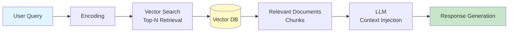
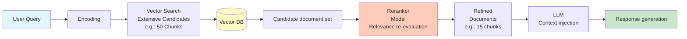
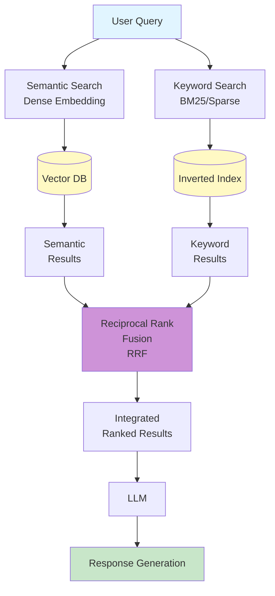
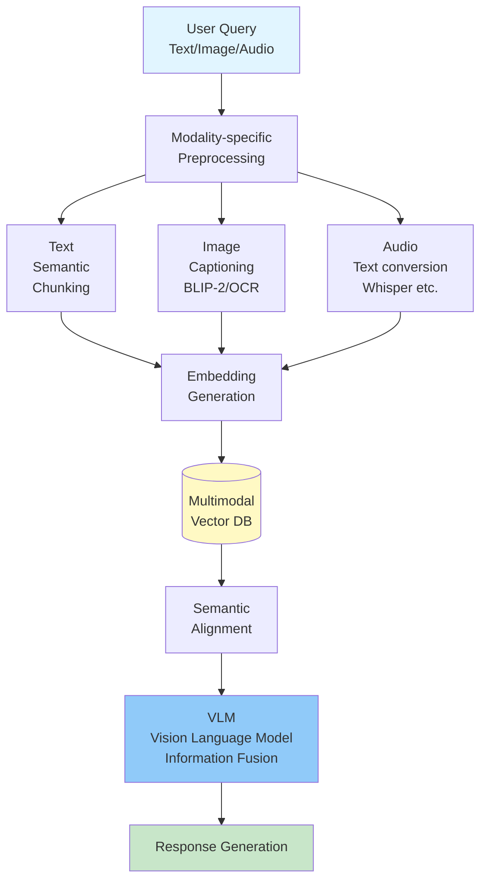
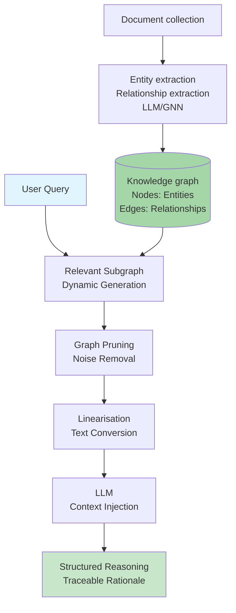
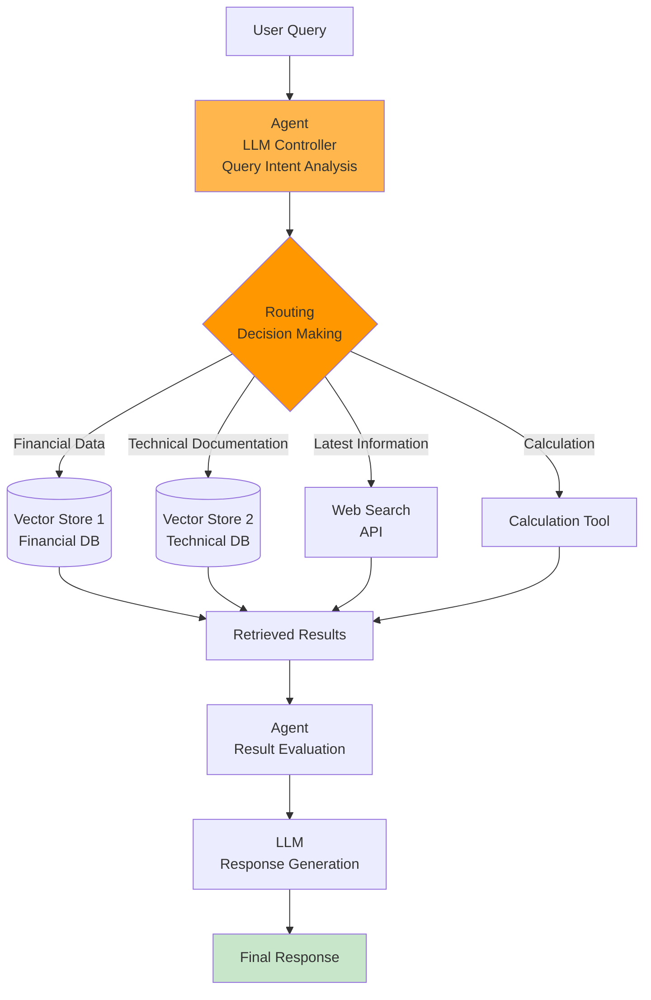
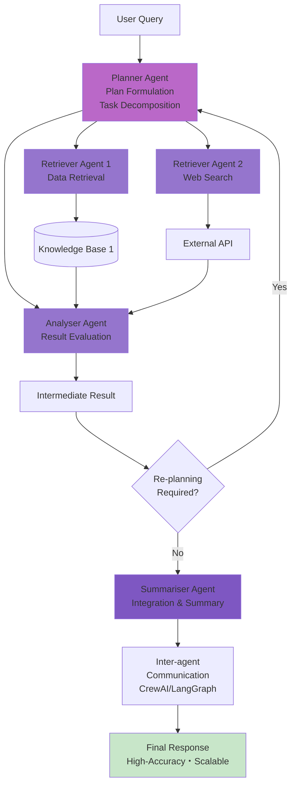

<!-- generated from articles/dev/2025-10-27-rag-architecture-design-theory-and-conceptual-organization-i.md by scripts/import-articles.ts - do not edit -->

Greetings from the island nation of Japan.

This article attempts a rather ambitious feat: bringing a semblance of order to the glorious chaos that is Retrieval-Augmented Generation (RAG) Architecture in the age of AI Agents.

One might assume, looking at a Large Language Model, that it is simply a clever box that produces answers. A delightfully convenient illusion. The reality, as we engineers know, involves navigating a minefield of terminology and the structural integrity of something resembling a digital 'Spaghetti Junction' of data pipelines.

When the brief arrives to build an "AI Agent," one must resist the urge to simply nod politely and immediately book a one-way ticket to a remote island. (Alas, as I already reside on one, that option is closed.)

Instead, one must embark upon the meticulous, yet necessary, task of separating the 'Agentic Workflow' (the noble intention, or The What) from the 'Agentic Architecture' (the tiresome, costly engineering, or The How). Failure to do so, I assure you, is simply not cricket.

Having prepared myself a rather weak cup of tea—a metaphor, perhaps, for the often-diluted knowledge passed down in AI discussions—let us proceed to the seven essential patterns that will allow you to build something scalable, rather than merely something shouty.

I trust you will find this structural guidance to be, at the very least, adequate.

## 1. Clarifying Ambiguity and a Paradigm Shift in RAG Design

### 1.1. The Evolution of RAG and Confusion in Design Concepts: Why Terminology Needs Clarification

Retrieval-Augmented Generation (RAG), which enhances the capabilities of Large Language Models (LLMs) with external knowledge, has rapidly evolved as a foundational technology for AI applications. It's evolving so fast it's scary, and I'm struggling to keep up.
I need to organize my thoughts in this article, especially since I mentioned there were four approaches...

<a class="link-card" href="https://dev.to/_768dd7ab130016ab8b0a/the-era-of-choosing-rag-learning-cognitive-load-and-architecture-design-from-gpt-5s-failures-5dl3" target="_blank" rel="noopener">

dev.to
The Era of Choosing RAG — Learning Cognitive Load and Architecture Design from GPT-5’s Failures

</a>

This evolution has progressed from the initial, simple Naive RAG to Advanced RAG, which incorporates sophisticated retrieval methods, and now to Modular RAG, which views RAG as a set of interchangeable modules [^1].

[^1]: https://www.arionresearch.com/blog/uuja2r7o098i1dvr8aagal2nnv3uik

In this process of rapid evolution and diversification, confusion in terminology related to system design has been observed, particularly the blurring distinction between "Agentic Workflows" and "Agentic Architectures." (A quick search suggests this is a common issue both domestically and internationally. Chaos.)

Agentic Workflows = A series of steps an agent takes to achieve a goal
When considering "what" is done, it refers to the actual process.

This includes (but is not always present):
• Using LLMs to create plans
• Breaking down tasks into subtasks
• Utilizing tools like internet search
• Reflecting on results and adjusting plans

Agentic Architectures = A technical framework and system design
When considering "how" it is done, it refers to the underlying structure.

This basically includes:
• At least one agent with decision-making capabilities
• Tools that agents can use
• Systems for short-term and long-term memory

The confusion likely arises because the same workflow can be implemented with different architectures. I see it like having multiple ways to make the same recipe; the steps are similar, but the kitchen setup is different.

While these two concepts are closely related and function simultaneously, they fundamentally refer to different aspects of system design. To accurately convey design intent and build flexible and scalable (I want to use this cool word) systems, it's crucial to distinguish and understand these concepts.
It might be too basic to mention, but there are just too many concepts...!

The goal of this article is to resolve this conceptual confusion and structurally analyze the main typologies of RAG architectures. Furthermore, referencing optimization strategies based on empirical data from large-scale production environments processing 5 million documents, I will discuss with AI system architects the importance of both theoretical rigor and practical insights.
Given the many things that cannot be discussed due to compliance issues these days, I will gratefully refer to this.

### 1.2. Rigorous Conceptual Definition: Distinguishing Workflow (What) from Architecture (How)
When designing to agentify a RAG system, the most crucial distinction lies in separating **what we aim to achieve (the workflow)** from **how we achieve it (the architecture)**.
This may overlap slightly with the previous section, but I wish to clarify it anew for my own understanding.

#### Workflow (Agentic Workflows - What)

Agentic workflows refer to the sequence of steps or processes an agent follows to achieve its ultimate goal. This defines the actual process—that is, what is executed. Specifically, it may include steps such as formulating plans using an LLM, decomposing complex tasks into subtasks, utilising external tools like internet searches, and undertaking reflection steps to evaluate outcomes and dynamically adjust plans. [^2].

[^2]: https://www.ibm.com/think/topics/agentic-rag

Research from Anthropic (Claude's team) defines workflows as systems where LLMs and tools coordinate through predefined code paths[^3]. This definition emphasises that workflows operate according to relatively fixed procedures or policies. In non-agentic workflows, AI models execute predetermined tasks but do not make autonomous decisions or dynamically alter processes[^4].

[^3]: https://www.anthropic.com/research/building-effective-agents
[^4]: https://orkes.io/blog/what-are-agentic-workflows/

#### Architecture (Agentic Architectures - How)

Agentic architecture refers to the technical framework, system design, and underlying structure required to implement the workflow. It establishes the foundation for “how” the workflow is executed. The foundational elements of architecture invariably include at least one agent (LLM) with decision-making capability, a suite of tools available to the agent, and systems for both short-term and long-term memory[^5].

[^5]: https://weaviate.io/blog/what-is-agentic-rag

The reason this distinction is critically important in system design lies in the fact that the same workflow can be implemented using different architectures. For example, an agent RAG workflow that ‘decomposes queries, retrieves information, and evaluates relevance’ could be built using a single-agent router architecture or a multi-agent system where multiple agents collaborate. Understanding this flexibility enables designers to select the architecture best suited to specific requirements.
Choosing the better option requires a hand to play, though that may be a personal view.

## 2. Establishing the Conceptual Foundation: Elements and Blueprint of Agentic RAG

### 2.1. Fundamental Elements Composing Agentic RAG

What fundamentally distinguishes Agentic RAG systems from traditional RAG systems (which rely on static knowledge and a single search path) is their flexibility, adaptability, and scalability[^2]. These capabilities are underpinned by the following three fundamental elements.

**Decision-Making Agent**: Embedded throughout the entire RAG pipeline, it handles autonomous decision-making, including query routing, step-by-step planning, and identifying and executing necessary tools[^2]. This locus of autonomy constitutes the core of the agentic system. The ReAct (Reasoning and Action) framework, a representative design paradigm, enables agents to iterate through the process of “Thought” → “Action” → “Observation”, dynamically adjusting workflows until task completion[^2].

**Tools and External Data Sources**: Agentic RAG overcomes the limitations of traditional RAG, which relied on a single vector database, by leveraging multiple external knowledge bases and diverse tools to enhance flexibility[^2]. Traditional RAG can be genuinely challenging, often requiring considerable thought on how to effectively combine resources. Beyond RAG, this includes web search, computational tools, API access to email and chat programmes, and other programmable software[^5].

**Memory Systems**: By maintaining both short-term memory (conversation history) and long-term memory (external knowledge bases/vector stores), agents can preserve state and provide consistent responses to complex, multi-part sequential queries[^5].
I'd like to write about the battle against cognitive load separately at some point.

### RAG Blueprint: A Relational Model of Workflow and Architecture

Traditional RAG systems were reactive data retrieval tools that discovered and presented relevant information in response to a given query. The term “reactive” feels somewhat peculiar when applied to AI. In contrast, Agentic RAG systems are likened to proactive, creative teams—systems that proactively solve problems[^2]. This capability stems from the agent's dynamic decision-making ability.

It is important to clarify where control resides in the design. In non-Agentic systems, control lies within fixed code paths, with the LLM merely executing tasks within those paths. However, in a truly Agentic architecture, control shifts to the LLM, which gains the ability to dynamically determine the process based on the situation and autonomously execute tasks[^3]. This dynamic path-generation capability is the fundamental reason Agentic RAG possesses high flexibility and adaptability. Configuration and design are certainly necessary, but I feel we've become reasonably proficient at it.

The design of Agentic RAG can be categorised as a process of choosing whether to implement abstract workflow concepts (e.g., planning, information retrieval, verification) within a concrete architecture (e.g., a router structure using a single agent, or a system employing multiple collaborative agents). Or rather, we have done so.

| Concept | Definition (What/How) | Elements | Concrete Examples in RAG |
| :--- | :--- | :--- | :--- |
| **Agentic Workflow** | A sequence of steps executed by the Agent to achieve a goal (The What) | Planning, Task Decomposition, Tool Utilization, Outcome Reflection | Query decomposition, Evaluation of retrieved information, Retrial logic in RAG |
| **Agentic Architecture** | The technical framework and system design supporting the Workflow (The How) | Decision-Making Agent, Tool Access, Short/Long-term Memory Systems | Single-Agent Router structure, Communication design between Multi-Agents[^5] |

## 3. Typology of RAG Architectures: Seven Design Patterns and Their Functional Analysis
The evolution of RAG has progressed not merely in terms of scaling to handle increasing data volumes, but across three dimensions: data complexity, inter-data relationships, and task complexity. Here, we categorise the seven primary RAG architecture patterns encountered by designers, explaining their technical details and design trade-offs.

### 3.1. Foundational RAG Patterns: Naive RAG and the First Step Towards Accuracy Improvement

#### Naive RAG

Naive RAG represents the most fundamental form of RAG implementation[^7]. Its process relies on three simple steps: query encoding, retrieval of relevant documents using a vector database (obtaining the top N), and injecting the acquired context into an LLM to generate a response[^7]. However, this basic approach carries the risk of extracting inaccurate information or drawing erroneous conclusions when dealing with large-scale or noisy data, as it does not consider context[^8].

[^7]: https://www.ibm.com/think/topics/rag-techniques
[^8]: https://en.wikipedia.org/wiki/Retrieval-augmented_generation

**Features**: Simplest three-step architecture (encoding → retrieval → generation)

#### Retrieve-and-rerank (Reranker RAG)

Reranking is one of the most cost-effective improvements for addressing the limitations of Naive RAG and significantly enhancing retrieval precision[^9]. In this pattern, the retriever first fetches a broad set of candidate documents (e.g., 50 chunks). Subsequently, a reranker model (typically a dedicated classification model) re-evaluates these candidates based on their true relevance to the query, ultimately passing the most relevant few (e.g., 15 chunks) to the LLM[^10]. The introduction of relinkers is recognised as a simple yet effective method for dramatically improving search quality while minimising input noise to the LLM[^9].

[^9]: https://www.pinecone.io/learn/series/rag/rerankers/
[^10]: https://blog.abdellatif.io/production-rag-processing-5m-documents

**Features**: Two-stage search significantly reduces noise, high ROI

## 3.2. Fusion Strategy for Scaling: Hybrid RAG

Hybrid RAG is a strategy that combines different search methods to ensure both search coverage and precision.

**Definition and Mechanism**: Hybrid RAG combines semantic search (Dense Embedding/Vector) with lexical search (Sparse Retrieval/keywords such as BM25) [^12]. While semantic search excels at capturing meaning and conceptual matches, it may overlook rare words or proper nouns such as IDs, codes, and technical terms. Hybrid RAG bridges this search gap by achieving both the precise keyword-based matching of BM25 and the contextual depth of vector search[^14].

[^12]: https://ai.plainenglish.io/8-rag-architectures-powering-the-next-generation-of-ai-0cc868f2bed2
[^14]: https://www.chitika.com/hybrid-retrieval-rag/

**Result Integration**: Reciprocal Rank Fusion (RRF) is employed as the standard technique for integrating search results[^13]. RRF maximises the advantages of both keyword and semantic matching by prioritising documents highly ranked by both methods, thereby enhancing system accuracy.

[^13]: https://neo4j.com/blog/genai/advanced-rag-techniques/

**Features**: Fuses semantic and keyword matching; strong with technical terminology.

I'm currently researching, writing, digesting and organising things as I go, and I'm genuinely excited—this is brilliant, isn't it? It's amazing. Ultimately, I suppose technical jargon is unavoidable in any industry, isn't it? That thought crosses my mind too.

### 3.3. Handling Complex Data: Multimodal RAG

Multimodal RAG is a RAG architecture capable of acquiring information not only from text but also from multiple modalities such as images, audio, and video, and comprehending it holistically[^15].

[^15]: https://www.gigaspaces.com/blog/multimodal-rag-boosting-search-precision-relevance

**Data Processing Challenges**: Implementing Multimodal RAG requires complex data preprocessing. This includes modality-specific chunking (e.g., semantic chunking of text blocks, row-based chunking of tables) [^17]. For images specifically, visual information is converted into semantic representations by captioning (converting to textual descriptions) using models such as BLIP-2 or extracting text via OCR techniques[^17].

[^17]: https://www.reddit.com/r/Rag/comments/1m5ev9g/multimodal_data_ingestion_in_rag_a_practical_guide/

**Information Fusion**: Ensuring semantic alignment between information (embeddings) from multiple modalities is crucial[^15]. Vision Language Models (VLM) fulfil this role, fusing knowledge from different data types to enable more comprehensive contextual understanding[^16].

[^16]: https://kanerika.com/blogs/multimodal-rag/

**Benefits**: It provides deeper and more accurate contextual understanding and decision-making for complex document analysis involving charts and graphs, or educational content combining visual information and text—tasks previously challenging for traditional RAG systems[^15].

**Features**: Integrates understanding across multiple data types; excels at chart analysis

### 3.4. Enhancing Relational Inference: Graph RAG

Graph RAG overcomes the limitations of traditional RAG, particularly when dealing with large domain-specific datasets or when complex reasoning based on relationships between entities across documents is required[^19].

[^19]: https://www.elastic.co/search-labs/blog/rag-graph-traversal

**Structured Knowledge**: This architecture structures knowledge as a knowledge graph (KG). Within a KG, data is represented by nodes (entities or concepts) and edges (relationships) between them[^21].

[^21]: https://www.ibm.com/think/topics/graphrag

**Construction and Search Process**: KG construction involves processes such as using LLMs to extract entities and relationships from documents[^22], or employing advanced AI models like graph neural networks (GNNs)[^21]. During search, knowledge subgraphs relevant to the query are dynamically generated. This subgraph is then converted into a text format (linearised) suitable for processing by the LLM, after techniques such as graph pruning remove unnecessary information (noise), and is provided as context [^19].

[^22]: https://medium.com/neo4j/from-legal-documents-to-knowledge-graphs-ccd9cb062320

**Advantages**: Graph RAG enables structured reasoning impossible with systems relying solely on vector search. It also provides **explainability**, allowing traceability of relationships and evidence supporting answers, proving particularly valuable in regulated environments where traceability and accuracy are paramount, such as finance, legal, and healthcare [^20].

[^20]: https://neo4j.com/blog/developer/rag-tutorial/

**Characteristics**: Inference based on relationships between entities, high explainability. Personally favour the direction of extending inference.

### 3.5. Autonomous Design: Agentic RAG (Router-type)

Agentic RAG is an architecture that incorporates an AI agent's decision-making capability into the RAG pipeline, with the Router-type being its simplest form.

**Architecture and Functionality**: In the Router architecture, a single agent (typically an LLM) acts as a controller, dynamically determining which of multiple independent knowledge bases or tools (e.g., multiple vector stores, web search, APIs) to route queries to[^5].

**Introduction of Autonomy**: This design enhances RAG's flexibility and adaptability by enabling ‘query routing’ – analysing query intent and selecting the optimal data source[^2]. It is an essential structure for choosing efficient search paths in systems with multiple data sources.

**Features**: Single agent dynamically selects data sources, high flexibility

### 3.6. RAG as an Expert Collective: Agentic RAG (Multi-Agent Type)

The Multi-Agent type represents the most complex and highly autonomous design within the Agentic RAG architecture.

**Architecture and Functionality**: Multiple agents, each possessing distinct roles (e.g., planning formulation, data retrieval, result evaluation, summarisation), collaborate to execute tasks[^6].

[^6]: https://www.datacamp.com/tutorial/crewai-vs-langgraph-vs-autogen

**Frameworks and Collaboration**: Frameworks such as CrewAI (role-based orchestration) and AutoGen (conversation-driven chat) support this multi-agent collaborative model[^6]. CrewAI focuses on role assignment, LangGraph enables collaboration through structured state transitions, and AutoGen emphasises dynamic group chat[^6].

**Benefits**: This architecture demonstrates high accuracy and scalability for tasks requiring multiple sequential decisions and division of labour, such as market research or complex project management[^2]. However, there is a trade-off involving increased complexity in designing agent communication and state management[^6].

**Features**: Multi-agent coordination; high-precision processing of complex tasks through division of labour

Tools like OpenAI's recently popular “Agent Builder” and Google's “Opal” provide precisely this. It's clear they aim to enable anyone to design AI systems possessing the elements of Agentic RAG – planning, acting, reflecting, tool use, and external collaboration – essentially a multi-agent architecture, without needing complex Python frameworks like LangChain or LlamaIndex.
One might even say it represents the most crucial design pattern for maximising the current intelligence of LLMs and realising AGI-like behaviour within practical applications. It's complex, so we'll need to make a real effort to understand it... It's quite a challenge.

### Feature Comparison and Recommended Use Cases for Seven RAG Architectures
| Architecture | Primary Function | Complexity (1 Low〜5 High) | Trade-offs | Optimal Use Case |
| :--- | :--- | :--- | :--- | :--- |
| Naive RAG | Basic Retrieval and Generation | 1 | Low accuracy, High risk of hallucination | PoC, Small static datasets[^7] |
| Retrieve-and-rerank | Improves relevance of search results | 2 | Increased computational cost (2nd pass) | Initial accuracy improvement, Noise reduction[^9] |
| Hybrid RAG | Fusion of Semantic and Keyword Search | 3 | Difficulty in tuning score fusion (RRF) | High-precision search in large datasets, Excellent handling of specialized terminology[^12] |
| Multimodal RAG | Integrated retrieval of Text, Image, and Audio | 4 | Complexity of data pre-processing, VLM cost | Complex document analysis (incl. graphs, tables), Educational content[^15] |
| Graph RAG | Inference based on relationships between entities | 4 | Cost of Knowledge Graph construction and maintenance | Complex relational queries in legal, medical, or IT architecture fields[^19] |
| Agentic RAG (Router) | Decision-making for tool/data source selection | 3 | Recovery from routing failure | Query routing between multiple independent knowledge bases[^5] |
| Agentic RAG (Multi-Agent) | Complex problem solving through division of labor and cooperation | 5 | Difficulty in designing inter-agent communication | Market research, Autonomous research tasks, Complex project management[^6] |

## 4. Production Optimisation Strategies to Maximise RAG Performance

While selecting a theoretical architecture is crucial, the success of a RAG system hinges on laying solid foundations for search quality within real production environments. In other words, even the most robust theory is useless if it can't be implemented. R&D components are naturally included too. Insights gleaned from a recent article detailing the development of a large-scale RAG system processing 5 million documents suggest that, prior to introducing complex agentic architectures, one should thoroughly optimise foundational strategies with high return on investment [^10].
I was delighted to come across this – such valuable real-world experience! Given compliance constraints, I'd love to read more accounts of these earnest struggles.

<a class="link-card" href="https://blog.abdellatif.io/production-rag-processing-5m-documents" target="_blank" rel="noopener">

blog.abdellatif.io
Production RAG: what I learned from processing 5M+ documents

</a>

### 4.1. The Essence of Data Preprocessing: The Importance of Appropriate Chunking Strategies and Metadata Utilisation

#### Custom Chunking Strategies

Chunking strategies form the bedrock of RAG systems. Given the diverse nature of production environment data, it is essential to divide chunks so that each retains self-contained information as a logical unit, rather than mechanically cutting words or sentences midway[^10]. Standard chunkers (e.g., Unstructured.io) provide a starting point, but building a custom chunking flow is required to accommodate domain-specific data structures and formats (particularly corporate data)[^10].
Corporate data often suffers from rather idiosyncratic storage methods (a veritable parade of wildly unconventional formats like bizarre Excel files, bizarre Word documents, and excessively fiddly PDFs). While type conversion is important, it would be beneficial to address these issues too.

#### Metadata Injection

While early approaches often pass only the chunked text to the LLM, experimental results demonstrate that combining relevant metadata (e.g., document title, author, section information) with the chunked text and injecting this as context into the LLM significantly improves response quality[^10]. This helps the LLM gain a deeper understanding of the source and context of the provided information, enabling it to generate more reliable (grounded) responses. When I first learnt this, it really gave me an adrenaline rush.

### 4.2. Techniques for Dramatically Improving Search Accuracy

In large-scale systems, reliably presenting the information users seek at the top of results directly impacts the system's credibility. That said, I think it's common to encounter phenomena where this isn't the case during verification.

#### The Overwhelming ROI of Reranking

Reranking is often described as the ‘five lines of code with the highest value’ among strategies to add to production RAG systems, offering remarkably significant benefits relative to its ease of implementation[^10]. Adopting a reranker can compensate for weaknesses such as suboptimal initial retriever configuration or insufficient vector embedding quality. This is achieved by inputting a sufficient number of chunks (e.g., 50 chunks) initially[^10]. This demonstrates the practical lesson that improving search quality should be prioritised before undertaking complex architectural changes.

#### Practical Implementation of Hybrid Search

Implementing Hybrid Search is a crucial step towards broadening search coverage. By combining semantic search with keyword search, it achieves both semantic accuracy and word-level precision[^13]. In a case study involving 5 million documents, selecting a vector database (e.g., Turbopuffer) that natively supports keyword search contributed to efficient Hybrid Search implementation in large-scale environments[^10]. Reciprocal Rank Fusion (RRF), as mentioned earlier, is typically used for result integration[^13].
This was genuinely helpful as my own thinking was starting to become rather rigid; I felt I'd gained some valuable insights.

### 4.3. Query Processing to Unlock LLM Capabilities: Advanced Query Generation and Routing

Advanced RAG systems do not merely accept queries; they optimise the queries themselves and manage the system's limitations.

#### Query Generation

The last query entered by the user may not capture the full context. To compensate, an effective approach involves using the LLM to review the entire conversation thread and generate multiple semantic queries or keyword queries in parallel [^10]. Executing these multiple generated queries concurrently and passing the results to the relancer ensures broader search coverage, including potential contextual elements. This is something I've experienced quite a lot in practice. I feel that in real-world settings and with users, there are far more short, directive phrases like ‘Do ◎◎’ or ‘△△!’ than one might expect, making it difficult to grasp the context... I think it's quite fundamental that how well instructions are given in the first place significantly impacts how effectively AI is utilised. This strategy of technically compensating for the ambiguity in user instructions is, I believe, where the true value of LLM-based query generation lies.

#### Query Routing

Defensive design is indispensable for ensuring system robustness. This is common knowledge and practically a given by now! Query routing is the mechanism whereby a RAG system detects queries outside the knowledge base's scope (e.g., tasks like ‘summarise this document’ or ‘who wrote this article’, which fall under processing or metadata extraction rather than information retrieval) and, instead of executing the full RAG pipeline, performs a separate, simpler API call or transfers the query to an LLM[^10]. This avoids unnecessary RAG execution, optimising both cost and latency. Whilst a complex element of the agentic architecture, it is a fundamental strategy essential for stable, large-scale production deployment. There are various approaches to defence design.

### ROI Analysis of Production RAG Optimisation Strategy (Based on a 5 Million Document Case Study)

| Optimisation Strategy | Overview | ROI Assessment (High/Medium/Low) | Key Effects | Practical Notes |
| :--- | :--- | :--- | :--- | :--- |
| **Reranking** | Re-evaluating the relevance of initial search results | High (Highest value) | Dramatic improvement in search accuracy, noise suppression[^9] | Easiest to implement with significant effects. The technique to try first. |
| **Query Generation** | Generating multiple queries via LLM | High | Expanded search coverage, extraction of hidden context[^10] | Significant synergistic effect when combined with Reranking. |
| **Chunking Strategy** | Domain-specific logical chunk segmentation | Medium to High | Minimisation of context loss, optimisation of search granularity [^10] | High initial cost but forms the long-term foundation of the system. |
| **Metadata Injection** | Providing LLM with metadata related to chunks | Medium | Enhances answer reliability, reinforces context[^10] | Relatively easy to implement and clarifies the basis for answers. |
| **Query Routing** | Detects questions unanswerable by RAG and forwards to APIs or other LLMs | Medium | Avoids unnecessary RAG execution, optimises cost and latency[^10] | Ensures robustness in production environments. |

## 5. Practical Design Guide: Combining RAG Architectures and Conclusions

### 5.1. Design Approach for Complex Requirements: Combining RAG Architectures

In real-world system development, RAG design is not confined to a single architecture pattern but is realised as a modularised system combining multiple strategies[^1]. Frankly, I suspect survival would be tough otherwise. When comparing from a product quality perspective, the superior approach is clearly preferable.

Successful case studies in large-scale systems demonstrate that a multi-layered approach is key: placing high-precision search techniques like Query Generation or Hybrid Search at the front end of the workflow, refining results via a Reranker, and then routing them to specific RAG modules via an Agentic Router[^10].

Within this design philosophy, Agentic RAG assumes the role of the orchestration layer for the entire RAG pipeline. For example, the Agentic Router can dynamically determine which RAG module to invoke—Hybrid RAG, Multimodal RAG, or Graph RAG—based on the user's query content. The Agentic architecture sits atop specialised RAG modules, functioning to enhance the adaptability and flexibility of the entire system.

### 5.2. Decision Matrix: Criteria for Architecture Selection

When selecting a RAG architecture, I believe evaluation can be conducted based on the following four primary design axes:

1. **Data Properties**: Whether the data being handled is text-only, multimodal data including images or audio, or contains complex relationships between entities. This determines the necessity of implementing Multimodal RAG or Graph RAG.

2. **Required Task Autonomy**: Whether queries can be resolved through simple question-answering, or whether step-by-step planning like ReAct or autonomous use of external tools is required. This determines the level of Agentic RAG needed (Router-based or Multi-Agent-based).

3. **Performance and Cost**: The response time, throughput, and computational resources required of the system. The level of high-ROI Reranking or Hybrid Search should be considered first.

4. **Explainability and Trustworthiness**: Is the ability to trace the reasoning behind generated answers and verify their reliability required? For use cases involving complex reasoning, adopting Graph RAG offers advantages[^20].

RAG has significantly increased the amount of thought required, even for a single word, while simultaneously expanding the available options. This area feels like a real showcase for technical prowess and a potential competitive edge, though it remains somewhat opaque.

### 5.3. Summary and Future Directions

Designing a RAG system is not merely an integration of technical components, but a decision-making process grounded in conceptual clarity and strategic optimisation. Designers must first rigorously distinguish between the “agentic workflow (what)” and the “agentic architecture (how)”, understanding whether the **locus of control** resides in fixed code paths or within the LLM's dynamic decision-making capabilities.

In practical terms, it is crucial to prioritise high-ROI search quality enhancement strategies—such as Reranking, Query Generation, and Hybrid Search—before implementing complex agentic architectures, thereby establishing a solid foundation for retrieval quality. This is because many challenges in RAG implementation projects stem not from a lack of advanced architecture, but from insufficient basic search accuracy. Ultimately, it boils down to the fact that feeding it rubbish isn't going to work, is it?

The future evolution of RAG is predicted to converge towards more flexible and adaptable Agentic Modular RAG systems, where diverse specialised modules are orchestrated by advanced autonomous agents. Or rather, I suspect the AGI trend is now unstoppable. ChatGPT Atlas seems capable of quite a bit of mischief, doesn't it? Well, being a Windows user myself, just observing the information flowing in makes me rather fearful of the potential for trouble... That said, it also made me realise we need to make things more robust and secure our foundations properly, or else it's scary.

P.S.: The footnotes are numerous and might make it a bit of a slog to read, but they're all valuable information, so do check out the original article.
This time I've leaned quite heavily on footnotes rather than a traditional reference list format, but I'm still rather undecided about which approach is best...
Which is better, everyone...?
