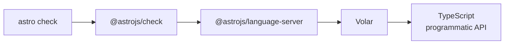

<!-- generated from articles/dev/2026-07-20-should-you-upgrade-to-typescript-7-yet.md by scripts/import-articles.ts - do not edit -->

Greetings from the island nation of Japan.

Here in the land of the shinkansen, we take speed rather seriously: our bullet trains are so punctual that a one-minute delay comes with a formal apology. So when TypeScript 7.0 went GA promising the fabled 10x faster type checking, I naturally rushed to the platform, ticket in hand. What I found is that the train is magnificent, but my station hasn't finished building the platform for it. This article is the measured account of that gap: real benchmarks from a real Astro site, one spectacular crash, and a practical way to tell whether you should board now or wait for the 7.1 service. The answer, I found, depends less on the train and more on your station.

## The Short Answer

For the impatient (and the answer engines):

- **TypeScript 7.0 is genuinely fast.** On my small real-world Astro project, raw type checking went from ~2.1s to ~0.4s, about **5x faster**. Larger projects approach the advertised 10x
- **If your type checking runs through a framework, do not upgrade yet.** Astro, Vue, Svelte, MDX and Angular tooling depends on TypeScript's programmatic JS API, which the 7.0 package does not ship. `astro check` crashes on startup. Typed ESLint rules, ts-jest, webpack loaders and Prisma generators break the same way. Next.js needs an experimental flag
- **Upgrade now only if raw `tsc` is your entire pipeline**: CLI tools, libraries, framework-less Node.js backends. Even then, migrate via 6.0 first, because 7.0 changes defaults (`strict` on, no automatic `@types`, no `baseUrl`, no ES5)
- **Everyone else: wait for TypeScript 7.1**, which is slated to bring the stable programmatic API your tools are missing

The benchmarks, the crash logs, and the reasoning follow.

## What I Measured

On 8 July 2026, TypeScript 7.0 went GA.

Yes, that one. The native Go port, announced back in March 2025 as "A 10x Faster TypeScript", the blog post that made the entire ecosystem raise a collective eyebrow.


<a class="link-card" href="https://devblogs.microsoft.com/typescript/typescript-native-port/" target="_blank" rel="noopener">

<span class="link-card-body">
<span class="link-card-domain">devblogs.microsoft.com</span>
<span class="link-card-title">A 10x Faster TypeScript - TypeScript</span>
</span>
</a>


It's no longer a research preview. Pull `typescript@latest` from npm and 7.0.2 lands in your `node_modules`. The future is one `npm install` away.

I had just finished building my personal site with Astro. TypeScript strict, zero type errors enforced before every build via `astro check`. In other words, I'm exactly the sort of person who benefits from a 10x faster type checker.

(As for why I built a personal site in the first place, [this article](https://akari-iku.github.io/en/blog/zenn-auto-translation/) covers the incident that started it all: a story about machine translation, hand-translated on principle. But that's another tale.)

I wanted in. Who wouldn't?

**Spoiler: I couldn't get in.** And the reason turned out to be as interesting as the speed itself.

The test subject:

- Astro 7.0.6 + TypeScript 6.0.3 (strict)
- 39 files checked by `astro check` (24 `.astro` + 13 plain `.ts`)
- A small, real, production site. Not a mega-monorepo, just honest personal-project scale

## Round One, Raw tsc vs Raw tsc

Before touching `astro check`, I wanted a fair fight: raw `tsc` against raw `tsc`, same files, same tsconfig.

Raw tsc can't read `.astro` files, so I benchmarked the plain TypeScript part (13 files) with both compilers:

| Compiler | Type check time |
| ---- | ---- |
| TypeScript 6.0.3 | ~2.1s |
| TypeScript 7.0.2 | **~0.4s** |

**About 5x.**

"That's not 10x," you say. Good eye. I said the same thing.

The gap narrows on small projects because fixed costs dominate: most of that 2 seconds is Node.js starting up and loading the compiler, not actual type checking. The bigger your project, the closer you get to the advertised 10x.

Flip that around, though: **even a tiny project gets 5x for free**. 0.4 seconds is below the threshold where "waiting" registers as a concept. Blink and it's done. Literally.

I should confess why I'm so susceptible to this. In a previous life I did SEO for a living, where a one-second slowdown visibly bleeds users off a page. Web speed converts directly into user retention, and I believe tool speed converts directly into *attention* retention. A few seconds of waiting is exactly the doorway through which one "quickly checks" social media and loses twenty minutes.

So no, I cannot resist 0.4 seconds. Speed is justice.

At this point I was fully in adoption mode.

## The Main Event, Putting It into astro check

Here's where the story turns.

My site's type checking isn't raw `tsc`. It's `astro check`, the command that type-checks the TypeScript *inside* `.astro` components. For Astro users, it's the lifeline.

Let's install TypeScript 7 and find out:

```text
npm warn ERESOLVE overriding peer dependency
npm warn While resolving: akari-log@0.1.0
npm warn Found: typescript@6.0.3
npm warn
npm warn Could not resolve dependency:
npm warn peer typescript@"^5.0.0 || ^6.0.0" from @astrojs/check@0.9.9

added 1 package, changed 1 package, and audited 427 packages in 2s
```

npm is already filing a complaint. `@astrojs/check` wants TypeScript `^5.0.0 || ^6.0.0`. **Version 7 isn't even in the conversation.**

And yet npm installs it anyway. That's npm for you: it lodges a formal objection, then holds the door open. (Add `--strict-peer-deps` if you'd like the door actually closed. The default behaviour is a cultural essay for another day.)

Well, it's my own machine and my own mess. `npx astro check`:

```text
[check] Getting diagnostics for Astro files...
Cannot read properties of undefined (reading 'fileExists')
  Location:
    node_modules/@astrojs/language-server/dist/check.js:162:73
  Stack trace:
    at AstroCheck.getTsconfig (node_modules/@astrojs/language-server/dist/check.js:162:73)
    at new AstroCheck (node_modules/@astrojs/language-server/dist/check.js:58:14)
```

Crash.

Note what this is *not*: it's not a type error. **The type checker itself failed to start.** It reached into the TypeScript package for a part called `fileExists` and found nothing there.

## The Autopsy, a Dependency Chain

This isn't a bug. It's structural.

Dig into `astro check` and you find this chain:



The endpoint is the whole story.

Volar (the language-tooling foundation under Vue and Astro) doesn't *run* TypeScript as a command. It **imports TypeScript as a library and reaches directly into its internals**: `ts.sys.fileExists` and friends. Hands inside the compiler's chest cavity. Wild, honestly.

And what ships in the TypeScript 7.0 npm package is a native Go binary. As a `tsc` command it's flawless. But the traditional JavaScript API you could `import` and poke at? **Not there.** (A stable programmatic API is slated for 7.1.)

So the ecosystem splits cleanly in two:

- **You only ever invoke tsc as a command** → you can board today and enjoy the full 5-10x
- **Your tools embed TypeScript as a library** (Astro, Vue, and very likely your editor's language server) → you wait until those tools support 7

My site is firmly in the second group. Moment of silence, please.

## Not Just Astro, the "Wait" List

This isn't Astro-specific bad luck. "Tools that swallow TypeScript whole" are everywhere, and they all hit the same wall.

**Hold off for now:**

- **Vue / Svelte / Astro / MDX / Angular**: template and component type checking runs through TypeScript's JS API. No API yet (7.1), so editor integration and check commands break. Wait.
- **Anything that imports the `typescript` package directly**: typed ESLint rules, webpack loaders, ts-jest, content-collections, Prisma generators. Same principle as my `fileExists` crash, they fall over immediately.
- **Next.js**: support is in progress behind `experimental.useTypeScriptCli`. As long as the word "experimental" is in the flag name, well, you know. I've also seen scattered reports of people getting burnt on Vercel deploys.

**Board now:**

- Environments where raw tsc is the whole story: CLI tools, library authoring, framework-less Node.js backends

The full damage report is well summarised in this migration guide:


<a class="link-card" href="https://www.developersdigest.tech/blog/typescript-7-native-compiler-migration-guide" target="_blank" rel="noopener">

<span class="link-card-body">
<span class="link-card-domain">www.developersdigest.tech</span>
<span class="link-card-title">TypeScript 7.0 Native Compiler: What Breaks, What Gets 10x Faster, and How to Migrate</span>
</span>
</a>


In short: it depends. Check **which command actually performs your type checking** at the end of the day. If it's `tsc`, you can board. If it's a framework's check command, you're probably waiting on the platform with me.

## Even If You Can Board, Mind the Gap

A word of caution for the "we're raw tsc, upgrading today" crowd.

7.0 is a major version, and it behaves like one:

- `strict` is now the default
- automatic `@types` package loading is gone
- `baseUrl` is removed
- `target: es5` is no longer supported

On an older codebase, flipping the switch means an eruption of errors. The official recommendation is staged migration: **go to 6.0 first, clean up the deprecations, then step up to 7**. Jumping straight from 5.x to 7.0 means debugging the migration and the new defaults simultaneously. In a monorepo, I imagine, that's a special kind of purgatory.

Here's the comedy in my case: my site was already on 6.0.3 with strict mode from day one. **A model student, migration-wise.** Past me chose the stack well. Past me deserves a biscuit.

The settings were 7-ready. The compiler was willing. And I still couldn't board, because the blocker was never the compiler or the config. It was the ecosystem.

That's the entire article in one paragraph, really.

## The 11 Seconds That Won't Become 1

One more measurement, because it reframes the whole cost-benefit question.

My full `astro check` takes about 11 seconds. Naively: "10x faster type checking turns 11 seconds into 1!" Except when I actually looked at those 11 seconds, they include content collection syncing, type generation, and Vite initialisation.

Even with perfect TypeScript 7 support landing tomorrow, 11 seconds does not become 1. The type-checking slice gets faster; I'd save a few seconds.

**The thing you assume is your bottleneck is not your bottleneck until you've measured it.** Performance engineering's oldest lesson, found lying around in my build pipeline.

And this feeds straight into the upgrade maths. On a small project, the prize is "2 seconds becomes 0.4". Pleasant, life unchanged. The cost is config surgery plus a fresh crop of strict-mode errors, and **that cost doesn't shrink with project size**. The dramatic before/after stories you see tend to come from huge codebases that were suffering minutes of type checking. Benefit scales with size; cost doesn't. Small projects can afford to be fashionably late.

One more 2026-flavoured variable: these days, the entity running `astro check` most often on my machine isn't me. It's a coding agent. Pre-build checks are delegated, so those 11 seconds are mostly Claude's problem now. Humans get irritated by waiting; agents just wait. When the waiting is outsourced, the *felt* cost of a slow compiler drops even further. Then again, if you're optimising for agent iteration speed, a faster compiler buys you more attempts per hour, so the value goes *up*. Which weight you assign is, at this point, a matter of tech selection and taste.

## An Aside, for the TypeScript-Tired

While researching all this, I kept bumping into a quieter conversation around TypeScript 7: not "how fast", but "why at all". Leaving it here for balance.

- **The type tax**: some developers report spending 30-40 minutes a day fighting the compiler. Elaborate generics, `any` escape hatches, sheer attrition
- **False security**: a green compile does not prevent runtime errors. You still need tests
- **Accumulated complexity**: "I liked JavaScript's simplicity, and now I study TypeScript to use JavaScript" is a sentiment that refuses to die
- **Overkill for micro-projects**: fiddling with tsconfig for a weekend script does invite existential questions

For the record, I'm a strict-mode person. My site enforces zero type errors and I'm not changing that. But it's worth being precise about what TypeScript 7 offers: **it shortens the time you spend paying the type tax. It does not abolish the tax.**

A 10x faster compiler does not make your type puzzles one character shorter. Keep those expectations separate and you won't be disappointed.

## The Lesson, Speed Belongs to the Language

The generalisable takeaway:

**A compiler's speed and its ecosystem's readiness ship on different release cycles.**

TypeScript 7.0 is genuinely fast. I measured it. But in front-end reality, TypeScript never runs alone. It runs *inside* language servers, editor extensions, and check commands, tools that swallowed the compiler whole and grew around it.

Which means adoption arrives in waves:

1. **First wave (now)**: raw-tsc environments. CLI tools, libraries, plain Node.js backends
2. **Second wave (7.1 and later)**: after the programmatic API stabilises and tooling catches up. Astro, Vue, Svelte, MDX, Angular, typed ESLint rules (Next.js rides an experimental 1.5th wave)

If you live on top of a framework, the second wave is the sensible boarding call. Rush the first wave and you'll sink where I did, in the `fileExists` sea.

Me? I'll be waiting for 7.1 and `@astrojs/check`, dreaming of the 0.4-second world while sitting through my 11 seconds.

The 5x was real, though. Truly. I just wasn't allowed to keep it.

## Summary

- TypeScript 7.0 (the native Go port) is GA, one `npm install` away
- Real-project benchmark: **~5x faster** type checking even at small scale (bigger projects approach the advertised 10x)
- But `astro check` depends on **TypeScript's programmatic API via Volar**, which 7.0 doesn't ship, so it crashes on startup
- Same story for **Vue / Svelte / MDX / Angular / typed ESLint rules** and anything importing the `typescript` package. Only raw-tsc environments can board the first wave
- Even then, mind the breaking changes (`strict` by default, no automatic `@types`, no `baseUrl`, no ES5): the official route is a staged migration through 6.0
- Small projects: the benefit is small and the cost isn't, so feel free to be late
- And measure your bottleneck before dreaming about it (most of my 11 seconds wasn't type checking at all)
