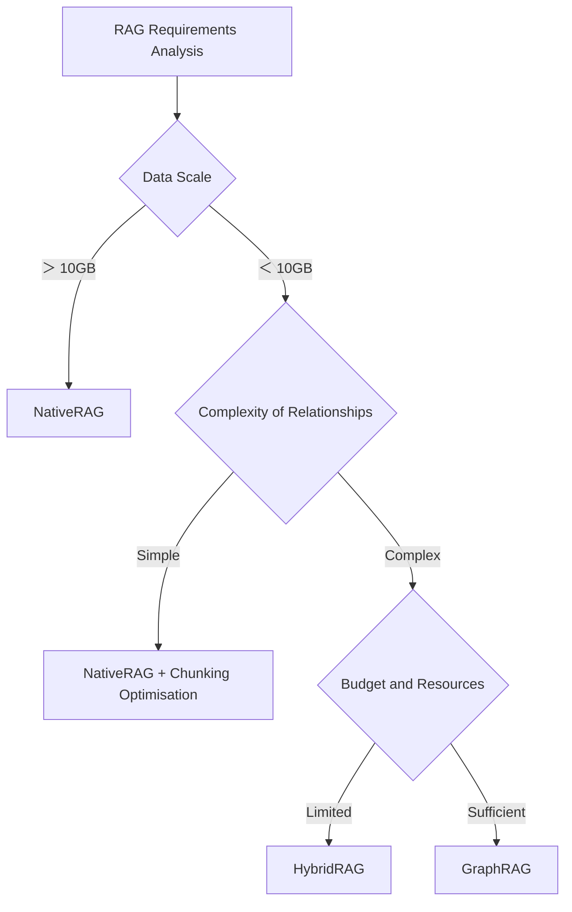
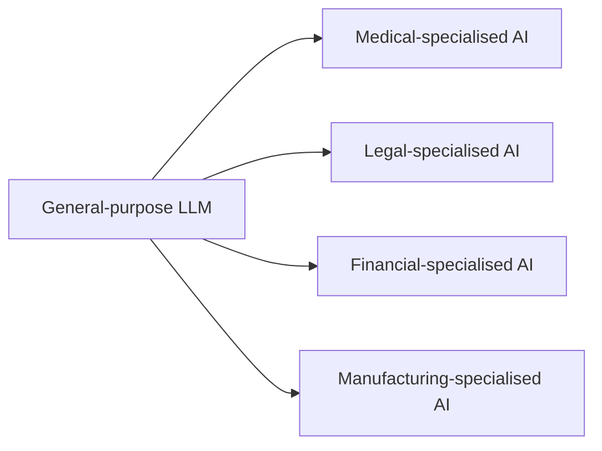

<!-- generated from articles/dev/2025-09-20-when-your-ceo-says-lets-use-ai-a-technology-selection-surviv.md by scripts/import-articles.ts - do not edit -->

Greetings from Japan.
The CEO declares: ‘Let's introduce generative AI to improve operational efficiency.’
I ask: ‘Which AI?’
‘Oh, AI. The generative sort.’
And so begins yet another episode of ‘the disconnect between broad terminology and implementation reality’.
Explaining that AI isn't magic is easy.
But making AI work requires knowledge.
When confronted with sudden, ambiguous demands from superiors, I choose to believe it's universal to switch into survival mode.
Hoping this single thought process might prove useful to someone, I've recorded it here under the title Survival Guide.
From this island nation of Japan, I sincerely pray for careful consideration by all involved with AI. I wish you every success.

## Introduction: The Overly Vague Concept of 'Generative AI'
‘Our company is also looking to boost operational efficiency through generative AI...’
‘It's all the rage, so let's use AI for something!’
We're hearing these kinds of discussions more frequently.
However, when considering implementation, we face the challenge that **the term “generative AI” is far too vague, leaving us overwhelmed by the sheer number of choices for what exactly to optimise.**

Or rather, whenever I see a seminar title like ‘Boost Business Efficiency with Generative AI!’, from a personal perspective I find myself thinking: ‘Which generative AI?’ and ‘What exactly is the goal of boosting efficiency in the first place?’
It often seems the use of generative AI itself becomes the objective, leaving the fundamental reason for pursuing efficiency improvements rather vague. This leaves me feeling rather... hmm.
Since such seminar marketing and management-related matters aren't the main theme here, I'll leave it at that. My apologies.

ChatGPT, Midjourney, Stable Diffusion, GitHub Copilot, Gemini... and the list keeps growing day and night. All of these are broadly categorised under the umbrella term “generative AI”, yet their technical stacks, performance characteristics, and application domains differ significantly.

This article presents my personal approach to **organising thoughts for technology selection**, aiming to facilitate appropriate choices.
It may resemble a framework, but it is purely my own method for organising my thoughts. My brain tends to scatter easily, so this is for me.

## Chapter 1: Classification and Characteristic Analysis Based on Technical Architecture
### 1.1 Technical Characteristics of Key Architectures
Generative AI can be broadly categorised into three types based on its underlying technology.

Transformer (Large Language Model)
I believe this is what the general public currently envisions when thinking of generative AI.
A significant achievement by OpenAI. Though Mr Altman's face visibly aged with the release of GPT-5.
```
Architecture: Self-Attention + Position Encoding
Specialised domain: Sequential data (text, code)
Computational characteristics: Parallel processing possible; memory usage proportional to the square of sequence length
Representative implementations: GPT series, BERT series, T5 series
```
**Reference Materials**:
- [Attention Is All You Need (2017) - TransformerOriginal research paper](https://arxiv.org/abs/1706.03762)
- [GPT-4 Technical Report](https://arxiv.org/abs/2303.08774)

Diffusion Model
This is the Nano Banana (Gemini 2.5 Flash Image) that's been causing quite a stir lately.
Rumour has it it tops the LM Arena rankings, and above all, I love the humour in its nickname.
```
Architecture: U-Net + Noise Scheduler
Speciality: Image and video generation
Computational characteristics: Stepwise noise removal process, longer inference times
Representative implementations: Stable Diffusion, DALL-E, Midjourney
```
**Reference Materials**:
- [Denoising Diffusion Probabilistic Models (2020)](https://arxiv.org/abs/2006.11239)
- [Stable Diffusion Technical Details](https://github.com/CompVis/stable-diffusion)

#### GAN (Generative Adversarial Network)
This is slightly outdated material and knowledge, but I'll include it here for completeness.
```
Architecture: Generator + Discriminator
Strengths: High-quality image generation (conventionally)
Computational characteristics: Unstable learning, mode collapse issues
Current status: Mainstream has shifted to diffusion models
```
**Reference materials**:
- [Generative Adversarial Networks (2014) - GAN original paper](https://arxiv.org/abs/1406.2661)

### 1.2 Quantitative Comparison of Performance Characteristics
Comparing the technical specifications of major models:


| Model | Architecture | Number of Parameters | Context Length | Inference Speed | Memory Usage |
|-------|--------------|-------------|--------------|----------|------------|
| GPT-4o | Transformer | ~2T | 128K tokens | Medium | High  |
| Gemini 1.5 Pro | Transformer | ~5T | 1M tokens | Low  | Ultra-high|
| Claude 3.5 Sonnet | Transformer | ~1.75T | 200K tokens | Medium | Medium-high|
| Stable Diffusion | U-Net + VAE | ~1B | 77 tokens | Low  | Medium |

**Considerations**:
- Context length and memory usage represent a trade-off relationship
- A large number of parameters ≠ high performance across all tasks
- Inference speed is a critical metric directly impacting practicality

**Reference Benchmarks**:
- [ChatBot Arena Leaderboard](https://lmarena.ai/leaderboard) - Real-time performance comparison
- [Open LLM Leaderboard](https://huggingface.co/spaces/HuggingFaceH4/open_llm_leaderboard) - Open-weight model evaluation

## Chapter 2: Classification and Selection Guidelines Based on Input/Output Modalities
### 2.1  Modality Matrix

| Input\Output | Text | Image | Audio | Code |
|----------|---------|------|------|--------|
| **Text** | GPT-4o, Claude, Gemini | DALL-E, Midjourney | ElevenLabs | GitHub Copilot |
| **Image** | GPT-4V, Gemini Pro | img2img (SD) | - | - |
| **Audio** | Whisper + LLM | - | Voice Cloning | - |
| **Code** | Code Llama | - | - | Code generation |

### 2.2 Technical Implementation of Multimodal Processing
Analysing the processing flow of the latest multimodal model:

```python
# GPT-4o multimodal processing (conceptual implementation)
def multimodal_processing(inputs):
    # 1. Encoding by modality
    if input.type == ‘text’:
        tokens = tokenizer(input.text)
    elif input.type == ‘image’:
        tokens = vision_encoder(input.image)
    elif input.type == ‘audio’:
        tokens = audio_encoder(input.audio)
    
    # 2. Processing in unified representation space
    hidden_states = transformer(tokens)
    
    # 3. Decoding according to output modality
    if output_type == ‘text’:
        return text_decoder(hidden_states)
    elif output_type == ‘audio’:
        return audio_decoder(hidden_states)
```
**Implementation Considerations**:
- The encoder quality of each modality influences overall performance
- Designing a unified representation space is crucial
- Memory usage during inference is the sum across all modalities

**Reference Implementation Examples**:
- [OpenAI GPT-4o Official Documentation](https://platform.openai.com/docs/guides/images-vision)
- [Google Gemini API Documentation](https://ai.google.dev/docs/multimodal_concepts)
- [Multimodal AI Implementation Guide](https://huggingface.co/docs/transformers/modality_specific_guides/vision)

## Chapter 3: Technical Comparison and Selection Criteria for RAG Architectures
### 3.1 Quantitative Analysis of the Hallucination Problem
Measuring the hallucination rate of large language models:
Measuring the hallucination rate of large language models:

Experimental setup: 1,000 fact-checkable questions
Results:
```
- GPT-4 (without RAG): 15.3% hallucination rate
- GPT-4 + NativeRAG: 4.2%
- GPT-4 + GraphRAG: 2.1%

```
### 3.2 Technical Comparison of RAG Architectures
#### NativeRAG
```python
# Basic RAG implementation
def native_rag(query, knowledge_base):
    # Vector search
    relevant_docs = vector_search(query, knowledge_base)
    
    # Prompt extension
    augmented_prompt = f"""
    Context: {relevant_docs}
    Question: {query}
    Answer based on the context:
    """
    
    return llm.generate(augmented_prompt)
```
**Technical Characteristics**:
- Implementation complexity: Low
- Search accuracy: Medium
- Response speed: High
- Infrastructure cost: Low

**Implementation Resources**:
- [LangChain RAG Tutorial](https://python.langchain.com/docs/tutorials/rag/)
- [Pinecone RAG Implementation Guide](https://docs.pinecone.io/guides/getting-started/quickstart)
- [ChromaDB Implementation Example](https://docs.trychroma.com/docs/overview/getting-started)

#### GraphRAG
```python
# Graph-based RAG implementation
def graph_rag(query, knowledge_graph):
    # Entity extraction
    entities = extract_entities(query)
    
    # Graph traversal
    subgraph = traverse_graph(entities, knowledge_graph, depth=2)
    
    # Build relational context
    context = build_relational_context(subgraph)
    
    return llm.generate_with_context(query, context)
```
**Technical Characteristics**:
- Implementation complexity: High
- Search accuracy: High
- Response speed: Medium
- Infrastructure cost: High

**Implementation Resources**:
- [Microsoft GraphRAG](https://github.com/microsoft/graphrag)
- [AWS GraphRAG実装ガイド](https://aws.amazon.com/blogs/machine-learning/improving-retrieval-augmented-generation-accuracy-with-graphrag/)
- [LightRAG](https://github.com/HKUDS/LightRAG)

### 3.3 Architecture Selection Flowchart
Even Dev didn't support mermaid syntax,
but as I'm somewhat accustomed to it,
I've written it below as is.
Apologies if this makes it difficult to read.


Regarding RAG, there are various types available.
As I've covered this in separate articles, if you wish to delve deeper into RAG, you might find these useful.


<a class="link-card" href="https://dev.to/_768dd7ab130016ab8b0a/the-era-of-choosing-rag-learning-cognitive-load-and-architecture-design-from-gpt-5s-failures-5dl3" target="_blank" rel="noopener">

<span class="link-card-body">
<span class="link-card-domain">dev.to</span>
<span class="link-card-title">The Era of Choosing RAG — Learning Cognitive Load and Architecture Design from GPT-5’s Failures</span>
</span>
</a>


## Chapter 4: Implementation Patterns and Cost Analysis
Regarding costs, I'm being quite vague here, to be honest.
After all, it depends on the scale of what you're building.
4.1 Technical Requirements by Implementation Pattern

Pattern 1: API-based
```yaml
Technical Requirements:
  - API client implementation
  - Rate limiting support
  - Error handling

Cost Structure:
  - Initial cost: ¥1 million–
  - Monthly fee: ¥100,000 to ¥1,000,000 (depending on usage)
  
Applicable scenarios:
  - Prototype development
  - Small-scale usage
```


Pattern 2: On-Premises Deployment
```yaml
Technical Requirements:
  - GPU cluster (A100 x4–8)
  - Model optimisation (quantisation, pruning)
  - Inference engine (TensorRT, ONNX Runtime)
  
Cost Structure:
  - Initial cost: ¥10 million and upwards
  - Monthly cost: ¥2 million and upwards (power, maintenance)
  
Applicable Scenarios:
  - Large-scale usage
  - Strict security requirements
```

### 4.2 Performance and Cost Trade-off Analysis

Analysis based on actual project data:

| Implementation Pattern | Initial Cost | Monthly Cost | Response Speed | Customisability | Security |
|-------------|-----------|-----------|----------|--------------|------------|
| OpenAI API | Low | Medium (variable) | High | Low | Medium |
| Azure OpenAI | Low | Medium (variable) | High | Low | High |
| On-premises (Llama) | High | High (fixed) | Medium | High | Highest |
| Hybrid | Medium | Medium | Medium | Medium | High |

**Reference Cost Analysis**:
- [LLM API Price Comparison 2025 Edition](https://aithemes.net/en/posts/llm_provider_price_comparison_tags)
- [Self-Hosting vs Cloud Cost Analysis](https://medium.com/artefact-engineering-and-data-science/llms-deployment-a-practical-cost-analysis-e0c1b8eb08ca)
- [OpenAI Pricing Calculator](https://docsbot.ai/tools/gpt-openai-api-pricing-calculator)

## Chapter 5: Practical Technology Selection Checklist
Dreaming and adventuring are important, but we mustn't forget that ultimately it falls to us to implement them – a reminder to ourselves.
This is just the bare minimum we'd expect to have in this area, really.
I imagine more detailed requirements will likely emerge later.
Personally, if you think a product could be released successfully, it might be worthwhile to draft a requirements specification for your preferred AI model before making a proposal. Ask it to reason: ‘Assuming this product fails, what are the potential failure factors at one month, three months, and six months?’
This technique has recently become a personal favourite of mine.
The timing of the period is also provisional, I suppose.
It's not good to be constantly intimidated, but there's no such thing as “absolutely impossible” when it comes to utilising AI technology, is there?
Of course, there are external factors, internal factors, company circumstances, client circumstances, and so on, but “impossible things are impossible” is indeed the case.

Technical requirements to be confirmed prior to implementation:

```markdown
## Functional Requirements
- [ ] Input modalities (text/image/audio)
- [ ] Output modalities (text/image/audio)
- [ ] Data processing volume (single instance/large batch)
- [ ] Response speed requirements (real-time/batch)

## Non-Functional Requirements
- [ ] Security Level (Public/Private)
- [ ] Availability Requirement (99.9%/99.99%)
- [ ] Scalability (Number of Users/Number of Requests)
- [ ] Operational Maintenance Structure (In-house/Outsourced)

## Business Requirements
- [ ] Budget constraints (initial/operational)
- [ ] Implementation deadline
- [ ] Target ROI
- [ ] Compliance requirements

```
### 5.2 Technology Selection Decision Tree Approach
```python
def select_generative_ai(requirements):
    if requirements.modality == 「text_only」:
        if requirements.context_length > 100000:
            return 「Gemini 1.5 Pro」
        elif requirements.safety_first:
            return 「Claude 3.5 Sonnet」
        else:
    return 「GPT-4o」
    
    elif requirements.modality == 「multimodal」:
        if requirements.real_time_voice:
            return 「GPT-4o」
        else:
            return 「Gemini Pro」
    
    elif requirements.modality == 「image_generation」:
        if requirements.quality > requirements.speed:
            return 「Midjourney」
        else:
            return 「Stable Diffusion」
    
    elif requirements.modality == 「code_generation」:
        return 「GitHub Copilot」 or 「Claude 3.5 Sonnet」
```
### 5.3 Approach to Phased Implementation
This is also a tentative outline, considering goals in a somewhat vague manner.
I've written down what I imagine it might look like for this particular goal.

Implementation strategy to increase the likelihood of success:

#### Phase 1: Proof of Concept (1-2 months)
```
Objective: Technical validation and identification of challenges
Implementation: Small-scale prototype using APIs
Budget: ¥1-5 million
Evaluation Metrics: Accuracy, Speed, Usability
```

#### Phase 2: Pilot (3-6 months)
```
Objective: Validate effectiveness in actual operations
Implementation: Full-scale operation with limited users
Budget: ¥5-20 million
Evaluation Metrics: ROI, User Satisfaction, Operational Load
```

#### Phase 3: Full Rollout (6-12 months)
```
Objective: Company-wide deployment and scaling
Implementation: Stable operation in production environment
Budget: ¥20 million-
Evaluation Metrics: Business impact, TCO
```
## Chapter 6: Technical Pitfalls During Implementation and Countermeasures
### 6.1 Common Implementation Mistakes
#### Neglecting Prompt Engineering
```python
# Bad example
prompt = f‘Summarise this document: {document}’

# Good example
prompt = f‘’"
Please summarise the following document into three key points:

Document:
{document}

Summary format:
1. [Key point 1]
2. [Key point 2]
3. [Key point 3]

Please describe each key point concisely in one sentence.
‘’"
```
#### Inadequate Context Management
```python
# Bad example: No context overflow prevention
def chat_with_history(message, history):
    full_context = ‘\n’.join(history) + ‘\n’ + message
    return llm.generate(full_context)

# Good example: Proper context management
def chat_with_history(message, history, max_tokens=4000):
    # Truncate context based on importance
    important_history = select_important_messages(history)
    context = truncate_to_token_limit(important_history, max_tokens)
    return llm.generate(context + ‘\n’ + message)
```
Let's be thorough in our battle against overflow (a word to the wise)

### 6.2 Performance Optimisation Techniques
Frankly, this area is largely dependent on the fundamental design itself.
Caching, in particular.

```python
# Performance comparison: single request vs batch processing
single_request_time = 2.3  # seconds
batch_request_time = 8.1   # seconds (batch of 10 items)
batch_efficiency = 10 * single_request_time / batch_request_time  # 2.8 times faster
```
#### Caching Strategy
```python
from functools import lru_cache
import hashlib

@lru_cache(maxsize=1000)
def cached_llm_call(prompt_hash):
    return llm.generate(prompt)

def generate_with_cache(prompt):
    prompt_hash = hashlib.md5(prompt.encode()).hexdigest()
    return cached_llm_call(prompt_hash)
```
### Technical Analysis of Successful Cases
A few well-known places that seem easy to understand.
When it comes to Japanese material, I believe that with your skill, you could persuade your company's senior figures by presenting overseas (Japanese) data as a benchmark, demonstrating successful examples.
Personally, though, I prefer learning from failures – even if such cases don't circulate widely – over focusing solely on success stories.

#### Panasonic Connect ‘ConnectAI’
```yaml
Technology Stack:
  - Base Model: Large Language Model (details undisclosed)
  - RAG Architecture: Specialised for internal documents
  - Infrastructure: Cloud + On-premises hybrid

Implementation Highlights:
  - Quality enhancement through prompt refinement functionality
  - Structuring and indexing internal data
  - Phased user rollout
```
**Reference Material**: [Panasonic Connect AI Use Cases](https://connect.panasonic.com/jp-ja/products-services/dx/connect-ai)

#### Obayashi Corporation ‘AiCorb’
```yaml
Technology Stack:
  - Image Generation: Stable Diffusion-based
  - Input Processing: Sketch Recognition AI
  - Output Optimisation: Fine-tuning specialised for architectural drawings

Implementation Highlights:
  - Development of domain-specific models
  - Intuitive UI/UX design
  - Integration of learning data incorporating architectural expertise
```
**Reference Material**: [Obayashi Corporation AiCorb Presentation Materials](https://www.obayashi.co.jp/news/detail/news20240201_1.html)

### 7.2 Technical Analysis of Failure Patterns
Personally, I'm not fond of the term “best practice”, so consider this merely a reference.
Particularly in the prompt domain, I've been wondering lately whether being bound by best practices is really the way to go.
Underestimating usage forecasts can be seen as a welcome problem if usage exceeds expectations.

Common failures and their technical causes:
#### Failure Pattern 1: Insufficient Accuracy
```
Cause: Inadequate prompt engineering
Countermeasure: Systematic prompt optimisation
```
**Reference Material**: [Prompt Engineering Best Practices](https://platform.openai.com/docs/guides/prompt-engineering)

#### Failure Pattern 2: Response Speed Issues
```
Cause: Inappropriate model selection, insufficient optimisation
Countermeasure: Model selection tailored to requirements, inference optimisation
```
**Reference Material**: [LLM Inference Optimisation Guide](https://huggingface.co/docs/transformers/llm_tutorial_optimization)

#### Failure Pattern 3: Excessive Operational Costs
```
Cause: Underestimation of usage volume, architectural design flaws
Countermeasures: Phased scaling, cost monitoring framework
```
**Reference Material**: [AI Operational Cost Management Guide](https://aws.amazon.com/blogs/machine-learning/optimize-ai-workload-costs-and-efficiency-with-amazon-bedrock-and-aws-cost-optimization-hub/)

## Chapter 8: Future Technology Trends and Their Impact on Choices
### 8.1 The Technical Impact of AI Agentisation

```python
# Traditional AI: Single task execution
def traditional_ai(task):
    return llm.generate(task)

# AI Agent: Autonomous execution combining multiple tools
class AIAgent:
    def __init__(self):
        self.tools = [web_search, calculator, file_reader, email_sender]
    
    def execute_task(self, task):
    plan = self.create_plan(task)
    for step in plan:
        tool = self.select_tool(step)
        result = tool.execute(step)
        if self.task_completed(result):
            return result
    return self.synthesize_results()
```
### 8.2 The Rise of Vertical AI
Frankly, this area has strong implications for matters of life and death, labour issues, and livelihoods, so I suspect specialised AI will emerge rather quickly.
That said, the resulting rush of approvals and usability assessments will be quite demanding, of course.
But particularly in Japan's case, I feel it's likely to become notably specialised AI.
Whereas in places like the US, the style is for people to adapt to the tools, Japan has historically favoured adapting tools to people. So perhaps AI will follow suit? That's one rather vague thought I have.


**Technical Implications**:
- The importance of domain-specific fine-tuning
- Industry-specific datasets and annotations
- Tailored compliance requirements

**Reference Cases**:
- [Vertical AI Market Analysis 2025](https://www.nea.com/blog/tomorrows-titans-vertical-ai)
- [Case Studies on the Implementation of Medical AI](https://cloud.google.com/transform/101-real-world-generative-ai-use-cases-from-industry-leaders)
- [Financial AI Case Studies](https://www.mckinsey.com/industries/financial-services/our-insights/the-future-of-work-in-technology-in-financial-services)

## Conclusion: A Decision-Making Framework for Implementers
### Technology Selection Decision Process

1. **Clarifying Requirements**
   ```
   What → Which modality → At what accuracy → At what speed
   ```

2. **Evaluating Technical Constraints**
   ```
   Budget → Security → Scalability → Operational framework
   ```

3. **Phased Implementation Plan**
   ```
   Proof of Concept → Pilot → Full Rollout → Improvement Cycle
   ```

4. **Continuous Optimisation**
   ```
   Performance Monitoring → Cost Monitoring → User Feedback → Implementation of Improvements
   ```

### Finally: Selecting the Right Technology for the Right Purpose and Making Pragmatic Judgements

It is crucial not to be misled by the broad concept of “generative AI” and instead make choices based on specific technical requirements. However, it must be emphasised that what is written in this article is merely one example for the purpose of organising one's thinking.
#### A Practical Technology Selection Process
In actual projects and products, decisions require a combination of the following factors:

**Requirements × Budget × Performance Testing = Final Technology Selection**

Japanese projects in particular offer even more options:

**Examples of Japanese-specialised models**:
- **ELYZA-japanese-Llama-2**: Japanese fine-tuned version
- **Swallow**: Japanese LLM developed by Tokyo Institute of Technology
- **Japanese Stable LM**: Japanese version from StabilityAI
- **Rinna**: Specialised for Japanese dialogue
- **CyberAgent OpenCALM**: Commercially available

I wonder whether specialisation in one's own native language outside the English-speaking world might also emerge?
Given that Japanese is often cited as one of the most challenging languages to learn outside Asia, I do find myself thinking that having a strong grasp of it is a significant advantage.
Well, a product specifically targeting Japanese and English might be rather unusual, though.
It depends on the product.
These options must be evaluated along axes such as purpose (conversation vs document generation vs code generation), size (7B vs 13B vs 70B), licence (commercial use permitted or not), and Japanese language capability (via translation vs native training).

#### A Practical Approach
1. **Clarifying Requirements**: Organising using a framework
2. **Narrowing Down Candidates**: Selection based on budget and resource constraints
3. **Actual Testing**: Performance evaluation using our own use cases
4. **Phased Implementation**: Starting small and gradually scaling up

 **It is crucial to note that English-language evaluation metrics cannot be directly applied to Japanese contexts.**

 Ultimately, actually testing it in your specific use case will provide the most reliable basis for judgement.

Technology is a means to an end. I imagine those reading this article understand that. Probably.
Clearly define the problem you wish to solve, then select the most suitable technology for it.
If you stumble here, someone will suffer. Tremendously. Yes.
Paradoxically, one might say that when English-speaking regions consider the unique language of Japanese, it presents considerable difficulty.

## Reference Materials and Resources
### Technical Papers and Architectural Research
- [Attention Is All You Need (Original Transformer Paper)](https://arxiv.org/abs/1706.03762)
- [RAG vs. GraphRAG Comparative Study](https://arxiv.org/abs/2502.11371)
- [Comprehensive Survey of AgenticRAG](https://arxiv.org/abs/2501.09136)

### Implementation Frameworks and Tools
- [LangChain Official Documentation](https://python.langchain.com/docs/introduction/)
- [Microsoft GraphRAG](https://github.com/microsoft/graphrag)
- [LightRAG - Lightweight RAG Implementation](https://github.com/HKUDS/LightRAG)
- [Awesome RAG Resource Collection](https://github.com/Danielskry/Awesome-RAG)

### Cost Analysis and Price Comparison
- [LLM API Price Comparison 2025 Edition](https://aithemes.net/en/posts/llm_provider_price_comparison_tags)
- [Practical Analysis of LLM Deployment Costs](https://medium.com/artefact-engineering-and-data-science/llms-deployment-a-practical-cost-analysis-e0c1b8eb08ca)
- [RAG System Cost Optimisation](https://ragaboutit.com/aws-s3-vectors-vs-traditional-vector-databases-the-enterprise-cost-analysis-that-changes-everything/)

### Corporate Implementation Case Studies
- [Google Cloud - 101 Practical AI Case Studies](https://cloud.google.com/transform/101-real-world-generative-ai-use-cases-from-industry-leaders)
- [20 Essential AI Implementation Case Studies](https://enterpriseaiexecutive.ai/p/20-must-read-ai-case-studies-for-enterprise-leaders)
- [Panasonic ConnectAI Case Studies](https://connect.panasonic.com/jp-ja/products-services/dx/connect-ai)

### Benchmarking and Evaluation
- [ChatBot Arena Leaderboard](https://lmarena.ai/leaderboard)
- [Open LLM Leaderboard](https://huggingface.co/spaces/HuggingFaceH4/open_llm_leaderboard)
- [Stanford AI Index Report 2025](https://hai.stanford.edu/ai-index/2025-ai-index-report)

### AI Agent Framework
AI Agent Framework
- [Google Agent Development Kit](https://developers.googleblog.com/en/agent-development-kit-easy-to-build-multi-agent-applications/)
- [LangGraph Multi-Agent Systems](https://langchain-ai.github.io/langgraph/concepts/multi_agent/)
- [CrewAI Platform](https://www.crewai.com/)
- [Moveworks Agentic Frameworks Guide](https://www.moveworks.com/us/en/resources/blog/what-is-agentic-framework)
