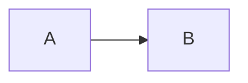

<!-- generated from articles/zenn/2026-07-23-astro-bilingual-blog-implementation.md by scripts/import-articles.ts - do not edit -->

## はじめに

[前回の記事](/blog/personal-site-tech-selection/)で「なぜ Astro + GitHub Pages にしたか」を書きました。
今回はその続き、**実装編**です。

### Astroって何

**[Astro](https://astro.build/)** はコンテンツ中心のWebサイト向けの静的サイトジェネレータです。
Markdownで書いた記事をHTMLに変換してくれる、という点ではHugoやJekyllと同じ。違うのは、**デフォルトでクライアントJavaScriptをゼロにする**設計思想。

設計の核になっているのが**アイランドアーキテクチャ**。ページ全体を静的HTMLで出力した上で、インタラクションが必要な部分だけをReactやVueの「島」として埋め込む方式です。島を足さなければ完全な静的HTMLが出る。
TypeScript-first で、ビルド時のデータ取得やコンテンツの型検証が強力。ブログ、ドキュメントサイト、ポートフォリオあたりが得意ゾーンです。

初版リリースは2022年8月（v1.0）。静的サイトジェネレータとしては後発で、Hugo（2013年〜）やGatsby（2015年〜）の世代が踏んだ地雷をうまく避けた設計になっています。Gatsby が GraphQL 必須で敷居を上げたのに対して、Astro は素の `fetch` やファイル読み込みでデータを取れる。Hugoがテンプレート言語に閉じた世界なのに対して、Astroは `.astro` ファイルの中で普通にTypeScriptが書ける。

あと、AI時代のコーディングとの相性が良い。`.astro` ファイルは1ファイルにフロントマター（ロジック）とテンプレート（HTML）とスタイルが収まる単機能コンポーネントなので、**コーディングエージェントに渡すコンテキストが小さく済む**。実際、このサイトの大半のコンポーネントは100行前後で完結していて、「このファイルをこう変えて」で意図が通ります。

### この記事で書くこと

作ったのは日英バイリンガルの技術ブログ + 自己紹介サイト。完全静的生成で、ランタイムJSはほぼゼロ。

実装してみて「これは汎用的に使えるな」と思ったパターンを5つに絞って書きます。
Astroを採用候補にするときの検討材料になればと思います。

## 1. Content Collections のスキーマ設計

Astro の Content Collections は、Markdownのフロントマターに **Zodスキーマで型を付ける** 仕組みです。
これがTypeScript-firstで開発するときに非常に効きます。

```ts
// src/content.config.ts
import { defineCollection, z } from 'astro:content';
import { glob } from 'astro/loaders';

const blog = defineCollection({
  loader: glob({ pattern: '**/*.md', base: './src/content/blog' }),
  schema: z.object({
    title: z.string(),
    description: z.string(),
    date: z.coerce.date(),
    tags: z.array(z.string()),
    lang: z.enum(['ja', 'en']),
    pair: z.string().optional(),
    source: z.enum(['zenn', 'dev', 'original']),
    accent: z.string().default('#E5007F'),
  }),
});
```

ポイントをいくつか。

**`lang` を `enum` で持つ**。
日英をディレクトリで分けつつ（`blog/ja/`, `blog/en/`）、スキーマでも言語を明示する。ページ側で `getCollection('blog', p => p.data.lang === 'ja')` とフィルタするだけで言語別の一覧が取れます。i18nライブラリ（多言語対応の翻訳管理ライブラリ）不要。

**`pair` で日英ペアを繋ぐ**。
相手言語の記事slugを入れておくだけ。ビルド時に `pair` があればENバッジを出す、なければ出さない。nullable にしておくのが大事で、「全記事にペアがある」前提にすると運用が破綻します。

**`date` は `z.coerce.date()`**。
フロントマターの文字列 `'2026-07-23'` を自動でDateオブジェクトに変換してくれる。地味だけど毎回 `new Date()` しなくて済むのがありがたい。

**`accent` でカテゴリ色を持つ**。
記事のタグから決定したアクセントカラーをフロントマターに焼き込んでおく（後述の取り込みスクリプトで自動付与）。ページ側はこの値をそのまま `style` に渡すだけ。

スキーマに合わないMarkdownが混ざると **ビルドが落ちる**。
これが良い。44本の記事を一括取り込みしたとき、フロントマターの不備が全部コンパイルエラーとして出てくれたので、1本ずつ目視で確認する必要がなかったです。

## 2. 記事変換パイプライン

既存記事をZennやDev.toから移植する場合、**プラットフォーム固有の記法を変換する**工程が必要です。
もちろん他のサイト（はてなブログ・Medium・WordPress）などからの移植でも変換は必要ですね。

うちのサイトでは TypeScript の取り込みスクリプト（`scripts/import-articles.ts`）がこれを担当しています。元ファイルは一切改変せず、変換結果だけを `src/content/blog/` に出力する方式。

### 変換カタログ

変換すべき記法をリストアップすると、こうなります。

**Zenn（日本語記事）**:

| 記法 | 変換先 |
| ---- | ---- |
| `:::message` / `:::message alert` | `<aside class="callout">` |
| `:::details タイトル` | `<details><summary>` |
| `[URL](URL)` / bare URL自動カード化 | リンクカード（HTML） |
| `[URL](URL)` | 静的ツイート引用 or リンク |
| ` ```js:filename.js `（ファイル名付き） | ファイル名をボールドで前置 + コードブロック |
| ` ```diff js ` | `diff` のみに正規化 |

**Dev.to（英語記事）**:

| 記法 | 変換先 |
| ---- | ---- |
| `` 等のLiquid Tags | Markdownリンク |
| `...` | `<details><summary>` |
| `` | `$$` ブロック |
| 手動 Table of Contents + `<a name>` アンカー | 検出して除去 |

ここではZennとDev.toだけ挙げていますが、はてなブログ（`[~~]`記法、`[:contents]`自動目次）やMedium（エクスポートがHTML）、WordPress（ショートコード）等でも、変換対象が変わるだけで構造は同じです。

Mermaid対応の有無、テーブル記法の違い、数式の書き方など、サイトごとに「何が独自で何が標準Markdownか」はけっこう違います。移植前に元サイトの記法ドキュメントを一通り確認しておくと、変換漏れで表示が崩れる事故を防げます。

### 実装のコツ

行単位のストリーム処理で書くと見通しが良くなります。

```ts
function convertBody(body: string): string {
  const out: string[] = [];
  let inCode = false;

  for (const line of body.split('\n')) {
    // コードブロック内は変換しない
    if (/^```/.test(line)) {
      inCode = !inCode;
      out.push(line);
      continue;
    }
    if (inCode) {
      out.push(line);
      continue;
    }
    // ここでプラットフォーム固有の変換を適用
    out.push(convertLine(line));
  }
  return out.join('\n');
}
```

**コードブロック内をスキップする**のが最重要。これを忘れるとサンプルコード内の `:::` や `` まで変換してしまう。

もう1つ、**リンクカード**は単独行のリンクを検出してHTML化する仕組みで作りました。ビルド時に og:title と og:image を fetch してJSONにキャッシュし、2回目以降はキャッシュから読む。記事が増えてもfetchは新規URLだけです。

Xのステータスリンクは、syndication APIからテキストを取得して **静的な引用カード** にしています。クライアントJSゼロでツイート埋め込み相当のことができる。react-tweet の内部で使われているのと同じエンドポイントです。

### site-only / devto-only マーカー

同じ原稿からサイト版とDev.to版を出し分けるために、HTMLコメントでマーカーを入れています。

````markdown
<!-- site-only -->

<!-- /site-only -->

<!-- devto-only -->
（Dev.toではMermaidがレンダリングされないため、テキストで説明）
A → B の関係です。
<!-- /devto-only -->
````

取り込みスクリプト側で対象外ブロックを除去し、マーカー自体も消す。ZennはHTMLコメントをそのまま無視する（プラットフォーム側で透過する仕様）ので、日本語原稿にマーカーが残っても表示に影響しません。

## 3. ビルド時OGP画像生成

**[satori](https://github.com/vercel/satori) + [@resvg/resvg-js](https://github.com/nicolo-ribaudo/resvg-js)** でOGP画像（1200x630）をビルド時に生成しています。

satoriはReact-likeなJSXをSVGに変換するライブラリで、**フォントのバイナリが必要**。ここがグリフ数の多いフォントを使うときの鬼門です。

### フォントサイズの罠

Noto Sans JP のフルセットは約5MB。日本語に限らず、CJKフォントやグリフ数の多い書体を選ぶと同じ問題が起きます。
記事が50本あると、50回×5MBの処理が走ってビルドが死にます。
ビルドが走る、つまりトークンがその分溶ける、ということですね。

解決策は **Google Fonts のサブセット機能**。
Thank you Google。

```ts
// Legacy UAを指定してwoff/TTFを取得（satoriはwoff2を解析できない）
const LEGACY_UA = 'Mozilla/5.0 (Windows NT 6.1; rv:10.0) Gecko/20100101 Firefox/10.0';

async function fetchGoogleFont(spec: string, text: string): Promise<ArrayBuffer[]> {
  const chars = [...new Set(text)];
  // &text= パラメータで必要なグリフだけを含むサブセットを取得
  const cssUrl = `https://fonts.googleapis.com/css2?family=${spec}&text=${encodeURIComponent(chars.join(''))}`;
  const css = await (await fetch(cssUrl, { headers: { 'User-Agent': LEGACY_UA } })).text();
  const url = css.match(/src:\s*url\((.+?)\)\s*format\('(?:woff|opentype|truetype)'\)/)?.[1];
  return (await fetch(url)).arrayBuffer();
}
```

**全記事のタイトルを結合して、出現する文字だけのサブセットフォントを1回だけ取得する**。これで数十KBに収まります。ビルドが速くなった上に、文字化けも起きない。

もう1つの罠: satoriは **woff2を解析できない**。Google Fonts はモダンブラウザにはwoff2を返すので、User-Agentを古いブラウザに偽装してwoff/TTFを取得する必要があります。知らないと「フォントを渡しているのに何も描画されない」で原因が分からず時間を溶かします。

### Astroのエンドポイントで返す

OGP画像はAstroの静的エンドポイント（`.png.ts`）として実装します。

```ts
// src/pages/og/blog/[slug].png.ts
export async function getStaticPaths() {
  // 記事一覧からパスを生成
}

export async function GET({ props }) {
  const png = await renderOgImage({ /* ... */ });
  return new Response(png, { headers: { 'Content-Type': 'image/png' } });
}
```

ビルド時に全記事分のPNGが `dist/og/blog/slug.png` に書き出される。GitHub Pages、Cloudflare Pages、Netlify等、静的ホスティングならどこでもそのまま配信できます。

## 4. Tailwindトークン再定義でダークモード

ダークモードを入れるかどうかは好みの話です、日本国内では。個人的には反射で入れる派ですが、OS設定に従う方式、トグルで切り替える方式、そもそも対応しない方式、どれも選択肢としてあり得ます。ここでは「入れると決めた後、どう実装するか」の話。

最初は `dark:` プレフィックスを全要素に付ける方式を考えていました。やめました。面倒すぎる。

代わりに採用したのが **Tailwindのカラートークンを丸ごと再定義する方式**。

```css
/* ライトモード: デフォルトのまま */

/* ダークモード: トークンを再マッピング */
html[data-theme="dark"] {
  color-scheme: dark;
  --color-white: #010101;
  --color-neutral-200: #262626;
  --color-neutral-300: #404040;
  --color-neutral-400: #525252;
  --color-neutral-600: #a3a3a3;
  --color-neutral-700: #d4d4d4;
  --color-neutral-900: #ededed;
}
```

`bg-white` と書けば、ライトモードでは白、ダークモードでは黒になる。**既存のクラスを一切変更せずにダークモードが完成する**。

ただし、**テーマに関係なく固定したい要素**（全画面メニュー、記事ヒーロー、フッター等）がある。これらには `.theme-fixed` クラスを付けて、トークンを元に戻します。

```css
html[data-theme="dark"] .theme-fixed {
  color-scheme: light;
  --color-white: #ffffff;
  --color-neutral-200: #e5e5e5;
  /* ... 元の値に戻す */
}
```

設計上のルールは「**アクセントカラーはテーマで変えない**」。黒白だけが反転し、刺し色はそのまま。モノクロ×刺し色のデザインだとこれが自然にハマります。

### 白フラッシュ防止

ダークモードユーザーがページを開いた瞬間、一瞬白く光る問題。`<head>` 内にインラインスクリプトを置いて、描画前にテーマを適用します。

```html
<script is:inline>
  try {
    if (localStorage.getItem('theme') === 'dark')
      document.documentElement.dataset.theme = 'dark';
  } catch {}
</script>
```

`is:inline` でAstroのバンドルから外す。これがないと描画に間に合いません。

### コントラスト比の落とし穴

トークンを反転させただけで安心してはいけない。**ダークモードではWCAG AAのコントラスト比（通常テキスト4.5:1、大きいテキスト3:1）を満たさなくなる色が出てくる**。

実際このサイトでは、ライトモードで問題なかった `neutral-500`（`#737373`）がダークモードの背景（`#010101`）に対して 4.40:1 しかなく、AA基準を割っていました。`#7a7a7a` に調整して 4.86:1 に。たった数値1つの差だけど、ツールで検証しないと気づけない。
というかAIコーディングだとこの視点が漏れていたので、抜けてるよ～と。

トークン再定義方式は便利だけど、**反転後の全組み合わせでコントラスト比を再検証する必要がある**。正直、この辺りガン無視しているサイトも日本だと多いんですが、やるからにはちゃんとやりたい。Chrome DevToolsのアクセシビリティパネルか、[WebAIM Contrast Checker](https://webaim.org/resources/contrastchecker/) で確認できます。

### アクセシビリティ基準と各国の温度差

ダークモードに限らずですが、Webアクセシビリティの法的な扱いは国によってかなり違います。

- **EU**: European Accessibility Act（EAA）が2025年6月に施行。民間の商用サイト・アプリにもWCAG 2.1 AA準拠を義務化
- **米国**: ADA（障害者差別禁止法）がWebサイトにも適用される判例が積み上がっていて、訴訟リスクが現実にある
- **日本**: JIS X 8341-3（WCAGベース）はあるけど、公共機関向けの努力義務どまり。民間への法的拘束力は弱い

個人サイトに法的リスクがどこまであるかは別として、**英語圏向けにコンテンツを出すなら「配慮」ではなく「基準」として意識しておく方が良い**。
私は日英で発信をしていた都合上この辺りを気にする癖がついていますが、英語記事を載せるサイトを作る人は押さえておくと安心です。

参考:

- [WCAG 2.2 — Success Criterion 1.4.3 (Contrast)](https://www.w3.org/WAI/WCAG22/Understanding/contrast-minimum.html)
- [European Accessibility Act (EAA)](https://ec.europa.eu/social/main.jsp?catId=1202)
- [Tailwind CSS — Dark Mode](https://tailwindcss.com/docs/dark-mode)

## 5. アイランドアーキテクチャとゼロJSパターン

Astroの「アイランドアーキテクチャ」は、ページの大部分を静的HTMLにして、インタラクションが必要な部分だけをReactやVueの「島」にする思想です。名前は聞いていたけど、実装してみると**思想として良い**と感じたのと、**コードとしても良い**の両方がありました。

思想としては、**「足す」設計**なのが好ましい。SPAフレームワークは全部JSで動かした上で静的部分を最適化する（引き算）。Astroは全部静的にした上で、必要な部分だけJSを足す（足し算）。デフォルトが軽い側にあるので、何もしなければ壊れない。

コードとしては、結果的に**ほとんどの島が要らなかった**のが面白い。当初はReactアイランドでテキストアニメーションを入れる計画もあったんですが、メニューもダークモード切替もコピーボタンも全部素のJSで事足りた。Mermaidも動的importで済んだ。「島にするかどうか」の判断を迫られる時点で、本当にJSが必要か再考する機会になる。結果、このサイトのReact依存はゼロです。

これはパフォーマンスの話でもあるけど、**保守性の話でもある**。
クライアントにJSが無ければ、状態管理も要らないし、ハイドレーションの不整合も起きない。壊れる部分が物理的に存在しない。

じゃあインタラクションはどうするのか。素のJSで十分だったパターンをいくつか。

### 全画面メニュー: inert で閉じ込める

フォーカストラップをJSで自作すると面倒ですが、`inert` 属性を使えば一発です。

```js
const setOpen = (open) => {
  menu.classList.toggle('hidden', !open);
  // メニュー以外の全要素を inert にする
  for (const el of document.body.children) {
    if (el !== menu) el.toggleAttribute('inert', open);
  }
  if (open) closeBtn.focus();
};
```

`inert` を付けた要素はTab移動もスクリーンリーダーも完全にスキップされる。
`<dialog>` を使わなくても、アクセシブルなモーダルが作れます。

### Mermaid: 遅延ロード

Mermaid.js はバンドルサイズが大きい（600KB+）。全ページで読み込むのは論外です。

```js
// 記事内に mermaid ブロックがある場合だけ、
// IntersectionObserver で図が画面に近づいたら CDN から動的 import
const io = new IntersectionObserver((entries) => {
  if (entries.some((e) => e.isIntersecting)) {
    io.disconnect();
    const { default: mermaid } = await import(
      'https://cdn.jsdelivr.net/npm/mermaid@11/dist/mermaid.esm.min.mjs'
    );
    mermaid.initialize({ startOnLoad: false, theme: 'neutral' });
    // pre[data-language="mermaid"] を <div class="mermaid"> に置換して実行
    await mermaid.run();
  }
}, { rootMargin: '400px' });
```

Mermaidを使わない記事ではスクリプトが一切ロードされません。使う記事でも、図がビューポートの400px手前に来るまで遅延される。

### フォント: 非同期ロード

Google Fonts のCSSを同期で読むと、フォントがレンダリングをブロックします。

```html
<!-- printメディアで読み込み、完了後にallに切替 -->
<link rel="stylesheet" href={fontsHref} media="print" onload="this.media='all'" />
<noscript>
  <link rel="stylesheet" href={fontsHref} />
</noscript>
```

`media="print"` + `onload` のトリック。ブラウザはprint用CSSをレンダリングブロックしないので、フォントが非同期で読み込まれる。`<noscript>` はJS無効環境のフォールバック。

## おわりに

5つのパターンを振り返ると、共通するテーマは「**ビルド時にできることはビルド時にやる**」です。

OGP画像もリンクカードもツイート引用も、ビルド時に生成してしまえばクライアントJSは要らない。
ダークモードはCSSカスタムプロパティの再定義で済む。Mermaidのような巨大ライブラリは、必要なページで必要なタイミングだけ読む。

Astroの「デフォルトゼロJS」は制約ではなく設計指針で、これに沿って考えると自然と軽いサイトになります。

技術選定の話は[前回の記事](/blog/personal-site-tech-selection/)に書いたので、合わせてどうぞ。

このサイト自体がソースコードです。[GitHub](https://github.com/akari-iku/akari-iku.github.io)で全コードを公開しています。
