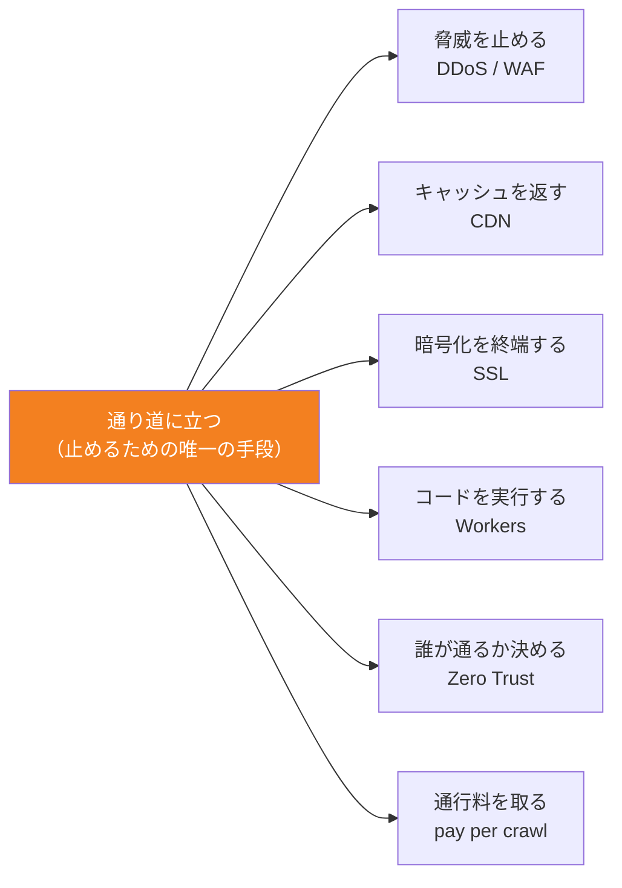

<!-- generated from articles/zenn/2026-08-10-cloudflare-design-philosophy.md by scripts/import-articles.ts - do not edit -->

## はじめに

Cloudflare OSの話を3本書きました。ローカルLLMで三目並べに5ラウンドかけた奮闘記、モデル間の受け渡し設計の話、セキュリティとガバナンスの話。

<a class="link-card" href="https://akari-iku.github.io/blog/cloudflare-os-local-llm/" target="_blank" rel="noopener">

akari-iku.github.io
Cloudflare OSをVRAM 8GBのゲーミングPCで動かしたら、三目並べ1個に5ラウンドかかった話 | akari.log

</a>

<a class="link-card" href="https://akari-iku.github.io/blog/multi-model-handoff/" target="_blank" rel="noopener">

akari-iku.github.io
複数モデルで開発するなら、受け渡し方法も設計しておくといい | akari.log

</a>

<a class="link-card" href="https://akari-iku.github.io/blog/cloudflare-os-security-design/" target="_blank" rel="noopener">

akari-iku.github.io
AIエージェントを「安全に暴れさせる」設計。Cloudflare OSのセキュリティとガバナンスを読む | akari.log

</a>

3本目でこう書きました。「思想さえ理解すれば、この環境は怖くない」と。

……で、その思想って結局なんやねん、という。

自分で書いておいて回収してないんですよ。ずるい。
もうしわけない、ちゃんと書きます。よろしくね。
なので4本目です。1つのプロダクトで4本、もう完全に沼です。
さすがにラストです。

ただ今回はCloudflare OSの記事ではありません。**Cloudflareという会社そのものの設計思想**の話です。というのも、Cloudflare OSを読み込む、触っていくほど「これ、この会社が16年前からやってることと全く同じでは？」という気がしてきたので。

操作の手引きではなく、**Cloudflareの製品と向き合うときの初手の怖さと億劫を少しだけ減らすこと**です。管理画面を開く前に、判断の基準を1本だけ持っておく。それだけで大分違うので。多分ね。

先に結論を置きます。

> **Cloudflareがやっていることは、ひとつだけ。トラフィックの通り道に自分が立って、そこで全部処理する。**

これだけです。CDNもDNSもWAFもWorkersもZero TrustもAIクローラー課金もCloudflare OSも、全部この一点から導出できます。

そしてこれ、特段私の幻覚とか謎解釈じゃなくて、調べたら公式が全部言ってました。というわけで一次ソースを辿りながら確認していきます。

## 社名が答えを言っている

始まりは2004年、Cloudflareですらない頃。Matthew PrinceとLee Hollowayが立ち上げた**Project Honey Pot**というプロジェクトでした。

問いはシンプルで、「メールスパムはどこから来るのか？」。サイト運営者が、スパマーがどうやってメールアドレスを収集しているかを**追跡**できる仕組みです。185カ国、数千サイトが参加するくらいには育ちました。

で、ユーザーから繰り返し来た要望がこれ。

> 追跡はいいから、**止めてくれ**。

ここが分岐点です。追跡は外から観測すればできる。でも**止めるには、通り道に立つしかない**。この要望に応えようとした瞬間、アーキテクチャの選択肢は「間に入る」の一択になります。

2009年、MatthewはハーバードビジネススクールでMichelle Zatlynと出会い、この話をします。Michelleは即座に「止める側に行くべき」と反応し、二人は事業計画を書き始めます。同年4月にHBSのビジネスプランコンテストで優勝、7月に法人設立。
速度が速すぎる、3か月でスピードが速すぎる。

そして社名。最初の事業計画名は「Project Web Wall」だったんですが、響きが悪い。友人が「**クラウド上のファイアウォール**を作ってるんだから Cloudflare だろ」と提案して、それが定着しました。

つまり、この会社の名前は最初から「**通り道に立つ壁**」という意味なんですよ。CDN企業でもDNS企業でもない。社名が思想を宣言している。

ここまでの経緯は、公式の [Our Story](https://www.cloudflare.com/our-story/) に年表として載っています。読み物として普通に面白いのでおすすめです。

## CDNはおまけだった

ここが個人的に一番痺れたところです。

創業時、投資家やアドバイザーから来た最大の懸念はこれでした。

> 間に挟まったら、**レイテンシが増えるだろ**。

まっとうな指摘です。ユーザーとオリジンの間に第三者が立つんだから、素直に考えれば遅くなる。セキュリティのために速度を犠牲にするのか、と。

この懸念に対するCloudflareの反応が、公式ストーリーにこう書かれています。

> the team became obsessed with stamping out latency anywhere in the system
> （チームはシステムのあらゆる場所からレイテンシを撲滅することに取り憑かれた）
>
> 出典: [Our Story](https://www.cloudflare.com/our-story/)

そして2010年6月、Project Honey Potコミュニティ向けのプライベートベータ。返ってきたユーザーの声が、

> 保護されただけじゃなくて、**読み込みが平均30%速くなった**。

……順序、逆なんですよ。

一般的なイメージだと「CDN企業のCloudflareがセキュリティも始めた」だと思うんです。
というか私もセキュリティ周りからだと思ってたくらいです。
実際は逆で、**セキュリティのために通り道に立った → 立ってしまったからキャッシュも返せた → ついでに速くなった**。CDNは目的じゃなくて、通り道に立ったことの副産物として出てきています。

同年9月27日、TechCrunch Disruptで正式ローンチ。

この順序を理解すると、後の全プロダクトの見え方が変わります。Cloudflareは「通り道に立つ」を先に決めていて、そのあと「立ってしまったからには、ここで何ができるか」を**16年間ずっと探している会社**なんです。
青年漫画っぽくて良いなあって思ってしまう私です。

一点から放射状に出てるだけで、横方向の連携で組み上がった図じゃないんですよね。だから「なんでこの会社CDNもDNSもセキュリティもやってるの？」という問いは、そもそも問いとして成立していない。全部同じことをしているので。

## 通り道を1台のコンピュータにする

「通り道に立つ」を決めたら、次の問題は「その通り道をどう作るか」です。

普通のインフラ設計だと、機能ごとに役割を分けたくなります。この拠点はWAF専用、あっちはZero Trust用、こっちは最適化用、みたいに。効率的に見えるので。

Cloudflareはこれをやりません。

> Anycast allows us to keep the networking setup uniform across all edge data centers. We applied the same design inside our data centers - our software stack is uniform across the edge servers. **All software pieces are running on all the servers.**
>
> 出典: [Cloudflare architecture and how BPF eats the world](https://blog.cloudflare.com/cloudflare-architecture-and-how-bpf-eats-the-world/)

全サーバーが、全ソフトウェアを動かしている。2020年に発表した自社設計サーバー「Gen X」の[記事](https://blog.cloudflare.com/cloudflares-gen-x-servers-for-an-accelerated-future)に至っては、副題が文字通り **"Every server can run every service"** です。

なぜこうするのか。**通り道を1本に保つため**です。

機能ごとに拠点を分けると、1つのリクエストが「WAF拠点に寄って、Zero Trust拠点にも寄って……」とネットワーク内を跳ね回る（ヘアピンする）ことになる。それは通り道が複数本に分岐するということで、レイテンシが増えるし、どこで何が起きたかも追いにくくなる。

全サーバーが全機能を持っていれば、パケットがどこに着地しても、**その場で全部の処理が1パスで終わる**。通り道が1本のまま保たれる。

創業時の「レイテンシを撲滅しろ」という強迫的観念が、そのままアーキテクチャの形になっているわけです。セキュリティのための設計とパフォーマンスのための設計が、同じ決定から出ている。

そして2019年、CloudflareはSun Microsystemsが1984年に掲げ、Oracle買収後に失効していた商標を[拾って自社登録します](https://www.cloudflare.com/press-releases/2019/cloudflare-registers-trademark-for-the-network-is-the-computer/)。

> **The Network is the Computer**

ネットワークがコンピュータである。Matthew Princeのコメントが「巨人の肩の上に立っている」なのがまた良いんですが、それ以上に、**通り道そのものを1台の巨大なコンピュータとして扱う**という思想を、わざわざ商標という形で宣言したのが強い。ポエムじゃなくて設計の記述なんですよね、これ。

現在で世界330以上の都市に展開し、Webトラフィックの約20%。ここまで来ると、通り道はもう「立っている場所」ではなく「地形」です。

## 通り道でコードを動かす

2017年、Workers。愛用している人も多いのじゃないですかね。
ここ最近本当に個人の開発とかはこれだよ～、というのも身近で増えました。
ここで通り道の支配権が**開発者に開放**されます。

作った理由が、身も蓋もなくて好きです（出典は発表時のブログ [Code Everywhere: Why We Built Cloudflare Workers](https://blog.cloudflare.com/code-everywhere-cloudflare-workers/)。以下この節の引用は全部ここからです）。

> **It all comes down to the speed of light.**
> （すべては光速の問題に行き着く）

コードがデータセンター1箇所にあると、地球の裏側のユーザーは物理的に待たされる。光速は変えられない。なら**コードのほうをユーザーの近くに置く**しかない。通り道を全世界に持っているCloudflareにとって、これは「持っているものの使い道」の話でした。

面白いのは、既存のやり方を検討した上で捨てているところです。
何を捨てるか、はいつだって難しいです。
nginxのconfやVarnishのVCLを開発者に開放する案もあった。でも、

> they are much too restrictive to really unleash the power of code at the edge
> （エッジでコードの力を本当に解き放つには、制約が強すぎる）

設定ファイルの表現力では足りない、と。
ここで出てくる結論が、この記事全体でもたぶん一番大事なフレーズです。

> **code turns Cloudflare from a service to a platform**
> （コードが、Cloudflareをサービスからプラットフォームに変える）

つまりWorkersは「エッジコンピューティング製品を作りました」ではなく、**通り道の支配権を、部分的にユーザーへ譲り渡す決断**なんですよ。うちが握っている通り道の上で、あなたのコードを動かしていい、と。

実装の決め手が「コンテナの次は何か → isolates（ブラウザのサンドボックス技術）」だったのも一貫しています。全サーバーが全サービスを動かす均質なネットワークに、重いコンテナは乗らない。軽くないと通り道全体に置けない。**アーキテクチャがランタイムの選択を決めている**。

そしてここから先の製品は、全部この延長で説明がつきます。

| 製品 | やっていること |
| --- | --- |
| Workers | 通り道でコードを実行する |
| Durable Objects | 通り道の途中で状態を持つ |
| Hyperdrive | 通り道から外部DBへ近いレイテンシで繋ぐ |
| R2 | 通り道の途中にデータを置く（出口料金を取らない） |
| Cloudflare One / Magic | 通り道そのものを仮想ネットワークにする |

名前は全部違うし、カテゴリもバラバラに見えます。でもやってることは「通り道でできることを1つ増やす」だけ。新製品が出るたびに「また覚えることが増えた」と思うか「またあれの派生か」と思うかは、この一点を知っているかどうかで変わります。
プロダクトの思想を理解していると「お、また工事して検問増やしたのね。今度はどんなん？」となるくらいになります。

## 通り道に境界を引き直す

Zero Trustも同じ形です。

従来のネットワークセキュリティは「[城と堀](https://www.cloudflare.com/learning/access-management/castle-and-moat-network-security/)」でした。境界の外は危険、内側は安全。VPNで堀を渡った人は信頼される。この前提は、リモートワークとSaaSで完全に崩壊しました。守るべきものが城の中になく、守るべき人も城の中にいない。

Zero Trustは「never trust, always verify」、内側も信頼しないという原則です。ここまでは業界共通の話。

Cloudflareの解き方が面白いのは、**境界をなくしたわけではない**ところです。

境界を**自社の通り道に移した**んですよ。城の壁を壊して更地にしたんじゃなくて、壁を自分たちのネットワークの上に引き直した。だから「誰がこの線を通るか」を、リクエスト単位で毎回検証できる。

2020年1月にAccess（アクセス制御）とGateway（外向き通信のフィルタ）を束ねたCloudflare for Teams、同年10月に [Cloudflare One](https://blog.cloudflare.com/introducing-cloudflare-one/) として統合。SASEというカテゴリ名がつきましたが、Cloudflareにとっては新規事業ですらない。

**すでに全世界に通り道を持っていて、そこで全機能が動く均質なネットワークがある**。ならそこに社員の通信を通せば、それがそのままZero Trustプラットフォームになる。既存資産の使い道がまた1つ増えた、というだけの話です。

他社が「セキュリティ製品を作って、それをどう配るか」を考えるところで、Cloudflareは「もう配り終わっているので、あとは何を載せるか」から始まる。この非対称性はえげつない。
本当に日本という島国へのマーケティングがお上手じゃないところだけど、しっかりやってるんですよねえ。

## 通り道で課金する

2025年7月1日、Cloudflareは **[Content Independence Day](https://blog.cloudflare.com/content-independence-day-no-ai-crawl-without-compensation/)** を宣言しました。

新規ドメインではAIクローラーを**デフォルトでブロック**。そして **[pay per crawl](https://blog.cloudflare.com/introducing-pay-per-crawl/)**。サイト運営者がクローラーに課金できる仕組みです。

技術的にどうやったかというと、**HTTP 402 Payment Required を復活させた**。1990年代から仕様に存在しつつ、ほぼ誰にも使われないまま眠っていたステータスコードです。実質死んでいた仕様を、掘り起こして実装した。

Matthew Princeの言い分は「Webがクローラーに露天掘り（stripmined）されていて、作り手にトラフィックも対価も還ってこない」。

私がここで唸ったのは、主張の是非より**これができるのが誰かという話**です。

AIクローラーへの課金を「やろう」と思う会社はたくさんあると思うんですよ。
その方が儲かりますし。
でも実際にできるのは、**そのリクエストが物理的に通る場所に立っている者だけ**です。Webトラフィックの20%が自分の上を流れているから、402を返すという選択肢が存在する。持っていなければ、そもそも構想が成立しない。

DDoSを止めるのも、AIクローラーに課金するのも、Cloudflareにとっては完全に同じ操作です。**通り道を通るものを見て、通すか、止めるか、条件をつけるか**。判断のロジックが違うだけで、機構は2010年から1ミリも変わっていない。

[2025年の創業者レター](https://blog.cloudflare.com/cloudflare-2025-annual-founders-letter/)にある一節も、この文脈で読むと解像度が上がります。

> Our mission is not to "build a better Internet" but to "**help** build a better Internet."

「help」にこだわるのは、単独ではできないという謙虚さの表明だと説明されています。それはそうなんですが、同時にこれ、**通り道に立つ者の自己認識**でもあると思うんですよ。通り道は自分のものではあるけれど、そこを流れるコンテンツも、繋がる先のサービスも、全部他人のもの。所有ではなく通過を握っている立場からしか出てこない言い方だな、と。

そういえば2014年の [Universal SSL](https://blog.cloudflare.com/introducing-universal-ssl/)
全顧客に無料でHTTPSを提供して、Web全体の暗号化率が一晩で倍になったやつのときも、Matthewはこう書いていました。

> **The Internet is a belief system**

短期の売上を捨てる判断を取締役会全員が支持した、という話とセットで出てくる一文です。通り道を持っている者が、その通り道を全部暗号化する。思想とビジネスが同じ方向を向いているとこういうことができるんだな、と思わされます。
一般的にどうしても短期回収の方に目が行きますし、中長期の提案も考慮はするが、という領域です。
取締役会全員が支持、という事の異質さがすごい。中々見れない文章ですよ。

## そしてCloudflare OS

で、2026年8月の [Cloudflare OS](https://blog.cloudflare.com/cloudflare-os/) です。

3本目の記事で一番硬派だと書いたのが **Gatekeeper** でした。

<a class="link-card" href="https://akari-iku.github.io/blog/cloudflare-os-security-design/" target="_blank" rel="noopener">

akari-iku.github.io
AIエージェントを「安全に暴れさせる」設計。Cloudflare OSのセキュリティとガバナンスを読む | akari.log

</a>

AIエージェントに認証情報を一切渡さず、外部サービスへのアクセスは1サービス1ラッパーのWorkerが仲介する。全操作をログに残し、副作用のある操作は承認キューを通す。自動フックですら例外なく通る。AIエージェントに認証情報を一切渡さず、外部サービスへのアクセスは1サービス1ラッパーのWorkerが仲介する。全操作をログに残し、副作用のある操作は承認キューを通す。自動フックですら例外なく通る。

これ、改めて見ると**構造が完全に見覚えのある形**なんですよ。

| | 2010年 | 2026年 |
| --- | --- | --- |
| 何と何の間に立つか | ユーザー ⇄ オリジン | エージェント ⇄ 外部API |
| 何を止めるか | DDoS、悪性リクエスト | 認証情報の漏洩、想定外の副作用 |
| どうやって | 逆プロキシとして間に立つ | 逆プロキシ（Worker）として間に立つ |
| 何が残るか | 全リクエストのログ | 全操作のログと承認履歴 |

要するに **Gatekeeperは、AIエージェント向けの逆プロキシ**です。名前が新しいだけ。

というか名前も新しくないんですよ。**Gatekeeper＝門番**。通り道に立って、通す・通さないを決める者。「クラウド上のファイアウォール」という社名の由来と、比喩として完全に同じです。16年後の新製品のコンポーネントが、創業時と同じ喩え方をしている。

この命名の癖は他も同じで、**Observer**（観測者）、**Blueprint**（設計図）、**Gadget**（小道具）、**Durable Objects**（永続オブジェクト）。全部、日常語で役割を説明しに来ています。Blueprintと言われたら「共有されるのは設計であって中身ではない」と察しがつくし、Observerと言われたら「見ている人がいる」という話だと分かる。**独自の造語で煙に巻かない**。

ドキュメントを読む前に半分わかる、という状態がここで作られています。地味ですが、これも「思想が読み取れる」の一部だと思います。

そしてもうひとつ、**経路を1本に保つ**というあの原則も、そのまま貫かれています。

ネットワーク側で「全サーバーが全サービスを動かして、1パスで終える」とやっていたのと同じことを、ソフトウェアの中でやっているんですよ。Gadgetのコードにはネットワークアクセスが与えられないので、外に出る道はGatekeeperしかない。サブエージェントに渡されるツールも2つだけ。自動フックですら承認キューを通る。**分岐も裏口も作らない**。

これ、窮屈にするための制約に見えて、順序が逆なんですよね。**経路が1本だから、全部見られるし、記録できるし、止められる**。
ずっとCloudflareのスタンスはこれなんですよ。
3本目で硬派だと書いたObserver機構共有しても権限が漏れないやつが成立するのも、Gadgetの読み取りが全部その1本を通るからです。抜け道が1本でもあった瞬間に、あの検証は意味を失います。

極めつけが **Blueprint** です。

Gadgetは `.gadget` ファイルとして外に持ち出せます。ファイルって、渡してしまったら最後、どこへ行ったか追えないんですよ。**経路の外**です。

じゃあそこが穴なのかというと、逆でした。**持ち出されて困るものが、最初から入っていない**。共有されるのはコードの「形」だけで、認証情報もDBの中身もチャット履歴も含まれない。受け取った側は、自分の権限で繋ぎ直さないと何も動かせない。

追跡できない経路には、追跡すべきものを流さない。ファイルという一番制御しにくい形式に対する答えが、禁止ではなく**渡しても意味を持たないものにする**なんですよね。

しかも中身が空っぽなわけじゃないんです。設計としてはちゃんと価値がある。**渡す価値はあるのに、漏れても困らない**。この非対称の作り方がうまい。持ち出しは自由、でも持ち出したところで、その人の権限を超えるものは何も付いてきません。

美しいな、と思います。少なくとも私は。

「通り道を1本に保つ」を、私は最初レイテンシのための設計だと思っていました。でも**制御可能性のための設計**でもあった。エッジのアーキテクチャとAIエージェントのガバナンスが、同じ一文で説明できてしまうわけです。

3本目で「持たせない、渡さない、迂回させない」が7レイヤを貫いていると書きましたが、あれが可能なのは、Cloudflareが**通り道を握る以外のやり方をしないから**だと思います。エージェントにAPIキーを配って「気をつけて使ってね」というのは、Cloudflareの発想だとありえない。それは通り道の外で物事が起きるということなので。

共有しても権限が漏れないObserver機構も同じです。「Gadgetが読める範囲を、見ている人全員の権限の共通部分まで狭める」という設計は、**すべての読み取りが通り道を通っていて、そこで毎回判定できる**という前提がないと成立しません。

Cloudflare OSが「AIエージェント基盤」として突然変異的に出てきたように見えるなら、それは名前のせいです。やっていることは、**新しい種類のトラフィックが生まれたので、そこにも立った**というだけ。

AIエージェントが外部システムを叩くという、2026年に急増している新しい通信。Cloudflareがそこで最初にやることは決まっています。**間に立つ**。16年間ずっとそうしてきたので。

だから怖くないに多少はなりましたかね？
権限や連携、細かい設定に癖はあるけど、彼らが何を思ってこうしているのかがわかると、あ、はいはいと多少はなれるかな、と思います。

## おまけ：10年越しのリベンジだった

Cloudflare OSの公開時に、個人的に一番グッときた後日談があります。

Workersの生みの親である **Kenton Varda** 本人が、Cloudflare OSについてこう書いていました。

> This is a remake of Sandstorm.io, my startup from 10 years ago
> （これは10年前の私のスタートアップ、Sandstorm.io のリメイクだ）
>
> 出典: [Kenton Varda 本人のポスト](https://x.com/KentonVarda/status/2084990137180590572)

[Sandstorm.io](https://sandstorm.io/about) は、Webアプリのセルフホスティング基盤です。売りは**ケーパビリティベースのセキュリティ**で、アプリを細かい単位で隔離し、権限を「持っているかどうか」で厳密に制御する。そのために自作したRPCシステムが Cap'n Proto。ちなみにこの人、Google時代はProtocol Buffers v2をほぼ書いた人で、Google Driveの共有とアクセス制御もやっています。**キャリアの最初から一貫して同じ問題を触っている**。

で、Sandstormは**商業的に失敗しています**。

原因は身も蓋もなくて、アプリ側をプラットフォーム向けに改造しないと載らない設計だったこと。対応アプリが増えない→ユーザーが増えない→対応アプリが増えない、の鶏と卵から抜けられなかった。開発チームは2017年頃にCloudflareへ迎えられ、そこで彼が始めたのがWorkersです。ホスティングサービスのOasisは2019年に停止。会社自体は2022年まで畳めなかったと本人が書いていて、しかも「Cloudflareに$0で買ってもらって、あっちの問題にしてもらうべきだった」とまで言っている。苦労が滲みます。

そして2026年、Cloudflare OS。**GadgetはSandstormでいう Grain の再来**だそうです。

ここで唸ったのが、10年前に足りなかったピースの正体でした。Sandstormを殺したのは「アプリを誰が用意するのか」という問題です。Cloudflare OSでは、**AIがその場で書く**。鶏と卵の輪が、外から来た要素で断ち切られている。

さらに、3本目で「いちばん硬派」と書いたObserver機構共有しても権限が漏れない、confused deputy問題を解くやつは、ケーパビリティセキュリティのど真ん中の課題です。Cap'n Protoの作者が10年以上温めてきたものが、そのまま製品として出ている。

会社が16年間ずっと同じことをしていて、その中にいる一人も10年以上ずっと同じことをしている。**思想が一貫している製品の裏には、だいたい一貫している人がいる**という話でもあると思います。

## Appleとの距離

ちょっと寄り道を。

垂直統合という点だけ見ると、CloudflareとAppleは似ています。ハードからソフトまで自分で握って、他社に依存しない。Cloudflareに至ってはサーバーを自社設計しています。

でも思想は真逆に近いです。

Appleの垂直統合は**ユーザーに複雑さを一切見せない**ためのもの。閉じた世界で完璧にコントロールして、「美しく、直感的で、魔法のように動く」を実現する。ユーザーに理解を要求しません。

Cloudflareの垂直統合は**通り道を1本に保つ**ためのもの。そして握った支配権を、Workersのようにかなりの部分ユーザーに開放してしまう。「複雑さは内部で吸収するけど、思想は理解してくれ」というスタンスです。

だから体験の質が違います。Appleが「何も考えなくても美しく動く」なら、Cloudflareは「**設計思想を理解した人間には、この上なく美しい**」。理解する側に美意識を要求するタイプ。
なので、まあはやってるし、コスト的にも良いしとか便利とか、色々な意味でCloudflareやるも良いですが、触ってみて合わなかった、でも良いと思ってます。
個人的に。

たぶんジョブスがCloudflareのダッシュボードを見たら「設定項目が多すぎる」と言うと思うんですよ。それは正しい指摘です。
実際やれる事も見るものも慣れないうちは、大変ですし。
でも裏側の「通り道を完全に握る」という潔さ自体は、あの人も嫌いじゃないんじゃないかな、という気がします。妥協がないという点では同種なので。

ここで言いたいのは優劣ではなくて、**プロダクトには思想があって、それを理解することにはちゃんと実利がある**ということです。そして思想には合う・合わないがある。理解した上で「自分はAppleのほうが好き」なのは全く健全で、理解しないまま「Cloudflareは難しい」と言うのとは別のことです。

## 迷ったときの判断基準

そろそろまとめます。

3本目で「Cloudflare初心者すぎて外部連携で手間取っている」という声に触れました。あれに対する私の答えは「操作じゃなくて判断が難しいんだ」だったんですが、今回の整理を経て、もう少し具体的に言えます。

**Cloudflareで迷ったら、「それは通り道のどこに置かれているものか」を考えてください。**

これで大体解けます。製品ごとに並べるとこうです。

- **WAF / DDoS防御**：なぜこちらが何も置かなくても守られるのか → 通り道の入口に最初からいるから。オリジンに届く前に終わっている
- **Workers**：なぜ実行時間もメモリも厳しいのか（ネイティブモジュールも不可） → 通り道の全地点に配るから。重いものは全世界には置けない。制約は妥協ではなく前提
- **Durable Objects**：なぜ同じIDのインスタンスが世界に1つだけなのか → 通り道の途中で状態を持つには、その置き場所を1箇所に決めるしかないから
- **Cloudflare One**：なぜVPNの置き換えになるのか → 境界が城の壁から通り道の上へ移っているから
- **Gatekeeper（Cloudflare OS）**：なぜエージェントにAPIキーを渡さないのか → 渡した瞬間、処理が通り道の外へ出るから。外に出たものは止められない
- **管理者による無効化**：なぜ既存Gadgetが持っている能力までは取り上げられないのか → 通り道の制御は将来のトラフィックにかかるもので、過去には遡れないから

そして最後に、全部に共通する線引きがこれです。

- **どこまで繋いでいいか** → 通り道を通るものは全部見られ、記録され、止められる。逆に言えば**通り道の外に出す設計にした瞬間、Cloudflareの保証は全部切れる**

「Cloudflareの内側に留める設計か、外に出す設計か」。実務ではこれが一番大事だと思います。

**どこまで製品の保証が効く話なのか**の線引きなので、少なくとも議論の出発点は決まります。レビューが片付くとまでは言いません。内側に留めたところで設計の妥当性は誰も見てくれないので、そこは3本目に書いたとおりです。

そしてこの見方は、作る側からも引けます。

**「自分がやりたいことは、通り道のどこで起きることか」**。これが決まると、使うパーツもだいたい決まる。

- リクエストが来た瞬間に処理したい → 通り道の上で動かす → **Workers**
- その処理に状態を覚えておいてほしい → 通り道の途中に持つ → **Durable Objects**
- 大きいデータを置いておきたい → 同じく途中に置く → **R2**
- 手元のDBに繋ぎたい → 通り道から外へ繋ぐ → **Hyperdrive**
- 社員の通信ごと通したい → 通り道を仮想ネットワークにする → **Cloudflare One**

製品名から入ると「これとこれ、何がどう違うの」で止まります。でも**置き場所から入ると、そもそも候補が重ならない**。同じ地点に2つ用意する、という作り方をしていないので。

新製品が出たときも同じで、「で、これは通り道のどこに置くやつ？」が分かれば、自分に要るかどうかはその場で判断できます。

「Cloudflare、製品が多すぎて分からん」ってなるのは、まあ自然なんですよ。実際多いので。ただ**全部を把握しておく必要はない**という話でもあって、必要になったときに必要なものを置き場所から引けばいい。カタログを暗記する種類の作業ではないです。

3本目で「安全である」と「作れる」は別の軸だと書きました。それは今も変わりません。境界を引く判断、いつ止めるかの判断、何をもって完成とするかの判断は、人間に残り続けます。

ただ、**判断の材料になる思想のほうは、驚くほどシンプル**でした。16年分の製品群を貫いている原理が、たった一行で書けてしまう。

> トラフィックの通り道に自分が立って、そこで全部処理する。

これを握っていれば、次に何が発表されても慌てなくて済むと思います。たぶんまた「通り道でできることが1つ増えた」だけなので。

シンプルすぎて、逆に美しいんですよね。

## で、あとは触ってください

身も蓋もない着地をします。

ここまで16年分辿ってきましたが、**これを読んだだけでCloudflareが使えるようにはなりません**。最後は触るしかない。

ただ、触る前に変えられるものがひとつあると思っていて、それが**初手の怖さ**のほうです。

管理画面を開いて設定項目の多さにうっと来るとき。新製品の発表を見て「また覚えることが増えた」とうんざりするとき。外部連携で「これ繋いで大丈夫なんか？」と手が止まるとき。

あの止まり方って、項目が多いこと自体が原因じゃないんですよ。**何を基準に判断すればいいか分からない**から止まる。

基準が1本あれば、そこは軽くなります。「これは通り道のどこに立ってる話か」。それだけ握って触りに行けば、少なくとも迷子にはならない。間違えはしますけど、**間違えたことには気づける**。これが結構でかいと思っていて。

そして触っていると、今度は逆方向が起きます。**あとから思想のほうが読めてくる**。

これ、Cloudflareに限った話じゃないんですよね。良いプロダクトって、慣れてくると随所に設計意図が透けて見えてくる。「なんでここがこの挙動なんだ」と思った部分が、しばらくして「あ、あっちと同じ考え方か」に変わる瞬間があって、そこから急に読み解きやすくなる。世の中そういうプロダクト、結構あります。

全然違う業界の例だと、キーエンスの [KI](https://analytics.keyence.com/)（データ分析プラットフォーム）なんかもそうだと思っていて。あれ、触ると**会社の思想がまるまる落ちている**のが分かるんですよ。要因ツリーで真因まで掘らせる作り、専門スキルを前提にしない設計、使い方だけでなくノウハウごと渡してくる伴走支援。全部あの会社が現場でやってきたことの写しです。公式も「キーエンスにおけるデータ活用のノウハウを具現化したプロダクト」と言い切っていて、**分析ツールというより自社の型そのものを製品にした**という感じ。

構図はCloudflareと同じです。**自分たちがやってきたことを、そのまま製品の形にして外に出している**。だから触っていると、設計意図のほうが見えてくる。

逆に、触っていると**苦しさ**のほうが出てくる製品もあります。これ、何も無いんじゃないんですよ。**複数の思想が同居している**やつ。無思想ならまだ軽いんですが、衝突は触る側に負荷として来ます。あっちの画面とこっちの画面で、そもそも世界の捉え方が違うので。

大規模なM&Aで育った製品群は、どうしてもこうなりがちです。Salesforce系はMuleSoft、Tableau、Slackと大型買収を重ねていますが、あそこは**買収先を半自律で走らせる方針**を明示的に取っていました（Slack買収時も、Butterfield氏がCEOのまま事業部門として継続する形）。買ったものの良さを壊さない判断としては、正しいと思います。ただ結果として、思想は並列に同居することになる。統合の遅さは投資家からも指摘され続けていて、これは製品の出来の問題というより**成長のさせ方の必然**です。

じゃあCloudflareが買収していないかというと、全然しています。Area 1 Security（メールセキュリティ）、Nefeli Networks（マルチクラウド）、BastionZero（インフラへのZero Trustアクセス）。ただ全部、**Cloudflare Oneという一本の通り道に溶かしてから出てくる**。買収先のブランドが独立した製品として棚に並ぶ形にはしていません。

どちらが正しいという話ではなく、トレードオフです。Salesforceは「買ったものの良さを保つ」を取り、Cloudflareは「一貫性」を取った。触ったときの手触りの差は、だいたいここから来ています。

Googleは面白い中間例で、一般提供まで上がったものは結構一貫している一方、研究リリースやラボ系は個人の思想が生で出ていることが多い。GAまでの過程そのものが**思想のフィルタ**になっているんでしょうね。

いずれにせよ、**思想が読み取れるかどうか自体が、わりと品質の指標**なんじゃないかと思っています。

そして一貫していることの実利は、**学習が転移する**ことです。

同じ会社からいくつも製品が出ていて、1つ覚えたら次が半分わかる状態。手になじむ、というのともちょっと違って、単純に理解しやすいんですよ。Cloudflareで言えば、Workersの制約が腑に落ちた人はDurable Objectsの位置づけで悩まないし、Gatekeeperを理解した人はZero Trustの設計に驚かない。**毎回ゼロから学び直さなくていい**。

思想がバラバラだと、ここが効きません。製品ごとに前提を入れ替える必要があって、10個あれば10回学ぶことになる。同じ会社の名前がついているのに、です。

製品数の多さが**負債になるか資産になるか**は、たぶんここで決まります。Cloudflareの製品リストがあれだけ長いのに窒息しないのは、増えているのが製品数であって、覚えるべき原理の数ではないからです。

その意味でCloudflareは、読み解きの手応えがある側です。16年分の製品を並べて一本の線が引けてしまうくらいには、ブレていない。

なので、プロダクトへの向き合い方としては、歩み寄りというより**探検**なんだと思っています。

歩み寄りだと、相手の作法に合わせに行く受け身になる。探検は、こっちから地形を見に行く能動です。しかも収穫が「一貫していて綺麗だった」でも「ここが境界線か」でも、**どっちでも成果になる**。読み解けなかった製品も、読み解けないという事実が分かった時点で探検としては成功なので。

面倒くささがゼロになるとは言いません。なりません。でも「怖い」が「面倒」まで下がって、「面倒」が「まあやるか」まで下がったら、この記事は仕事をしたことになるかなと。

あと一応言っておくと、**私はCloudflareのベンダーでも社員でもパートナーでもないです**。ただの一利用者が勢いで4本書いてしまっただけ。褒めすぎに見えていたらすみません、設計が綺麗だと嬉しくなってしまう性分なんです。

そのうち普通に文句も書くと思います。たぶん。

---

## 参考にした一次ソース

- [Our Story | Cloudflare](https://www.cloudflare.com/our-story/)：Project Honey Potから現在までの公式年表
- [Code Everywhere: Why We Built Cloudflare Workers](https://blog.cloudflare.com/code-everywhere-cloudflare-workers/)：Workersの設計動機
- [Cloudflare architecture and how BPF eats the world](https://blog.cloudflare.com/cloudflare-architecture-and-how-bpf-eats-the-world/)：均質アーキテクチャとリクエスト処理の実際
- [Cloudflare's Gen X: Servers for an Accelerated Future](https://blog.cloudflare.com/cloudflares-gen-x-servers-for-an-accelerated-future)："Every server can run every service"
- [Cloudflare Registers Trademark for The Network is the Computer®](https://www.cloudflare.com/press-releases/2019/cloudflare-registers-trademark-for-the-network-is-the-computer/)：商標取得の発表
- [Introducing Universal SSL](https://blog.cloudflare.com/introducing-universal-ssl/)："The Internet is a belief system"
- [Introducing Cloudflare One](https://blog.cloudflare.com/introducing-cloudflare-one/)：Zero Trustプラットフォームの統合
- [Content Independence Day: no AI crawl without compensation!](https://blog.cloudflare.com/content-independence-day-no-ai-crawl-without-compensation/)：AIクローラーのデフォルトブロック
- [Introducing pay per crawl](https://blog.cloudflare.com/introducing-pay-per-crawl/)：HTTP 402の復活
- [Cloudflare's 2025 Annual Founders' Letter](https://blog.cloudflare.com/cloudflare-2025-annual-founders-letter/)："help" build a better Internet
- [What is the castle-and-moat network security model?](https://www.cloudflare.com/learning/access-management/castle-and-moat-network-security/)：従来モデルとZero Trustの対比
