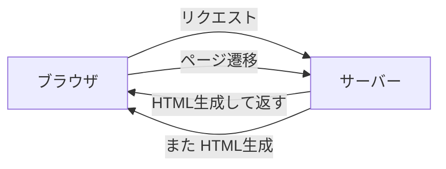
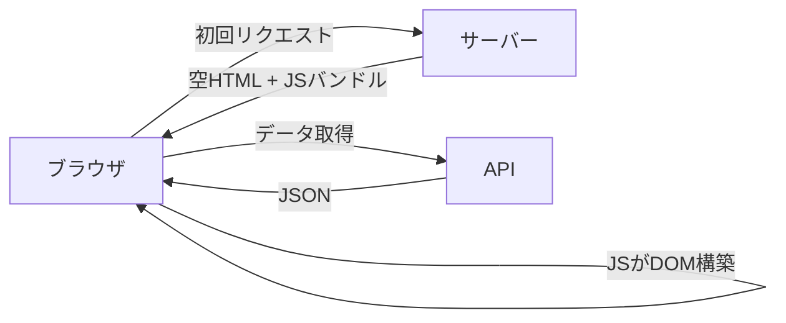
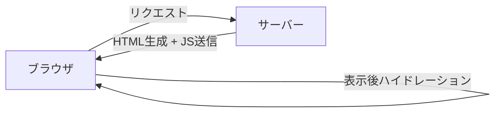
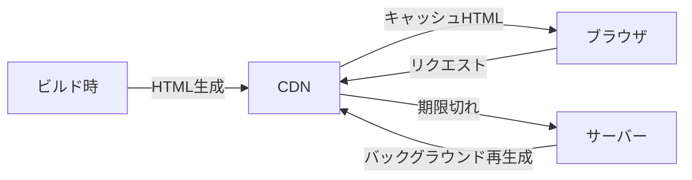
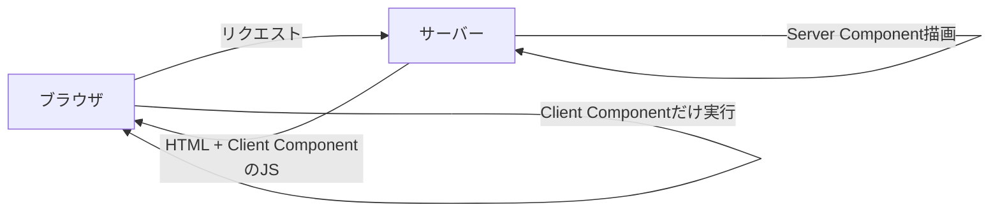
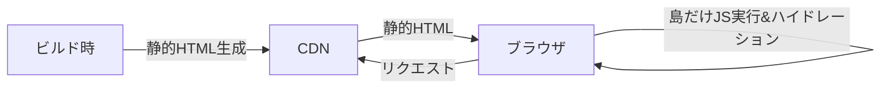
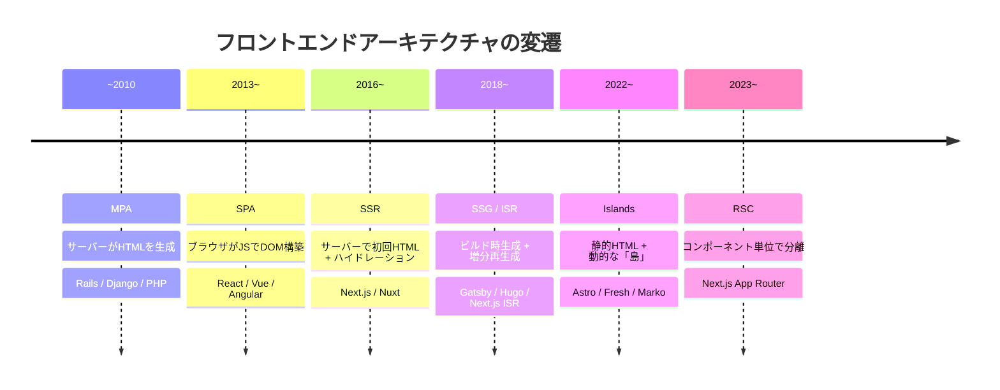

<!-- generated from articles/zenn/2026-07-25-frontend-architecture-landscape.md by scripts/import-articles.ts - do not edit -->

## はじめに

フロントエンドのアーキテクチャ、選択肢が多すぎませんか。

MPA、SPA、SSR、SSG、ISR、RSC、Islands。略語だけで7つ。
それぞれのフレームワークが「うちが最適解です」と主張していて、比較記事を読むほど混乱する。

先日、個人サイトをAstroで作りました。
なぜAstroを選んだかは「[個人サイト、結局何で作る？](https://akari-iku.github.io/blog/personal-site-tech-selection/)」に、実装パターンは「[Astroで日英ブログを作って分かった5つの実装パターン](https://akari-iku.github.io/blog/astro-bilingual-blog-implementation/)」に書いています。

技術選定編で「お試しアイランドアーキテクチャチャレンジも、立派な選定理由のひとつです」と書いて、「面白いオチになったので別記事にします」と予告していた、あの話です。

この記事では自サイトの実装から一歩引いて、フロントエンドアーキテクチャの全体像を整理します。
レンダリング戦略の変遷、アイランドアーキテクチャの思想と実際、そして結局どう選ぶかの話。

正解はないんですけど、選択肢の輪郭が見えていると選びやすくはなる。
輪郭は一度触ってみて初めてはっきりします。

## 「誰がHTMLを作るか」の歴史

フロントエンドアーキテクチャの変遷は、突き詰めると「**誰がHTMLを作るか**」の問いの歴史です。

サーバーが作るのか、ブラウザが作るのか、ビルド時に作るのか。
それぞれが何を解決して、何を新たに背負ったのかを順番に見ていきます。

### MPA

Multi-Page Application。
Rails、Django、Laravel、PHP。サーバーがリクエストのたびにHTMLを生成して返す。
ページ遷移はフルリロード。



これがWebの原型で、今でも管理画面や社内ツールでは十分に現役です。
シンプルで、SEOの心配がなく、サーバー側で完結するので状態管理も単純。

代わりに、ページ遷移のたびに画面が白くなる。リッチなインタラクションを入れようとするとjQueryスパゲッティが生まれる。


<a class="link-card" href="https://web.dev/articles/rendering-on-the-web" target="_blank" rel="noopener">
<span class="link-card-body">
<span class="link-card-domain">web.dev</span>
<span class="link-card-title">Rendering on the Web &amp;nbsp;|&amp;nbsp; Articles &amp;nbsp;|&amp;nbsp; web.dev</span>
</span>
</a>


### SPA

Single-Page Application。
React、Vue、Angular。HTMLの骨組みだけをサーバーから受け取って、ブラウザ側のJavaScriptがDOMを組み立てる。ページ遷移もJS内で完結するので、画面がちらつかない。



2010年代中盤から爆発的に普及しました。
UXは劇的に良くなった。でも代償も大きかった。

- 初期ロードが重い。JSバンドルを全部ダウンロードして実行するまで何も見えない
- SEOが弱い。クローラーがJSを実行しないと中身が空のHTMLしか見えない（Googlebot はJS実行するようになったけど、それでも不安定）
- 状態管理が複雑になる。クライアント側にアプリケーション状態が全部乗るので、Redux、Vuex、MobX……管理ライブラリが乱立した


<a class="link-card" href="https://developer.mozilla.org/en-US/docs/Glossary/SPA" target="_blank" rel="noopener">
<span class="link-card-body">
<span class="link-card-domain">developer.mozilla.org</span>
<span class="link-card-title">SPA (Single-page application) - Glossary | MDN</span>
</span>
</a>


### SSR

Server-Side Rendering。
SPAの弱点を補うために、サーバーで初回のHTMLを生成する。ブラウザはそのHTMLを表示した後、JSをロードしてハイドレーション（サーバーが生成したHTMLにイベントハンドラを紐付けてSPA化する処理）する。



Next.js（2016年〜）、Nuxt（2016年〜）がこの路線を切り開きました。

初回表示は速い。SEOも問題ない。でも代償がある。

二度レンダリング問題です。サーバーで一回、クライアントでもう一回、同じコンポーネントツリーを処理する。TTI（Time to Interactive）はHTMLが見えてからJSが動くまでの間、ボタンが押せそうで押せないゾンビ状態が生まれる。
サーバーも必要になるので、CDNだけでは完結しない。


<a class="link-card" href="https://nextjs.org/docs/pages/building-your-application/rendering/server-side-rendering" target="_blank" rel="noopener">

<span class="link-card-body">
<span class="link-card-domain">nextjs.org</span>
<span class="link-card-title">Rendering: Server-side Rendering (SSR) | Next.js</span>
</span>
</a>


### SSG

Static Site Generation。
Hugo、Jekyll、Gatsby。ビルド時にすべてのページをHTMLファイルとして生成し、CDNから配信する。


サーバー不要。高速。セキュリティリスクも最小限で、そもそも攻撃対象がない。

ただし更新のたびに全ページ再ビルドが走る。記事が数千ページあると、ビルドに数十分かかることもある。リアルタイム性が必要なコンテンツ（ユーザーのダッシュボード、EC在庫など）には向かない。
Gatsbyの場合はGraphQL必須という別の敷居もあった。


<a class="link-card" href="https://nextjs.org/docs/pages/building-your-application/rendering/static-site-generation" target="_blank" rel="noopener">

<span class="link-card-body">
<span class="link-card-domain">nextjs.org</span>
<span class="link-card-title">Rendering: Static Site Generation (SSG) | Next.js</span>
</span>
</a>


### ISR

Incremental Static Regeneration。
Next.jsが先行した仕組みで、SSGでビルドしたページを一定時間経過後にバックグラウンドで再生成する。



ほぼ静的だけど、古くなったら自動で更新される。
CDNのキャッシュとオンデマンド再生成で、SSGの速さとSSRの鮮度を両立させる。

その分、キャッシュの整合性問題がつきまとう。「今見ているページは最新か？」の保証が難しい。インフラもVercelのような特定プラットフォーム前提になりがちです。


<a class="link-card" href="https://nextjs.org/docs/pages/guides/incremental-static-regeneration" target="_blank" rel="noopener">

<span class="link-card-body">
<span class="link-card-domain">nextjs.org</span>
<span class="link-card-title">Guides: ISR | Next.js</span>
</span>
</a>


### RSC

React Server Components。
Next.js App Router（2023年〜）が本格導入しました。



これまでのSSRはページ単位でサーバーかクライアントかを考えていた。
RSCはコンポーネント単位でサーバーコンポーネントとクライアントコンポーネントを分離します。

サーバーコンポーネントはJSバンドルに含まれない。データ取得もサーバー側で完結する。
`"use client"` を宣言したコンポーネントだけがクライアントに送られる。

代わりにメンタルモデルが複雑になります。「このコンポーネントはサーバーで動く？ クライアントで動く？」を常に意識する必要がある。`"use client"` 境界をまたぐpropsのシリアライズ制約、Server Actionsの非同期フロー。学習曲線が急です。
React固有の概念なので、エコシステムがReactに閉じる点も気になる。


<a class="link-card" href="https://react.dev/reference/rsc/server-components" target="_blank" rel="noopener">

<span class="link-card-body">
<span class="link-card-domain">react.dev</span>
<span class="link-card-title">Server Components – React</span>
</span>
</a>


### Islands

Islands Architecture、アイランドアーキテクチャ。
Astro（2022年 v1.0〜）、Fresh（Deno）、Marko（eBay）。



ページ全体を静的HTMLで出力した上で、インタラクションが必要な部分だけを「島」として埋め込む。
島だけがハイドレーションされ、海（静的HTML）はJSゼロのまま。

ここまでの流れを振り返ると、SPAは全部動的な状態から静的な部分を最適化していく引き算の設計でした。Islandsは逆に、全部静的な状態から動的な部分を足していく足し算の設計です。デフォルトが軽い側にある。

島と島の間でクライアント状態を共有するのが難しい（各島が独立したハイドレーション境界を持つ）ので、アプリケーション的な複雑なUIには向かない。コンテンツ中心のサイト以外では制約が大きいです。


<a class="link-card" href="https://docs.astro.build/en/concepts/islands/" target="_blank" rel="noopener">

<span class="link-card-body">
<span class="link-card-domain">docs.astro.build</span>
<span class="link-card-title">Islands architecture</span>
</span>
</a>


### 変遷の全体像




各世代が前の世代の問題を解こうとして、新しい問題を背負っている。
進化というより振り子で、サーバーとクライアントの間を行ったり来たりしている。

## アイランドアーキテクチャを深掘りする

### Partial Hydrationとは何か

従来のSSRでは、ページ全体をハイドレーションします。
ヘッダー、フッター、サイドバー、記事本文。全部です。本当にインタラクションが必要なのがヘッダーのメニューだけでも、全コンポーネントにJSが紐付く。

Partial Hydration（部分的ハイドレーション）はこの前提を疑う。
必要な部分だけハイドレーションすればよくないですか。

Islands Architectureは、この考えをアーキテクチャレベルで実装したものです。
Jason Miller（Preactの作者）が2020年に「[Islands Architecture](https://jasonformat.com/islands-architecture/)」として概念を提唱し、Astroがフレームワークとして最初にこれを本格実装しました。

### Astroの `client:*` ディレクティブ

Astroでは、島のハイドレーション戦略を宣言的に指定できます。

```astro
<!-- 即座にハイドレーション -->
<Counter client:load />

<!-- ブラウザがアイドル状態のときにハイドレーション -->
<HeavyWidget client:idle />

<!-- ビューポートに入ったらハイドレーション -->
<Comments client:visible />

<!-- メディアクエリにマッチしたらハイドレーション -->
<MobileSidebar client:media="(max-width: 768px)" />

<!-- サーバーでは描画しない、クライアントのみ -->
<BrowserOnlyChart client:only="react" />
```

`client:visible` が特に強力です。
ファーストビューに見えないコンポーネントは、スクロールして画面に入るまでJSが一切ロードされない。これだけで初期バンドルサイズが劇的に変わります。

### 「足し算」の設計がもたらすもの

SPAフレームワーク（Next.js、Nuxt）は全部動的がデフォルトで、そこから静的な部分を最適化していく。引き算の設計です。

Astroは全部静的がデフォルトで、動的な部分だけを足していく。足し算の設計です。

この違いは思想的な好みだけの話ではなく、実利がある。

引き算の設計では、最適化を忘れると重くなる。開発者が意識的にコード分割やlazy loadingを入れないと、バンドルが膨れていく。
足し算の設計では、何もしなければ軽い。重くするには意図的に島を足す必要がある。デフォルトが安全な側にあるんです。

### Astro以外のIslands実装

Astroだけの話ではありません。

Fresh（Deno）はDeno公式のWebフレームワーク。Preactベースで、Astroと同じくデフォルト静的+島でインタラクション。`islands/` ディレクトリに置いたコンポーネントだけがクライアントに送られる、というファイルシステムベースの規約です。

Marko（eBay）はeBayが開発したUIフレームワーク。Islands Architectureの先駆的な実装で、コンポーネント単位の自動ストリーミングとPartial Hydrationを早い段階から実現していました。

QwikはIslandsとは少し違うアプローチで、Resumability（再開可能性）という概念を打ち出している。ハイドレーション自体をゼロにして、必要なイベントハンドラだけを遅延ロードする。ハイドレーションしないという発想です。Islandsと比べると、島の境界を開発者が明示する必要がない点が異なる。

### 概念を理解した上で「使わない」と判断した

ここからが技術選定編で予告した「面白いオチ」です。

Astroの看板機能であるアイランドアーキテクチャ。自サイトでは、これを一切使わなかった。

`client:load` も `client:visible` も `client:idle` もゼロ。React、Vue、Svelteの依存もゼロ。全インタラクションは `<script is:inline>` の素のJavaScript、合計約40行で実現しています。
具体的にどのインタラクションを島なしでどう実装したかは、[実装編のセクション5](https://akari-iku.github.io/blog/astro-bilingual-blog-implementation/)に書いています。

島を作るかどうかの判断を迫られる設計が、本当にJSが必要かを再考する機会になった。
これがIslands Architectureの隠れた強みだと思っています。SPAフレームワークだととりあえずReactコンポーネントで作るのが自然な動線になるけど、Astroでは島を作ること自体が明示的な選択になるので、本当に島が要るかを毎回考えることになる。

結果、OGP画像もリンクカードもビルド時に生成すればクライアント側には何も要らないし、メニューもダークモードもコピーボタンも素のJSで十分だった。

思想としては好きなんです、Islands Architecture。
でもその思想を突き詰めた結果、島が1つも要らないサイトが出来上がった。

別の言い方をすると、Islands（複数形）を名乗るアーキテクチャを理解しようと触ってみたら、出来上がったのは島ゼロ、ページ全体が海でした。名前だけ借りて、島は一つも置かなかったことになる。

でもこれは妥協の結果じゃなくて、判断材料が一つ増えた話なんです。Astroは「全部海」の構成もちゃんと出来る。しかも後から「ここは島にしたい」となったら、`client:visible` を一行足すだけで島は生やせる。今はゼロ、必要になったら複数でも生やせる。この伸びしろを残したまま最軽量で出荷できるのが効くところです。

ここで「島ゼロならAstroじゃなくてもよくない？ HugoでもEleventyでも素のHTMLでも」と思うかもしれません。でもそれも違うんです。今は海でも、島を生やす選択肢を常に手元に持っていられるのがAstroだから。素のSSGでインタラクションを足そうとすると、フレームワークの選定・導入からやり直しになる。「必要になったら一行で島にできる」という退路を確保したまま、今日はゼロで出荷できる。この非対称さがAstroを選んだ理由で、詳しくは[技術選定編](https://akari-iku.github.io/blog/personal-site-tech-selection/)に書いています。

矛盾ではなく、足し算の設計が正しく機能した結果です。足す必要がなければゼロで済む。デフォルトがゼロであることの価値を、ゼロのまま出荷できたことで体感しました。
知らないまま使わなかったのとは、全然違う経験です。

## レンダリング方式だけでは決まらない

アーキテクチャを選ぶとき、レンダリング方式は最初の分水嶺でしかありません。

ルーティングをどう切るか、認証をどこに置くか、パフォーマンスのどこにコストを払うか、状態をどこで持つか。実際の現場ではこの辺りが山ほど絡んできます。しかもこれらは独立した選択肢ではなくて、レンダリング方式を決めた時点で選べる範囲がかなり絞られている。

その連鎖は書き出すと長くなるので、別記事に分けました。

## 結局どう選ぶか

### コンテンツ中心か、アプリ中心か

最初の分岐点はここです。

| | コンテンツ中心 | アプリ中心 |
| ---- | ---- | ---- |
| 例 | ブログ、ドキュメント、LP、ポートフォリオ | ダッシュボード、SaaS、EC、SNS |
| 更新頻度 | 低〜中（記事追加、情報更新） | 高（ユーザー操作でリアルタイム変化） |
| インタラクション | 少ない（ナビゲーション、テーマ切替程度） | 多い（フォーム、チャット、D&D等） |
| 候補 | SSG / Islands（Astro, Hugo, Eleventy） | SPA / SSR（Next.js, Nuxt, Remix, SvelteKit） |

ここを間違えると、コンテンツサイトにSPAを選んで不必要な複雑さを抱えるか、アプリにSSGを選んで動的な要件が出るたびに苦しむか、になる。

### ハイブリッド

現実には綺麗に二分できないケースも多い。
ECサイトは商品ページ（コンテンツ中心）とカートや決済（アプリ中心）が混在する。
そういう場合は、Next.js App Routerのようにページ単位でSSG/SSR/ISRを使い分けられるフレームワークが選択肢に入る。あるいは、コンテンツ部分をAstro、アプリ部分を別サービスとしてマイクロフロントエンド的に分ける選択もある。

### 正解はない、でも変数は整理できる

最終的な判断は、以下の変数の掛け算です。

- コンテンツの性質。静的か動的か、更新頻度はどうか
- インタラクションの複雑さ。島で足りるか、アプリ全体が動的か
- チームのスキルセット。Reactに慣れているならNext.js、VueならNuxt。新しいものを学ぶ余裕があるか
- インフラ制約。サーバーを持てるか、CDNだけか、VercelやCloudflareのエッジ環境を使えるか
- SEO/AEO要件。検索やAI回答への露出がどれだけ重要か
- 運用体制。一人なのか、チームか。長期メンテナンスの体制

自サイトの場合はコンテンツ中心で完全静的、運用費ゼロでSEO全部盛り、一人運用だったのでAstro SSGが最適でした。
Islandsすら要らなかった。でもIslandsの思想を理解した上で今は要らないと判断できたのは、触ったからです。

### フロントだけでは閉じない

ここまでフロント視点で切ってきましたが、正直に言うと、これはプロダクト全体の設計の一部を切り出したものでしかありません。

レンダリング戦略の選択は、そのままバックエンドの設計に波及します。SSRを選ぶということはサーバーを持つということで、その先にはAPI・DB・インフラの設計が待っている。認証をどこに置くかはフロントの都合だけでは決まらず、バックエンドとの責務分界そのものです。ISRやSSRで扱う「データの鮮度」も、突き詰めればバックエンドのデータソース設計と直結している。

実際のプロダクトでは、フロントのアーキテクチャだけを独立して選ぶことはできません。自サイトが完全静的でバックエンドを持たない、という選択も、裏を返せば「バックエンドを持たない」というプロダクト全体の意思決定でした。フロントアーキの分水嶺は、バックエンド・インフラ・チーム構成まで含めた大きな地図の、入り口の一枚にすぎない。この記事はその一枚を広げてみた、というところまでの話です。

## おわりに

MPA、SPA、SSR、SSG、ISR、RSC、Islands。

振り子のように行ったり来たりしているけど、各世代が前の世代の問題を解こうとした結果です。
どれかが正解で、どれかが間違いということではない。

AIエージェントと一緒にコードを書く時代になって、実装のコストは下がりました。
フレームワークの乗り換えすら、以前ほど重い決断ではなくなっている。

でもアーキテクチャの選定は、コードを書く前の話です。
このサイトは誰がHTMLを作るべきか、インタラクションはどれだけ必要か、状態はどこに置くか。
この判断はコーディングエージェントに丸投げできない。人間側にアーキテクチャの理解があるかどうかで、設計の質が変わります。

自分のサイトをAstroで作って、Islandsは結局使わなかった。
でも触って理解した上で使わないと判断できたのと、知らないまま使わなかったのでは、全然違います。
コードを書いたのがAIエージェントだったとしても、選ばなかったという判断は人間側に残る。知見が人間側に溜まったこと、これが一番大きいと思っています。

なぜAstroを選んだかは[個人サイト、結局何で作る？](https://akari-iku.github.io/blog/personal-site-tech-selection/)に、ゼロJSパターンやビルド時生成の具体的な実装は[Astroで日英ブログを作って分かった5つの実装パターン](https://akari-iku.github.io/blog/astro-bilingual-blog-implementation/)に書いています。合わせてどうぞ。
