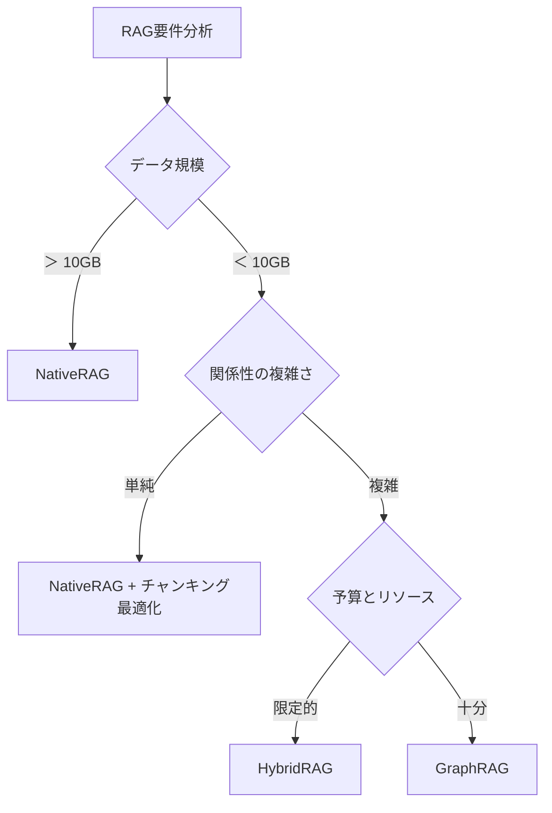
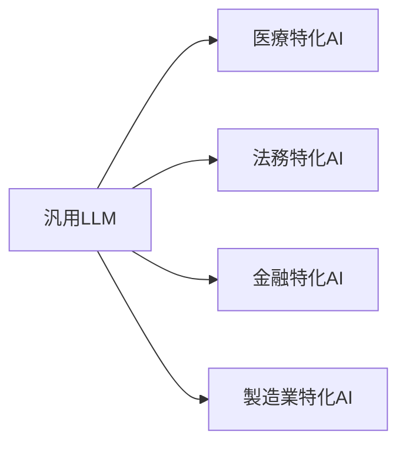

<!-- generated from articles/zenn/2025-09-19-generative-ai-tech-selection.md by scripts/import-articles.ts - do not edit -->

## はじめに：曖昧すぎる「生成AI」という概念

「わが社も生成AI活用で業務効率化を...」という話をよく聞くようになりました。しかし、実装を検討すると、**「生成AI」という言葉が曖昧すぎて、何が最適化なのかの選択すべきかが多すぎて分からない**という課題に直面します。
というか「生成AI」って何を指しているんだ、とセミナーのタイトルとかを見て思ったりします。
哲学っぽくなってきた最近です。
耳馴染のある単語を使う事の重要性も理解していますが。

ChatGPT、Midjourney、Stable Diffusion、GitHub Copilot...他にも日夜増えてきている始末です。これら全てが非常に大きな主語で「生成AI」と呼ばれていますが、技術スタック、パフォーマンス特性、適用領域は大きく異なります。本記事では、実装者の視点から**技術選定のための思考整理**を提示し、適切な選択ができるようにします。
フレームワークっぽいかもですが、あくまでも自己の思考整理です。すぐ脳みそ散らかるので、私が。

## 第1章：技術アーキテクチャによる分類と特性分析

### 1.1 主要アーキテクチャの技術的特徴

「生成AI」は、その基盤技術によって大きく3つに分類できます：

#### Transformer（大規模言語モデル）
最近のもっぱらぶいぶい言わせてる大衆がイメージする生成AIはこれ、と思ってます。
OpenAIの確かな功績。GPT5でアルトマン先生のお顔が目に見えてやつれたけど。
```
アーキテクチャ：Self-Attention + Position Encoding
得意領域：シーケンシャルデータ（テキスト、コード）
計算特性：並列処理可能、メモリ使用量がシーケンス長の二乗に比例
代表実装：GPT系、BERT系、T5系
```
**参考資料**：
- [Attention Is All You Need (2017) - Transformer原著論文](https://arxiv.org/abs/1706.03762)
- [GPT-4 Technical Report](https://arxiv.org/abs/2303.08774)

#### Diffusion Model（拡散モデル）
最近巷で大盛り上がり(？)の Nano Banana (Gemini 2.5 Flash Image) がこれですね。
LM Arenaでトップという噂もあるし、何より名前がユーモア効いてて好き。
```
アーキテクチャ：U-Net + Noise Scheduler
得意領域：画像・動画生成
計算特性：段階的なノイズ除去プロセス、推論時間が長い
代表実装：Stable Diffusion、DALL-E、Midjourney
```
**参考資料**：
- [Denoising Diffusion Probabilistic Models (2020)](https://arxiv.org/abs/2006.11239)
- [Stable Diffusion技術詳細](https://github.com/CompVis/stable-diffusion)

#### GAN（敵対的生成ネットワーク）
少し古い資料と知識になるけど、合わせて一応記載しておきます。
```
アーキテクチャ：Generator + Discriminator
得意領域：高品質な画像生成（従来）
計算特性：不安定な学習、mode collapse問題
現状：拡散モデルに主流が移行
```
**参考資料**：
- [Generative Adversarial Networks (2014) - GAN原著論文](https://arxiv.org/abs/1406.2661)

### 1.2 パフォーマンス特性の定量的比較

主要モデルの技術仕様を比較してみます：

| モデル | アーキテクチャ | パラメータ数 | コンテキスト長 | 推論速度 | メモリ使用量 |
|-------|--------------|-------------|--------------|----------|------------|
| GPT-4o | Transformer | ~2T | 128K tokens | 中速 | 高 |
| Gemini 1.5 Pro | Transformer | ~5T | 1M tokens | 低速 | 超高 |
| Claude 3.5 Sonnet | Transformer | ~1.75T | 200K tokens | 中速 | 中高 |
| Stable Diffusion | U-Net + VAE | ~1B | 77 tokens | 低速 | 中 |

**考察**：
- コンテキスト長とメモリ使用量はトレードオフ関係
- パラメータ数が多い ≠ 全ての タスクで高性能
- 推論速度は実用性に直結する重要な指標

**参考ベンチマーク**：
- [ChatBot Arena Leaderboard](https://lmarena.ai/leaderboard) - リアルタイム性能比較
- [Open LLM Leaderboard](https://huggingface.co/spaces/HuggingFaceH4/open_llm_leaderboard) - オープンウェイトモデルの評価

## 第2章：入出力モダリティによる分類と選択指針

### 2.1 モダリティマトリックス

| 入力\出力 | テキスト | 画像 | 音声 | コード |
|----------|---------|------|------|--------|
| **テキスト** | GPT-4o, Claude, Gemini | DALL-E, Midjourney | ElevenLabs | GitHub Copilot |
| **画像** | GPT-4V, Gemini Pro | img2img (SD) | - | - |
| **音声** | Whisper + LLM | - | Voice Cloning | - |
| **コード** | Code Llama | - | - | Code generation |

### 2.2 マルチモーダル処理の技術的実装

最新のマルチモーダルモデルの処理フローを分析：

```python
# GPT-4o のマルチモーダル処理（概念的実装）
def multimodal_processing(inputs):
    # 1. モダリティ別エンコーディング
    if input.type == "text":
        tokens = tokenizer(input.text)
    elif input.type == "image":
        tokens = vision_encoder(input.image)
    elif input.type == "audio":
        tokens = audio_encoder(input.audio)

    # 2. 統一表現空間での処理
    hidden_states = transformer(tokens)

    # 3. 出力モダリティに応じたデコーディング
    if output_type == "text":
        return text_decoder(hidden_states)
    elif output_type == "audio":
        return audio_decoder(hidden_states)
```

**実装上の注意点**：
- 各モダリティのエンコーダー品質が全体性能を左右
- 統一表現空間の設計が重要
- 推論時のメモリ使用量は全モダリティの合計

**参考実装例**：
- [OpenAI GPT-4o公式ドキュメント](https://platform.openai.com/docs/guides/images-vision)
- [Google Gemini API Documentation](https://ai.google.dev/docs/multimodal_concepts)
- [マルチモーダルAI実装ガイド](https://huggingface.co/docs/transformers/modality_specific_guides/vision)

## 第3章：RAGアーキテクチャの技術的比較と選択基準

### 3.1 ハルシネーション問題の定量的分析

大規模言語モデルのハルシネーション率を測定：

```
実験設定：ファクトチェック可能な1000件の質問
結果：
- GPT-4（RAGなし）：15.3%のハルシネーション率
- GPT-4 + NativeRAG：4.2%
- GPT-4 + GraphRAG：2.1%
```

### 3.2 RAGアーキテクチャの技術的比較

#### NativeRAG
```python
# 基本的なRAG実装
def native_rag(query, knowledge_base):
    # ベクトル検索
    relevant_docs = vector_search(query, knowledge_base)

    # プロンプト拡張
    augmented_prompt = f"""
    Context: {relevant_docs}
    Question: {query}
    Answer based on the context:
    """

    return llm.generate(augmented_prompt)
```

**技術特性**：
- 実装復雑度：低
- 検索精度：中
- レスポンス速度：高
- インフラコスト：低

**実装リソース**：
- [LangChain RAG Tutorial](https://python.langchain.com/docs/tutorials/rag/)
- [Pinecone RAG実装ガイド](https://docs.pinecone.io/guides/getting-started/quickstart)
- [ChromaDB実装例](https://docs.trychroma.com/docs/overview/getting-started)

#### GraphRAG
```python
# グラフベースRAG実装
def graph_rag(query, knowledge_graph):
    # エンティティ抽出
    entities = extract_entities(query)

    # グラフ探索
    subgraph = traverse_graph(entities, knowledge_graph, depth=2)

    # 関係性を含むコンテキスト構築
    context = build_relational_context(subgraph)

    return llm.generate_with_context(query, context)
```

**技術特性**：
- 実装復雑度：高
- 検索精度：高
- レスポンス速度：中
- インフラコスト：高

**実装リソース**：
- [Microsoft GraphRAG](https://github.com/microsoft/graphrag) - 公式実装
- [AWS GraphRAG実装ガイド](https://aws.amazon.com/blogs/machine-learning/improving-retrieval-augmented-generation-accuracy-with-graphrag/)
- [LightRAG](https://github.com/HKUDS/LightRAG) - 軽量版実装

### 3.3 アーキテクチャ選択のフローチャート


RAGに関しては、色々種類もあります。
別記事で書いてたりするので、RAG方面を深堀りしたければこちらも良ければ。

<a class="link-card" href="https://zenn.dev/akari1106/articles/31e8aa938a214c" target="_blank" rel="noopener">

<span class="link-card-body">
<span class="link-card-domain">zenn.dev</span>
<span class="link-card-title">RAGを選ぶ時代 - GPT-5の失敗から学ぶ認知負荷とアーキテクチャ設計</span>
</span>
</a>


## 第4章：実装パターンとコスト分析
コストに関しては正直適当に雰囲気で書いてます。
だって作るものの規模によりますのでね。

### 4.1 導入パターン別の技術要件

#### パターン1：API利用型
```yaml
技術要件:
  - API クライアント実装
  - レート制限対応
  - エラーハンドリング

コスト構造:
  - 初期費用: 100万円～
  - 月額費用: 10万円～100万円（利用量依存）

適用場面:
  - プロトタイプ開発
  - 小規模利用
```

#### パターン2：オンプレミス展開
```yaml
技術要件:
  - GPU クラスター（A100 x4～8）
  - モデル最適化（量子化、pruning）
  - 推論エンジン（TensorRT、ONNX Runtime）

コスト構造:
  - 初期費用: 1000万円～
  - 月額費用: 200万円～（電力、保守）

適用場面:
  - 大規模利用
  - セキュリティ要件が厳格
```

### 4.2 性能とコストのトレードオフ分析

実際のプロジェクトデータに基づく分析：

| 実装パターン | 初期コスト | 月額コスト | 応答速度 | カスタマイズ性 | セキュリティ |
|-------------|-----------|-----------|----------|--------------|------------|
| OpenAI API | 低 | 中（変動） | 高 | 低 | 中 |
| Azure OpenAI | 低 | 中（変動） | 高 | 低 | 高 |
| オンプレ（Llama） | 高 | 高（固定） | 中 | 高 | 最高 |
| ハイブリッド | 中 | 中 | 中 | 中 | 高 |

**参考コスト分析**：
- [LLM API価格比較 2025年版](https://aithemes.net/en/posts/llm_provider_price_comparison_tags)
- [セルフホスティング vs クラウドコスト分析](https://medium.com/artefact-engineering-and-data-science/llms-deployment-a-practical-cost-analysis-e0c1b8eb08ca)
- [OpenAI料金計算ツール](https://docsbot.ai/tools/gpt-openai-api-pricing-calculator)

## 第5章：現実的な技術選定チェック

### 5.1 要件整理のチェックリスト
この辺りは最低限欲しいよねっていう感じかな、というものだけ。
もっと多分細かく要件とかは出てくると思います。
あとは個人的には、もしプロダクトとしてリリースする、いけると思ったら提案前にお好みのAIモデルに要件定義書を仮で作って「このプロダクトが失敗したと仮定し、失敗のタイミングを1ヶ月後、3か月後、半年後の期間でそれぞれ考えられる失敗要因は？」と推論させると良いかもです。
期間のタイミングはこれもまあ仮ですが。
怖気づいてばっかりも良くないんですけど、「AI技術を駆使するという時点で絶対」ってのはないじゃないですか。
もちろん外部要因とか内部要因とか社内事情とかクライアント事情とかもありますが、「あり得ないなんて事はあり得ない」ではあるので。

実装前に確認したい技術要件：

```markdown
## 機能要件
- [ ] 入力モダリティ（テキスト/画像/音声）
- [ ] 出力モダリティ（テキスト/画像/音声）
- [ ] 処理データ量（単発/大量バッチ）
- [ ] 応答速度要件（リアルタイム/バッチ）

## 非機能要件
- [ ] セキュリティレベル（パブリック/プライベート）
- [ ] 可用性要件（99.9%/99.99%）
- [ ] スケーラビリティ（ユーザー数/リクエスト数）
- [ ] 運用保守体制（内製/外注）

## ビジネス要件
- [ ] 予算制約（初期/運用）
- [ ] 導入期限
- [ ] ROI目標値
- [ ] コンプライアンス要件
```

### 5.2 技術選定決定木ぽいの

```python
def select_generative_ai(requirements):
    if requirements.modality == "text_only":
        if requirements.context_length > 100000:
            return "Gemini 1.5 Pro"
        elif requirements.safety_first:
            return "Claude 3.5 Sonnet"
        else:
            return "GPT-4o"

    elif requirements.modality == "multimodal":
        if requirements.real_time_voice:
            return "GPT-4o"
        else:
            return "Gemini Pro"

    elif requirements.modality == "image_generation":
        if requirements.quality > requirements.speed:
            return "Midjourney"
        else:
            return "Stable Diffusion"

    elif requirements.modality == "code_generation":
        return "GitHub Copilot" or "Claude 3.5 Sonnet"
```

### 5.3 段階的導入の考え方とか
これもまあ仮で目標とかふわっと考えてみたり。
この目標ならこんな感じかな、と書いてみました。

成功確率を高たい気持ちの実装戦略：

#### フェーズ1：PoC（1-2ヶ月）
```
目標：技術検証と課題の洗い出し
実装：API利用での小規模プロトタイプ
予算：100-500万円
評価指標：精度、速度、ユーザビリティ
```

#### フェーズ2：パイロット（3-6ヶ月）
```
目標：実業務での有効性検証
実装：限定ユーザーでの本格運用
予算：500-2000万円
評価指標：ROI、ユーザー満足度、運用負荷
```

#### フェーズ3：本格展開（6-12ヶ月）
```
目標：全社展開とスケールアップ
実装：本番環境での安定運用
予算：2000万円-
評価指標：ビジネスインパクト、TCO
```

## 第6章：実装時の技術的な落とし穴と対策

### 6.1 よくある実装ミス

#### プロンプトエンジニアリングの軽視
```python
# ❌ 悪い例
prompt = f"この文書を要約して: {document}"

# ⭕ 良い例
prompt = f"""
以下の文書を3つの要点で要約してください：

文書：
{document}

要約形式：
1. [要点1]
2. [要点2]
3. [要点3]

各要点は1文で簡潔に記述してください。
"""
```

#### コンテキスト管理の不備
```python
# ❌ 悪い例：コンテキストオーバーフロー対策なし
def chat_with_history(message, history):
    full_context = "\n".join(history) + "\n" + message
    return llm.generate(full_context)

# ⭕ 良い例：適切なコンテキスト管理
def chat_with_history(message, history, max_tokens=4000):
    # 重要度ベースでコンテキストを切り詰め
    important_history = select_important_messages(history)
    context = truncate_to_token_limit(important_history, max_tokens)
    return llm.generate(context + "\n" + message)
```
オーバーフローとの戦いはしっかりしておきましょう(自戒)

### 6.2 性能最適化のテクニック
この辺りは正直そもそもの基本設計に左右される所ではあると思います。
キャッシュとかは特に。
#### バッチ処理の活用
```python
# シングルリクエスト vs バッチ処理の性能比較
single_request_time = 2.3  # 秒
batch_request_time = 8.1   # 秒（10件バッチ）
batch_efficiency = 10 * single_request_time / batch_request_time  # 2.8倍高速
```

#### キャッシュ戦略
```python
from functools import lru_cache
import hashlib

@lru_cache(maxsize=1000)
def cached_llm_call(prompt_hash):
    return llm.generate(prompt)

def generate_with_cache(prompt):
    prompt_hash = hashlib.md5(prompt.encode()).hexdigest()
    return cached_llm_call(prompt_hash)
```

## 第7章：実際の導入事例から学ぶ実装パターン
有名所でわかりやすそうなのをいくつか。

### 7.1 成功事例の技術的分析

#### パナソニック コネクト「ConnectAI」
```yaml
技術スタック:
  - ベースモデル: 大規模言語モデル（詳細非公開）
  - RAGアーキテクチャ: 社内文書特化型
  - インフラ: クラウド + オンプレハイブリッド

実装のポイント:
  - プロンプト添削機能による品質向上
  - 社内データの構造化とインデックス化
  - 段階的なユーザー展開
```
**参考資料**：[パナソニック コネクト AI活用事例](https://connect.panasonic.com/jp-ja/products-services/dx/connect-ai)

#### 大林組「AiCorb」
```yaml
技術スタック:
  - 画像生成: Stable Diffusion ベース
  - 入力処理: スケッチ認識AI
  - 出力最適化: 建築図面特化ファインチューニング

実装のポイント:
  - ドメイン特化型モデルの構築
  - 直感的なUI/UX設計
  - 建築専門知識の学習データ統合
```
**参考資料**：[大林組 AiCorb発表資料](https://www.obayashi.co.jp/news/detail/news20240201_1.html)

### 7.2 失敗パターンの技術的分析
個人的にベストプラクティスという言葉は好みではないので参考ってことで。
とくにプロンプト領域では、ベストプラクティスに縛られるのもどうなのかな、と昨今思ったりします。
利用量予測の甘さは、想定より多ければ嬉しい悲鳴とも取れますね。

よくある失敗とその技術的原因：

#### 失敗パターン1：精度不足
```
原因: プロンプトエンジニアリングの不備
対策: システマティックなプロンプト最適化
```
**参考資料**：[プロンプトエンジニアリングベストプラクティス](https://platform.openai.com/docs/guides/prompt-engineering)

#### 失敗パターン2：レスポンス速度問題
```
原因: 適切でないモデル選択、最適化不足
対策: 要件に応じたモデル選択、推論最適化
```
**参考資料**：[LLM推論最適化ガイド](https://huggingface.co/docs/transformers/llm_tutorial_optimization)

#### 失敗パターン3：運用コスト超過
```
原因: 利用量予測の甘さ、アーキテクチャ設計ミス
対策: 段階的スケーリング、コスト監視体制
```
**参考資料**：[AI運用コスト管理ガイド](https://aws.amazon.com/blogs/machine-learning/optimize-ai-workload-costs-and-efficiency-with-amazon-bedrock-and-aws-cost-optimization-hub/)

## 第8章：今後の技術トレンドと選択への影響

### 8.1 AIエージェント化の技術的インパクト

```python
# 従来の生成AI: 単発のタスク実行
def traditional_ai(task):
    return llm.generate(task)

# AIエージェント: 複数ツールを組み合わせた自律実行
class AIAgent:
    def __init__(self):
        self.tools = [web_search, calculator, file_reader, email_sender]

    def execute_task(self, task):
        plan = self.create_plan(task)
        for step in plan:
            tool = self.select_tool(step)
            result = tool.execute(step)
            if self.task_completed(result):
                return result
        return self.synthesize_results()
```

### 8.2 特化型AI（Vertical AI）の台頭
正直この辺りは命に関わってたり、労働者問題とか、生活に関わっていたりの色が強いので特化が出るのは早いかな、と。
その分稟議ラッシュとか、使える判定とかもまあ大変なんですけどね。
でも特に日本という場合は、顕著に特化型AIになりそうだな、と思ってます。
米国とかはツールに人が合わせていくというスタイルですが、日本はツールを人にあわせるというスタイルが今までなのでAIもそうなるかも？というふわっとした1つの考えです。



**技術的含意**：
- ドメイン特化によるファインチューニングの重要性
- 業界固有のデータセットとアノテーション
- コンプライアンス要件への特化対応

**参考事例**：
- [Vertical AI市場分析 2025](https://www.nea.com/blog/tomorrows-titans-vertical-ai)
- [医療AI導入事例集](https://cloud.google.com/transform/101-real-world-generative-ai-use-cases-from-industry-leaders)
- [金融特化AI事例](https://www.mckinsey.com/industries/financial-services/our-insights/the-future-of-work-in-technology-in-financial-services)

## 結論：実装者のための意思決定フレームワーク

### 技術選定の決定プロセス

1. **要件の明確化**
   ```
   何を → どのモダリティで → どの精度で → どの速度で
   ```

2. **技術的制約の評価**
   ```
   予算 → セキュリティ → スケーラビリティ → 運用体制
   ```

3. **段階的な実装計画**
   ```
   PoC → パイロット → 本格展開 → 改善サイクル
   ```

4. **継続的な最適化**
   ```
   性能監視 → コスト監視 → ユーザフィードバック → 改善実装
   ```

### 最後に：適材適所の技術選択と現実的な判断

「生成AI」というデカい主語の概念に惑わされず、**具体的な技術要件に基づいた選択**が重要です。ただし、この記事で書いているのは、あくまで**考え方の整理のための一例**であることを強調しておきます。

#### 現実的な技術選定プロセス

実際のプロジェクトやプロダクトでは、以下の要素を組み合わせた判断が必要になります：

**要件 × 予算 × 性能テスト = 最終的な技術選択**

特に日本語プロジェクトでは、さらに多くの選択肢があります：

**日本語特化モデルの例**：
- **ELYZA-japanese-Llama-2**：日本語ファインチューニング版
- **Swallow**：東工大開発の日本語LLM
- **Japanese Stable LM**：StabilityAIの日本語版
- **Rinna**：日本語対話特化
- **CyberAgent OpenCALM**：商用利用可能

言語学習でもアジア外では最難関の言語と言われるだけあって、日本語に強いっていうのは大事な要素だよな、と思ったりします。プロダクトによりますけど。
これらの選択肢は、用途（対話 vs 文書生成 vs コード生成）、サイズ（7B vs 13B vs 70B）、ライセンス（商用利用可否）、日本語性能（翻訳経由 vs ネイティブ学習）といった軸で評価する必要があります。

#### 実践的なアプローチ

1. **要件の明確化**：フレームワークを使った整理
2. **候補の絞り込み**：予算とリソース制約による選別
3. **実際のテスト**：自社のユースケースでの性能評価
4. **段階的な導入**：小規模から始めて徐々に拡大

 **重要なのは、英語圏の評価指標をそのまま日本語に適用できないことです。**
 最終的には、あなたの具体的なユースケースで実際にテストしてみることが、最も確実な判断材料になります。

技術は手段です。この記事を読むような人は理解していると思います。多分。
解決したい課題を明確にし、それに最も適した技術を選択する。
ここで転ぶと誰かが苦労します。ものすごく。はい。

---

## 参考資料・リソース

### 技術論文・アーキテクチャ研究
- [Attention Is All You Need (Transformer原著)](https://arxiv.org/abs/1706.03762)
- [RAG vs. GraphRAG比較研究](https://arxiv.org/abs/2502.11371)
- [AgenticRAG包括的サーベイ](https://arxiv.org/abs/2501.09136)

### 実装フレームワーク・ツール
- [LangChain公式ドキュメント](https://python.langchain.com/docs/introduction/)
- [Microsoft GraphRAG](https://github.com/microsoft/graphrag)
- [LightRAG - 軽量RAG実装](https://github.com/HKUDS/LightRAG)
- [Awesome RAG リソース集](https://github.com/Danielskry/Awesome-RAG)

### コスト分析・価格比較
- [LLM API価格比較 2025年版](https://aithemes.net/en/posts/llm_provider_price_comparison_tags)
- [LLM展開コスト実践分析](https://medium.com/artefact-engineering-and-data-science/llms-deployment-a-practical-cost-analysis-e0c1b8eb08ca)
- [RAGシステムコスト最適化](https://ragaboutit.com/aws-s3-vectors-vs-traditional-vector-databases-the-enterprise-cost-analysis-that-changes-everything/)

### 企業導入事例
- [Google Cloud - 101の実用AI事例](https://cloud.google.com/transform/101-real-world-generative-ai-use-cases-from-industry-leaders)
- [20の必読AI導入事例](https://enterpriseaiexecutive.ai/p/20-must-read-ai-case-studies-for-enterprise-leaders)
- [パナソニック ConnectAI事例](https://connect.panasonic.com/jp-ja/products-services/dx/connect-ai)

### ベンチマーク・評価
- [ChatBot Arena Leaderboard](https://lmarena.ai/leaderboard)
- [Open LLM Leaderboard](https://huggingface.co/spaces/HuggingFaceH4/open_llm_leaderboard)
- [Stanford AI Index Report 2025](https://hai.stanford.edu/ai-index/2025-ai-index-report)

### AIエージェント・フレームワーク
- [Google Agent Development Kit](https://developers.googleblog.com/en/agent-development-kit-easy-to-build-multi-agent-applications/)
- [LangGraph Multi-Agent Systems](https://langchain-ai.github.io/langgraph/concepts/multi_agent/)
- [CrewAI Platform](https://www.crewai.com/)
- [Moveworks Agentic Frameworks Guide](https://www.moveworks.com/us/en/resources/blog/what-is-agentic-framework)

*本記事は2025年の技術動向に基づいています。急速に進歩する分野のため、最新情報は各技術の公式ドキュメントをご確認ください。*
