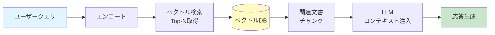
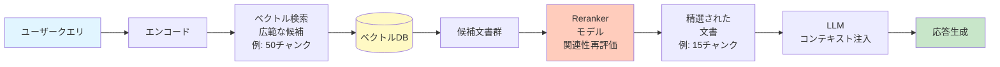
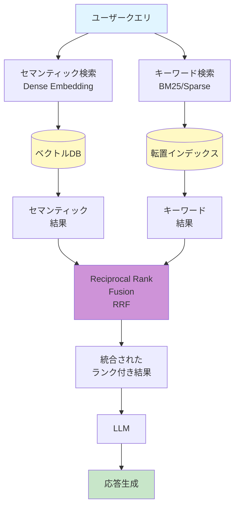
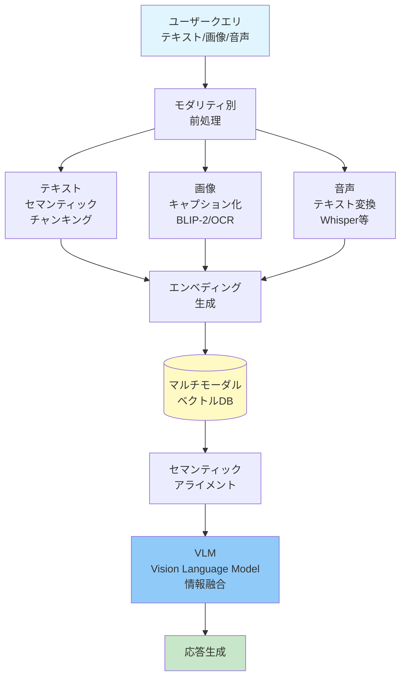
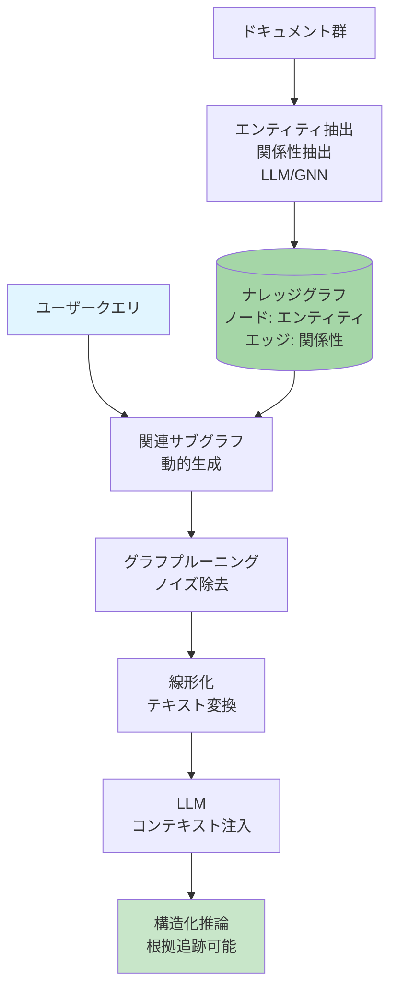
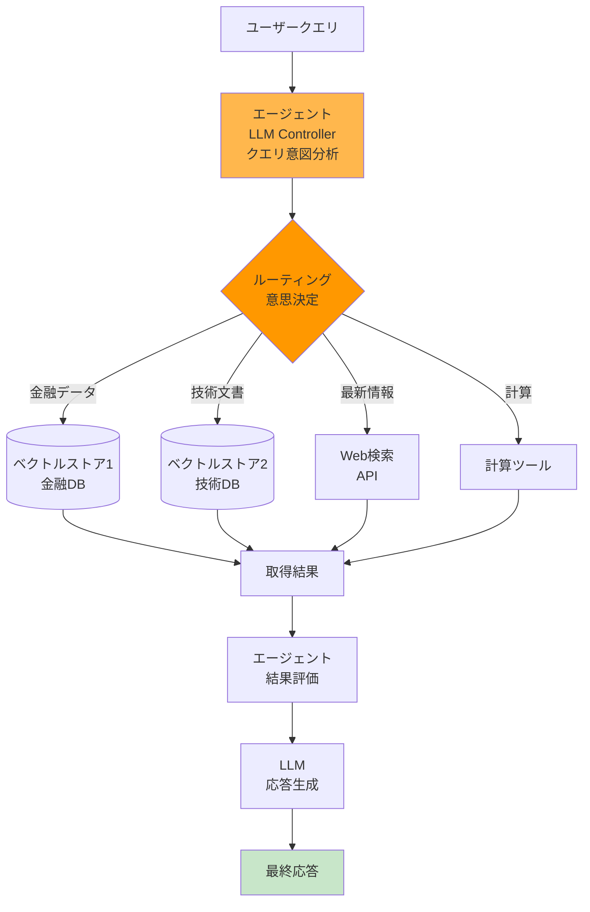
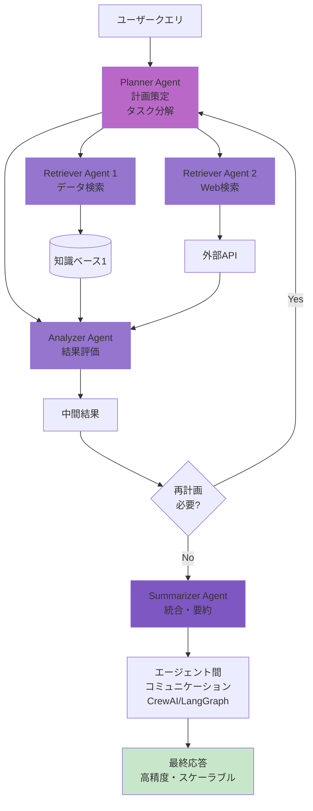

<!-- generated from articles/zenn/2025-10-27-rag-architecture-patterns.md by scripts/import-articles.ts - do not edit -->

# AIエージェント時代におけるRAGアーキテクチャを7種類のパターンでわける

## 1.曖昧さの解消とRAG設計のパラダイムシフト

### 1.1. RAGの進化と設計概念の混迷：なぜ用語整理が必要か

大規模言語モデル（LLM）の能力を外部知識で補強するRetrieval-Augmented Generation (RAG) は、AIアプリケーションにおける基盤技術として急速に進化を遂げてきました。いや本当に早すぎて怖いし、追い付くのに必死です。
この記事で自己整理もかねて、4つのアプローチが存在するとか言ってたのに…。

<a class="link-card" href="https://zenn.dev/akari1106/articles/31e8aa938a214c" target="_blank" rel="noopener">

zenn.dev
RAGを選ぶ時代 - GPT-5の失敗から学ぶ認知負荷とアーキテクチャ設計

</a>

この進化は、初期の単純なNaive RAGから、高度なRetrievalメソッドを導入したAdvanced RAG、そして現在では交換可能なモジュールとしてRAGを捉えるModular RAGへと段階的に複雑化しています[^1]。

[^1]: https://www.arionresearch.com/blog/uuja2r7o098i1dvr8aagal2nnv3uik

この急速な進化と多様化の過程で、システム設計に関する用語の混同、特に「エージェント的ワークフロー（Agentic Workflows）」と「エージェント的アーキテクチャ（Agentic Architectures）」の区別が曖昧になる現象が確認されています。(ちょっとパブサしたけど、国内外であるあるらしい。混沌。)

𝗔𝗴𝗲𝗻𝘁𝗶𝗰 𝘄𝗼𝗿𝗸𝗳𝗹𝗼𝘄𝘀 = エージェントが目標を達成するために取る一連のステップ
「何を」するかと考えると、実際のプロセス。

以下が含まれます(毎回ではない)：
• LLMを使って計画を作成する
• タスクをサブタスクに分解する
• インターネット検索などのツールを使用する
• 結果を振り返り、計画を調整する

𝗔𝗴𝗲𝗻𝘁𝗶𝗰 𝗮𝗿𝗰𝗵𝗶𝘁𝗲𝗰𝘁𝘂𝗿𝗲𝘀 = 技術的な枠組みとシステム設計
「どのように」するかと考えると、基盤となる構造。

基本以下が含まれます：
• 意思決定能力を持つ少なくとも1つのエージェント
• エージェントが使用できるツール
• 短期および長期記憶のためのシステム

同じワークフローを異なるアーキテクチャで実装できるから故に混同している人もいるのかな、と思う次第です。同じレシピを作るのに複数の方法があるようなもので、ステップは似ていますが、キッチンのセットアップが異なる、という認識をしてます。

この2つの概念は密接に関連し、同時に機能しますが、システム設計において指し示す側面は根本的に異なります。設計の意図を正確に伝達し、柔軟でスケーラブル(カッコいいから言いたい)なシステムを構築するためには、これらの概念を区別して、理解しておく事はそれこそ大事なのかなあ、なんて。
基本多すぎる問題…というのは野暮かもですが…！

この概念的な混同を解消し、RAGアーキテクチャの主要な類型を構造的に分析することが本題です、今回の。さらに、500万件のドキュメントを処理する大規模プロダクション環境における実証データに基づく最適化戦略を参照させてもらってAIシステムアーキテクトに対し、理論的厳密さと実践的知見のありがたみを噛み締めながら話していきます。
コンプラで中々言えない事も昨今多いので、ありがたく参照させてもらいます。

### 1.2. 概念の厳密な定義：ワークフロー（What）とアーキテクチャ（How）の違い

RAGシステムをエージェント化する設計を進める上で、最も重要な区別は、**何を達成しようとしているか（ワークフロー）** と、**どのようにそれを実現するか（アーキテクチャ）** の分離です。
ちょっと前項と被る事も書くけど、改めて整理したい、自分の中で。

#### ワークフロー (Agentic Workflows - What)

エージェント的ワークフローは、エージェントが最終的な目標を達成するために踏む一連のステップやプロセスを指します。これは実際のプロセス、すなわち「何を」実行するかを定義します。具体的には、LLMを使用した計画の策定、複雑なタスクのサブタスクへの分解、インターネット検索などの外部ツールの利用、そして結果を評価し計画を動的に調整する振り返りのステップが含まれる場合があります[^2]。

[^2]: https://www.ibm.com/think/topics/agentic-rag

Anthropic社(Claudeのところ)の研究では、ワークフローは、LLMとツールが事前に定義されたコードパスを通じて調整されるシステムと定義されています[^3]。この定義は、ワークフローが比較的固定された手順やポリシーに従って実行されるという側面を強調します。非Agenticなワークフローでは、AIモデルは事前に決められたタスクを実行しますが、自律的な決定やプロセスの動的な変更は行いません[^4]。

[^3]: https://www.anthropic.com/research/building-effective-agents
[^4]: https://orkes.io/blog/what-are-agentic-workflows/

#### アーキテクチャ (Agentic Architectures - How)

エージェント的アーキテクチャは、そのワークフローを実装するために必要な技術的な枠組み、システム設計、および基盤となる構造を指します。これは「どのように」ワークフローが実行されるかの基盤を定めます。アーキテクチャの基盤要素には、意思決定能力を持つ少なくとも1つのエージェント（LLM）、エージェントが利用できるツール群、および短期および長期記憶のためのシステムが常に含まれます[^5]。

[^5]: https://weaviate.io/blog/what-is-agentic-rag

この区別がシステム設計において決定的に重要である理由は、同じワークフローを異なるアーキテクチャで実装できる点にあります。例えば、「クエリを分解し、情報を取得し、関連性を評価する」というエージェントRAGのワークフローは、単一エージェントによるルーターアーキテクチャで構築することも、複数のエージェントが協調するマルチエージェントシステムで構築することも可能です。設計者がこの柔軟性を理解することで、特定の要件に最も適したアーキテクチャを選択できるようになるのかな、と。
より良いものを選択するには、手札が必要、と個人の思想かもしれませんが。

## 2. 概念基盤の確立：Agentic RAGの要素と設計図

### 2.1. Agentic RAGを構成する基盤要素

Agentic RAGシステムが従来のRAGシステム（静的知識と単一の検索パスに依存）と決定的に異なるのは、その柔軟性、適応性、およびスケーラビリティです[^2]。これらの能力は、以下の三つの基盤要素によって支えられています。

**意思決定エージェント**: RAGパイプライン全体に組み込まれ、クエリルーティング、ステップ・バイ・ステップの計画策定、および必要なツールの特定と実行といった自律的な意思決定を担います[^2]。この自律性の所在こそが、エージェント的システムの核です。代表的な設計フレームワークであるReAct（Reasoning and Action）は、エージェントが「思考（Thought）」→「行動（Action）」→「観察（Observation）」のプロセスを繰り返し、タスク完了まで動的にワークフローを調整することを可能にします[^2]。

**ツールと外部データソース**: Agentic RAGは、従来のRAGが依存していた単一のベクトルデータベースの限界を超え、複数の外部知識ベースや多様なツールを利用することで柔軟性を高めます[^2]。従来のRAGだと本当にキツくて、マジでどう組み合わせようやろうって考えること多いです。RAGに限らず、Web検索、計算機、EメールやチャットプログラムへのAPIアクセス、その他のプログラム可能なソフトウェアが含まれます[^5]。

**記憶システム**: 短期記憶（会話履歴）と長期記憶（外部知識ベース/ベクトルストア）を保持することで、エージェントは状態を維持し、複雑なマルチパートのシーケンシャルクエリに対して一貫した対応を取ることができます[^5]。
認知負荷との戦いはそのうち別で書きたいです。

### 2.2. RAG設計図：ワークフローとアーキテクチャの関係モデル

従来のRAGシステムは、与えられたクエリに対して関連情報を発見し提示する反応的なデータ取得ツールでした。AIに対して「反応的」という表現は少し変な感じがしますが。対照的に、Agentic RAGシステムは、積極的で創造的なチーム、すなわちプロアクティブに課題を解決するシステムに例えられます[^2]。この能力は、エージェントの動的な決定能力に由来します。

ここで明確にしておくのは、設計における制御の所在です。非Agenticなシステムでは、制御は固定されたコードパスにあり、LLMはそのパス内でタスクを実行するに過ぎません。しかし、真にAgenticなアーキテクチャでは、制御の所在はLLMに移り、LLMが状況に応じてプロセスを動的に決定し、タスクを自律的に遂行する能力を持ちます[^3]。この動的なパス生成能力こそが、Agentic RAGが高い柔軟性と適応性を持つ根本的な理由です。設定や設計こそ必要ですが、そこそこちゃんとやれるようになってきた気がします。

Agentic RAGの設計は、ワークフローという抽象的な概念（例：計画、情報取得、検証）を、具体的なアーキテクチャ（例：単一エージェントによるルーター構造、または複数の協調エージェントによるシステム）のいずれで実装するかを選択するプロセスとして区分できます。できますというか、した。

| 概念 | 定義（何を/どのように） | 要素 | RAGにおける具体例 |
|------|------------------------|------|-------------------|
| **Agentic Workflow** | エージェントが目標達成のために実行する一連のステップ（何を） | 計画策定、タスク分解、ツール使用、結果の振り返り | RAGにおけるクエリ分解、取得情報の評価、再試行ロジック |
| **Agentic Architecture** | ワークフローを支える技術的な枠組みとシステム設計（どのように） | 意思決定エージェント、ツールアクセス、短期/長期記憶システム | Single-Agent Router構造、Multi-Agent間のコミュニケーション設計[^5] |

## 3. RAGアーキテクチャの類型論：7つの設計パターンとその機能分析

RAGの進化は、単なるデータ量への対応（スケーリング）だけでなく、データの複雑性、データ間の関係性、そしてタスクの複雑性という三つの次元で進展してきました。ここでは、設計者が遭遇する主要な7つのRAGアーキテクチャパターンを類型化し、その技術的詳細と設計上のトレードオフを解説します。解説と言うか、まとめます。

### 3.1. RAGの基盤パターン：Naive RAGと精度改善の第一歩

#### Naive RAG

Naive RAGは、RAG実装の最も基本的な形態です[^7]。そのプロセスは、クエリのエンコーディング、ベクトルデータベースを使用した関連文書の検索（トップNの取得）、そして取得したコンテキストをLLMに注入して応答を生成するという、3つのシンプルなステップに依存します[^7]。しかし、この基本的なアプローチは、大規模なデータやノイズの多いデータに対して、文脈を考慮せず不正確な情報を引き出したり、間違った結論を導いたりするリスクを抱えています[^8]。

[^7]: https://www.ibm.com/think/topics/rag-techniques
[^8]: https://en.wikipedia.org/wiki/Retrieval-augmented_generation

**特徴**: 最もシンプルな3ステップ構成（エンコード→検索→生成）

#### Retrieve-and-rerank (Reranker RAG)

Rerankingは、Naive RAGの限界を補い、検索精度を大幅に向上させるための最もROI（投資対効果）の高い改善策の一つです[^9]。このパターンでは、リトリーバーがまず広範な候補文書（例：50チャンク）を取得した後、リランカーモデル（通常は専用の分類モデル）がこれらの候補をクエリとの真の関連性に基づいて再評価し、最終的に最も関連性の高い少数（例：15チャンク）をLLMに渡します[^10]。リランカーの導入は、LLMへの入力ノイズを最小限に抑えつつ、検索品質を劇的に向上させる、シンプルで効果的な方法として評価されています[^9]。

[^9]: https://www.pinecone.io/learn/series/rag/rerankers/
[^10]: https://blog.abdellatif.io/production-rag-processing-5m-documents

**特徴**: 2段階検索でノイズを大幅削減、高ROI

### 3.2. スケーリングのための融合戦略：Hybrid RAG

Hybrid RAGは、検索カバレッジと精度の両方を確保するために、異なる検索方法を融合させる戦略です。

**定義と仕組み**: Hybrid RAGは、意味的検索（Dense Embedding/ベクトル）と語彙検索（Sparse Retrieval/BM25などのキーワード）を組み合わせます[^12]。セマンティック検索は意味的、概念的な一致に優れていますが、ID、コード、専門用語といった稀な単語や固有名詞を見逃す可能性があります。Hybrid RAGは、BM25によるキーワードベースの正確な一致と、ベクトル検索による文脈的な深さを両立させることで、この検索ギャップを解消します[^14]。

[^12]: https://ai.plainenglish.io/8-rag-architectures-powering-the-next-generation-of-ai-0cc868f2bed2
[^14]: https://www.chitika.com/hybrid-retrieval-rag/

**結果の統合**: 検索結果を統合する標準的な技術として、Reciprocal Rank Fusion (RRF) が使用されます[^13]。RRFは、キーワードマッチとセマンティックマッチの両方で上位にランクインしたドキュメントを優先することで、両検索方法の利点を最大限に引き出し、システムの精度を高めます。

[^13]: https://neo4j.com/blog/genai/advanced-rag-techniques/

**特徴**: 意味的一致とキーワード一致を融合、専門用語に強い。

自分で今調べながら書きながら咀嚼して整理して、とやってるけどこれマジで良いよな、すごいよな、ってワクワクしている。結局専門用語ってどの業界でも避けられんよなあ、とかの思考もある。

### 3.3. 複雑なデータ対応：Multimodal RAG

Multimodal RAGは、テキスト情報だけでなく、画像、音声、動画といった複数のモダリティから情報を取得し、統合的に理解する能力を持つRAGアーキテクチャです[^15]。

[^15]: https://www.gigaspaces.com/blog/multimodal-rag-boosting-search-precision-relevance

**データ処理の課題**: Multimodal RAGの導入には、複雑なデータ前処理が必要です。これには、モダリティ固有のチャンキング（例：テキストブロックのセマンティックチャンキング、テーブルの行単位チャンキング）が含まれます[^17]。特に画像の場合、BLIP-2などのモデルを用いてキャプション化（テキスト記述に変換）したり、OCR技術を用いてテキストを抽出したりすることで、視覚情報をセマンティック表現に変換します[^17]。

[^17]: https://www.reddit.com/r/Rag/comments/1m5ev9g/multimodal_data_ingestion_in_rag_a_practical_guide/

**情報の融合**: 複数のモダリティからの情報（エンベディング）間で意味的な整合性（セマンティックアライメント）を確保することが重要です[^15]。VLM（Vision Language Model）はこの役割を担い、異なるデータタイプからの知識を融合させ、より包括的な文脈認識を可能にします[^16]。

[^16]: https://kanerika.com/blogs/multimodal-rag/

**メリット**: 従来のRAGでは困難だった、図表やグラフを含む複雑な文書解析、あるいは視覚情報とテキストが組み合わされた教育コンテンツなどに対し、より深く正確な文脈理解と意思決定を提供します[^15]。

**特徴**: 複数のデータタイプを統合的に理解、図表解析に強い

### 3.4. 関係性推論の強化：Graph RAG

Graph RAGは、特に大規模なドメイン固有データセットや、ドキュメントをまたがる複雑なエンティティ間の関係性に基づく推論が必要な場合に、従来のRAGの限界を克服します[^19]。

[^19]: https://www.elastic.co/search-labs/blog/rag-graph-traversal

**構造化された知識**: このアーキテクチャは、知識をナレッジグラフ（KG）として構造化します。KGでは、データはノード（エンティティや概念）と、それらの間のエッジ（関係性）によって表現されます[^21]。

[^21]: https://www.ibm.com/think/topics/graphrag

**構築と検索のプロセス**: KGの構築は、LLMを使用してドキュメントからエンティティと関係性を抽出するプロセスや[^22]、グラフニューラルネットワーク（GNNs）といった高度なAIモデルを活用する手法によって行われます[^21]。検索時には、クエリに関連する知識サブグラフが動的に生成されます。このサブグラフは、グラフプルーニングといった技術によって不要な情報（ノイズ）が除去された後、LLMが処理できるようにテキスト形式（線形化）に変換され、コンテキストとして提供されます[^19]。

[^22]: https://medium.com/neo4j/from-legal-documents-to-knowledge-graphs-ccd9cb062320

**優位性**: Graph RAGは、ベクトル検索のみに依存するシステムでは不可能な、構造化された推論を可能にします。また、回答を裏付ける関係性や根拠を追跡できる**説明可能性（Explainability）** を提供し、金融、法務、ヘルスケアなど、トレーサビリティと正確性が最も重要視される規制環境において特に価値を発揮します[^20]。

[^20]: https://neo4j.com/blog/developer/rag-tutorial/

**特徴**: エンティティ間の関係性に基づく推論、説明可能性が高い。推論を伸ばす方向個人的に好き。

### 3.5. 自律性を備えた設計：Agentic RAG (Router型)

Agentic RAGは、RAGパイプラインにAIエージェントの意思決定能力を組み込んだアーキテクチャであり、その最もシンプルな形態がRouter型です。

**アーキテクチャと機能**: Router型アーキテクチャでは、単一のエージェント（通常はLLM）がコントローラーとして機能し、複数の独立した知識ベースやツール（例：複数のベクトルストア、Web検索、API）のどれにクエリをルーティングするかを動的に決定します[^5]。

**自律性の導入**: この設計は、クエリの意図を分析し、最適なデータソースを選択する「クエリルーティング」を可能にすることで、RAGの柔軟性と適応性を高めます[^2]。複数のデータソースを持つシステムにおいて、効率的な検索パスを選択するために不可欠な構造です。

**特徴**: 単一エージェントが動的にデータソース選択、柔軟性が高い

### 3.6. 専門家集団としてのRAG：Agentic RAG (Multi-Agent型)

Multi-Agent型は、Agentic RAGアーキテクチャの中で最も複雑で自律性が高い設計です。

**アーキテクチャと機能**: 複数のエージェントが、それぞれ固有の役割（例：計画策定、データ検索、結果の評価、サマライゼーション）を持ち、相互に協調してタスクを遂行します[^6]。

[^6]: https://www.datacamp.com/tutorial/crewai-vs-langgraph-vs-autogen

**フレームワークと協調**: CrewAI（役割ベースのオーケストレーション）やAutoGen（会話駆動型チャット）といったフレームワークが、このマルチエージェント協調モデルをサポートしています[^6]。CrewAIは役割割り当てに焦点を当て、LangGraphは構造化された状態遷移によるコラボレーションを可能にし、AutoGenは動的なグループチャットを強調します[^6]。

**メリット**: このアーキテクチャは、市場調査や複雑なプロジェクト管理など、複数のシーケンシャルな意思決定と分業を必要とするタスクにおいて、高い精度とスケーラビリティを発揮します[^2]。ただし、エージェント間のコミュニケーション設計や状態管理が複雑になるというトレードオフがあります[^6]。

**特徴**: 複数エージェントの協調、複雑なタスクを分業で高精度に処理

最近流行りのOpenAIの「Agent Builder（エージェントビルダー）」やGoogleの「Opal」といったツールが提供しているのがこれ。複雑なPythonフレームワーク（LangChain、LlamaIndexなど）を使わなくても、誰もが「計画、行動、反省、ツール利用、外部連携」といったAgentic RAGの要素を持つAIシステム、つまりマルチエージェント型のアーキテクチャを設計できるようにすることを目指しているのがよくわかるね。
現時点のLLMの知能を最大限に活用し、AGI的な振る舞いを現実のアプリケーションで実現するための最も重要な設計パターンである、とも言い換えられるかもしれない。複雑だから、理解頑張らないとね…ひいひい。

### 7つのRAGアーキテクチャの機能比較と推奨ユースケース

| アーキテクチャ | 主要な機能 | 複雑性 (1低〜5高) | トレードオフ | 最適なユースケース |
|--------------|-----------|-----------------|------------|------------------|
| Naive RAG | ベーシックな検索と生成 | 1 | 低精度、ハルシネーションリスク大 | PoC、小規模な静的データセット[^7] |
| Retrieve-and-rerank | 検索結果の関連性向上 | 2 | 計算コストの増加 (2ndパス) | 初期精度改善、ノイズ削減[^9] |
| Hybrid RAG | 意味的検索とキーワード検索の融合 | 3 | スコア融合のチューニング難しさ (RRF) | 大規模データセットでの高精度検索、専門用語の扱いに優れる[^12] |
| Multimodal RAG | テキスト、画像、音声の統合的検索 | 4 | データ前処理の複雑性、VLMのコスト | 複雑な文書解析（グラフ、表を含む）、教育コンテンツ[^15] |
| Graph RAG | エンティティ間の関係性に基づく推論 | 4 | ナレッジグラフ構築・保守コスト | 法務、医療、ITアーキテクチャなどの複雑な関係性クエリ[^19] |
| Agentic RAG (Router) | 意思決定に基づくツール/データソースの選択 | 3 | ルーティング失敗時のリカバリ | 複数の独立した知識ベース間のクエリ振り分け[^5] |
| Agentic RAG (Multi-Agent) | 分業と協調による複雑な問題解決 | 5 | エージェント間のコミュニケーション設計難度 | 市場調査、自律的な研究タスク、複雑なプロジェクト管理[^6] |

## 4. RAG性能を最大化するプロダクション最適化戦略

理論的なアーキテクチャの選択は重要ですが、RAGシステムの成功は、現実のプロダクション環境における検索品質の基礎工事にかかっています。というか理論が最強でも実装出来なきゃ話にならんよな、っていう。R&D成分ももちろん含まれますが。先日見かけた500万ドキュメントを処理する大規模RAGシステムの開発経験の記事から得られた知見は、複雑なAgenticアーキテクチャの導入に先立ち、ROIの高い基本戦略を徹底的に最適化すべきであることを示唆しています[^10]。
良い生の実知見だ～と見かけた時喜んでしまった。コンプラとかあるので、こういう本気の苦労話はたくさん読みたいです。

<a class="link-card" href="https://blog.abdellatif.io/production-rag-processing-5m-documents" target="_blank" rel="noopener">

blog.abdellatif.io
Production RAG: what I learned from processing 5M+ documents

</a>

### 4.1. データ前処理の極意：適切なチャンキング戦略とメタデータ活用の重要性

#### カスタムチャンキング戦略

チャンキング戦略は、RAGシステムの根幹を成します。プロダクション環境のデータは多岐にわたるため、単語や文の途中で機械的にカットするのではなく、各チャンクが論理的な単位として自己完結した情報を保持するように分割することが不可欠です[^10]。標準的なチャンカー（例：Unstructured.io）は出発点となりますが、ドメイン固有のデータ構造やフォーマット（特に企業データ）に対応するためには、カスタムのチャンキングフローの構築が求められます[^10]。
企業データは、従来の保存方法が結構癖強い(神Excelとか神Wordとか神PDFとかの神のオンパレードがめっちゃある)ので、型変換もですがここら辺もやれると良いな、と。

#### メタデータインジェクション

初期のアプローチでは、チャンクのテキストのみをLLMに渡すことが多いですが、実験結果は、関連するメタデータ（例：ドキュメントのタイトル、著者、セクション情報など）をチャンクテキストと結合してLLMのコンテキストとして注入することが、回答の質を大幅に向上させることを示しています[^10]。これは、LLMが提供された情報の出所や文脈をより深く理解し、より信頼性の高い（Groundednessの高い）回答を生成するために役立ちます。これ本当に知った時、馬鹿ほどアドレナリン出た。

### 4.2. 検索精度を劇的に向上させる技術

大規模システムにおいて、ユーザーが求めている情報を確実に上位に提示することは、システムの信頼性に直結します。そうだけど、そうじゃない現象は検証しているとあるあるだと思います。

#### Rerankingの圧倒的なROI

Rerankingは、プロダクションRAGシステムに追加すべき戦略の中で、「最も価値の高い5行のコード」と評されるほど、導入の容易さに対して得られる効果が顕著です[^10]。リランカーの採用により、リトリーバーの初期設定が最適でなかったり、ベクトルエンベディングの品質が不十分であったりする場合でも、最初に十分な数のチャンク（例：50チャンク）を入力することで、その弱点を補うことができます[^10]。これは、複雑なアーキテクチャ変更を行う前に、まず検索品質を向上させるべきという実践的な教訓を示しています。

#### Hybrid Searchの実践的導入

Hybrid Searchの導入は、検索カバレッジを広げるための重要なステップです。セマンティック検索とキーワード検索を組み合わせることで、意味の正確さと単語レベルの精度を両立させます[^13]。500万ドキュメントの事例では、キーワード検索をネイティブでサポートするベクトルデータベース（例：Turbopuffer）を選定することが、大規模環境での効率的なHybrid Search実装に寄与しました[^10]。結果の統合には、前述のReciprocal Rank Fusion (RRF) が標準的に用いられます[^13]。
これ本当に私も思考が固まりかけていたので、良い知見を学んだな、と思いました。

### 4.3. LLMの能力を引き出すクエリ処理：クエリ生成とルーティングの高度化

高度なRAGシステムは、単にクエリを受け付けるだけでなく、クエリ自体を最適化し、システムの限界を管理します。

#### クエリ生成 (Query Generation)

ユーザーが入力した最後のクエリだけでは、文脈全体が捉えきれない場合があります。これを補うため、LLMを使って会話スレッド全体をレビューさせ、複数のセマンティッククエリやキーワードクエリを並行して生成するアプローチが有効です[^10]。生成された複数のクエリを並行して実行し、その結果をリランカーに渡すことで、潜在的なコンテキストを含むより広い検索カバレッジを確保できます。これは実体験でもかなり経験があるのですが、思ってる以上に現場とかユーザーって「◎◎して」「△△！」とか短文で指示が多くて文脈捉えるのが難しくなっている、、、と感じてます。そもそもの指示の出し方の上手い下手がAIを使いこなすのに左右される、というのは結構本質だと思います…。このユーザーの指示の曖昧さを技術的に補う戦略こそが、LLMによるクエリ生成の真価と言えるのかな、と。

#### クエリルーティング (Query Routing)

システムの堅牢性を確保するためには、「防御的設計」が不可欠です。これは共通で最早いつもの！という感じですが。クエリルーティングは、RAGシステムが知識ベースの範囲外にある質問（例：「このドキュメントを要約して」「誰がこの記事を書いたか」といった、情報検索よりも処理やメタデータ抽出に属するタスク）を検知し、フルRAGパイプラインを実行するのではなく、別のシンプルなAPIコールやLLMへの転送処理を行う仕組みです[^10]。これにより、RAGの誤実行を回避し、コストとレイテンシを最適化することができます。これは、複雑なAgenticアーキテクチャの要素ですが、大規模プロダクションの安定稼働に不可欠な基礎的戦略です。防御設計も色々ありますが。

### プロダクションRAG最適化戦略のROI分析（5Mドキュメント事例に基づく）

| 最適化戦略 | 概要 | ROI評価 (高/中/低) | 主要な効果 | 実務上の注記 |
|-----------|------|------------------|-----------|------------|
| Reranking | 初期検索結果の関連性を再評価 | 高 (最も高い価値) | 検索精度の劇的な向上、ノイズ抑制[^9] | 導入が最も容易で効果が顕著。最初に試すべき手法。 |
| Query Generation | LLMによる複数クエリの生成 | 高 | 検索カバレッジの拡大、隠されたコンテキストの抽出[^10] | Rerankingとの組み合わせで相乗効果大。 |
| Chunking Strategy | ドメイン特化型の論理的なチャンク分割 | 中〜高 | コンテキスト喪失の最小化、検索粒度の最適化[^10] | 初期コストは高いが、システムの長期的な土台となる。 |
| Metadata Injection | チャンクに関連するメタデータをLLMに提供 | 中 | 回答の信頼性向上、コンテキストの補強[^10] | 比較的導入が容易で、回答の根拠を明確化できる。 |
| Query Routing | RAGで回答不能な質問を検知し、APIや別LLMへ転送 | 中 | 不要なRAG実行の回避、コスト・レイテンシの最適化[^10] | プロダクション環境における堅牢性の確保。 |

## 5. 実践的設計ガイド：RAGアーキテクチャの組み合わせと結論

### 5.1. 複雑な要求に対する設計アプローチ：RAGアーキテクチャの組み合わせ

現実のシステム開発において、RAGの設計は単一のアーキテクチャパターンに限定されるものではなく、複数の戦略を組み合わせたモジュール化されたシステムとして実現されます[^1]。というかもうそうじゃないと多分生き残っていくの厳しいのかなって思ってる。プロダクトの質という観点で比較された時にそりゃ良いものの方が良いのは明白ですし。

大規模システムにおける成功事例は、Query GenerationやHybrid Searchといった高精度な検索手法をワークフローの前端に配置し、Rerankerで結果を精選した後、Agentic Routerを介して特定のRAGモジュールに送るという、多層的なアプローチが鍵であることを示しています[^10]。

この設計思想において、Agentic RAGは、RAGパイプライン全体のオーケストレーション層としての役割を担います。例えば、Agentic Routerは、ユーザーのクエリ内容に基づき、Hybrid RAGモジュール、Multimodal RAGモジュール、またはGraph RAGモジュールのいずれを呼び出すかを動的に決定することが可能です。Agenticアーキテクチャは、専門化されたRAGモジュール群の上に位置し、システム全体の適応性と柔軟性を高めるために機能します。

### 5.2. 意思決定マトリクス：アーキテクチャ選択の基準

RAGアーキテクチャを選択する際には、以下の4つの主要な設計軸に基づいて評価を行うことが出来るのかな、と思ってます。

1. **データの性質**: 扱うデータがテキストのみか、画像や音声を含むマルチモーダルデータか、あるいはエンティティ間の複雑な関係性を含むか。これによって、Multimodal RAGやGraph RAGの導入の必要性が決まります。

2. **要求されるタスクの自律性**: クエリが単純な質問応答で完了するか、あるいはReActのようなステップ・バイ・ステップの計画策定や外部ツールの自律的な利用が必要か。これにより、Agentic RAGのレベル（Router型かMulti-Agent型か）が決定されます。

3. **パフォーマンスとコスト**: システムに要求される応答時間、スループット、および計算資源。高ROIのRerankingやHybrid Searchのレベルが、まず検討されるべきです。

4. **説明可能性と信頼性 (Trustworthiness)**: 生成された回答の根拠を追跡し、その信頼性を検証する能力が必要か。複雑な推論を伴うユースケースでは、Graph RAGの採用が有利となります[^20]。

RAG1つの単語でものすごく考える事が増えたと同時に手札が増えて、ここは結構腕の見せ所で技術的な競争優位かな、と思います。わかりにくい所だけど。

### 5.3. まとめと今後とか

RAGシステムの設計は、単なる技術要素の統合ではなく、概念的な明確さと戦略的な最適化に基づいた意思決定プロセスです。設計者はまず、「エージェント的ワークフロー（何を）」と「エージェント的アーキテクチャ（どのように）」を厳密に区別し、**制御の所在（Locus of Control）** が固定されたコードパスにあるのか、LLMの動的な意思決定能力にあるのかを理解する必要があります。

実務上の話として、複雑なAgenticアーキテクチャの導入に先行して、Reranking、Query Generation、Hybrid Searchといった高ROIの検索品質向上戦略を優先的に適用し、Retrieval Qualityの基盤を確固たるものにすることが極めて重要です。多くのRAG導入プロジェクトの課題は、高度なアーキテクチャの欠如ではなく、基本的な検索精度の不足に起因することが多いためです。結局持たせるものがゴミだと良くないよね、に帰結しますが。

RAGの今後の進化は、多様な専門モジュールを高度な自律エージェントがオーケストレーションする、より柔軟で適応性の高いAgentic Modular RAGシステムへと収束していくと予測されます。というか多分もうAGIの流れが止められるようなものではないと思います。悪さも相当出来そうですよね、ChatGPT Atlas。まあ私はWindows民なので流れてくる情報見てるだけでも大分悪さが出来そう…っていう怯えがあります。と、同時により堅牢にして足元固めておかないと怖いなって思ったよ、っていう締めで。

追記：脚注補足めっちゃ多くて読みがたいかもですが、どれも良い情報なので是非元記事も。
今回結構脚注に寄せて参考文献式じゃないんですけど、どっちのが良いのか未だ迷走してます…。
どっちのが良いんだ、みんな……。
