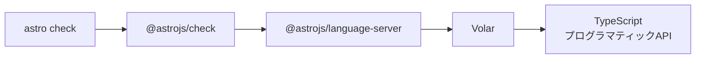

<!-- generated from articles/zenn/2026-07-20-typescript7-not-yet.md by scripts/import-articles.ts - do not edit -->

## はじめに

2026年7月8日、TypeScript 7.0 がGAになりました。

例のGoネイティブ実装です。2025年3月に「A 10x Faster TypeScript」というブログでアナウンスされて、界隈がざわついたあれ。
JavaScriptで書かれていたコンパイラをGoに移植して、型チェックが10倍速くなるという、にわかには信じがたい話でした。


<a class="link-card" href="https://devblogs.microsoft.com/typescript/typescript-native-port/" target="_blank" rel="noopener">

<span class="link-card-body">
<span class="link-card-domain">devblogs.microsoft.com</span>
<span class="link-card-title">A 10x Faster TypeScript - TypeScript</span>
</span>
</a>


それが正式リリースされた。npmで `typescript@latest` を引くと 7.0.2 が落ちてくる。もう未来の話ではなく、`npm install` 一発の距離にいる。

私はちょうど個人サイトをAstroで作り終えたところでした。
TypeScript strict、ビルド前に `astro check` で型エラーゼロを確認するのがルーチン。
（そもそもなんで個人サイトを作ろうと思ったのかは、[この記事](https://akari-iku.github.io/blog/zenn-translation-feature/)の一件がきっかけだったりします。それはまた別の話。）

つまり、型チェックが10倍速くなったら普通に嬉しい立場です。

入れたい。入れるでしょ、こんなの。

結論から言うと、**入れられませんでした**。
そして入れられなかった理由が、TypeScript 7の速さと同じくらい面白かったので記事にします。

「速いのは知ってる。で、いつ乗ればいいの？」という人向けの、実測つき断念レポートです。

## 実測環境

対象は私の個人サイト（Astro製の静的ブログ）です。

- Astro 7.0.6 + TypeScript 6.0.3（strict）
- `astro check` の対象は39ファイル（`.astro` 24本 + 純粋な `.ts` 13本）
- 型チェックのコマンドは `astro check`（Astroプロジェクトの標準）

規模としては小さめの実プロジェクト。「巨大モノレポで10倍」みたいな派手な話ではなく、**個人開発の等身大でどれくらい変わるのか**という計測です。

## まず素のtscで対決させる

いきなり `astro check` に入れる前に、条件を揃えて素の `tsc` 同士で比較しました。

`.astro` ファイルは素のtscでは読めないので、純TS部分（13ファイル）だけを対象にしたベンチ用tsconfigを作って、6.0.3と7.0.2で同じものをチェックさせます。

結果がこちら。各2回計測して安定していた値です。

| コンパイラ | 型チェック時間 |
| ---- | ---- |
| TypeScript 6.0.3 | 約2.1秒 |
| TypeScript 7.0.2 | **約0.4秒** |

**約5倍**。

「10倍じゃないじゃん」と思ったあなた、正直でよろしい。私も思いました。
でもまあ早いね、ええやん。早いのは良いことさ。

これは計測対象が小さすぎて、プロセス起動などの固定費が支配的になっているからです。
2秒のうちの大部分は「Node.jsが起動してコンパイラを読み込む時間」で、純粋な型チェック時間の差はもっと開いています。プロジェクトが大きいほど固定費の割合が下がるので、公称の10倍に近づいていく構図。

逆に言うと、**小規模プロジェクトでも問答無用で5倍速い**わけです。0.4秒はもう「待つ」という感覚が発生しない速度。
体感で言うと、エンターを押した瞬間に結果が出ています。
うおー、まじで速い。というかちゃんと体感でわかる。
まばたきしてる間に終わるとはまさにこれだ。

ちなみに私がこの速さに過剰反応するのには理由があって、元SEO畑の人間なんですよ。
表示が1秒遅くなると離脱率が跳ね上がる、「速さがそのまま数字に出る」世界で生きてきました。
Webページの速さがユーザーの離脱に直結するように、開発ツールの速さは集中の離脱に直結します。数秒の待ちは「ちょっとX開くか」の入口。
だから0.4秒には抗えない。速さは正義です。

この時点での私の気持ち: 完全に採用モード。

## 本命のastro checkに入れる

ここからが本題です。

うちのサイトの型チェックは素のtscではなく `astro check` です。`.astro` ファイルの中のTypeScriptまで含めて検査してくれる、Astroユーザーの生命線。

さっそくTypeScript 7を入れてみます。

```text
npm warn ERESOLVE overriding peer dependency
npm warn While resolving: akari-log@0.1.0
npm warn Found: typescript@6.0.3
npm warn
npm warn Could not resolve dependency:
npm warn peer typescript@"^5.0.0 || ^6.0.0" from @astrojs/check@0.9.9

added 1 package, changed 1 package, and audited 427 packages in 2s
```

npmが既に嫌な予告をしています。
`@astrojs/check` が要求しているTypeScriptは `^5.0.0 || ^6.0.0`。**7はそもそも想定範囲外**です。

でもnpmは警告だけ出して、インストール自体は通すんですよね。強行インストール。
ちなみに `--strict-peer-deps` を付けるとここでちゃんとエラーで止まります。デフォルトでは止まらないのがnpmの人柄です（この「言うだけ言って通す」文化、それはそれで記事が一本書ける気がする）。

まあ入ったなら動かしてみましょう。
個人環境なので、自分のケツは自分で拭けばいいスタイル。
`npx astro check`。

```text
[check] Getting diagnostics for Astro files...
Cannot read properties of undefined (reading 'fileExists')
  Location:
    node_modules/@astrojs/language-server/dist/check.js:162:73
  Stack trace:
    at AstroCheck.getTsconfig (node_modules/@astrojs/language-server/dist/check.js:162:73)
    at new AstroCheck (node_modules/@astrojs/language-server/dist/check.js:58:14)
```

はい、クラッシュ。

型エラーが出たのではなく、**型チェッカー自体が起動できずに死んでいる**ことに注目してください。
`fileExists` が読めない、つまり「TypeScriptというライブラリの中にあるはずの部品が見つからない」と言っています。

## なぜ壊れたのか: 依存チェーンの解剖

これはバグではなく、構造的な問題です。

`astro check` の中身を掘っていくと、こういう依存の連鎖になっています。



ポイントは終点です。
Volar（VueやAstroの言語ツールを支えている基盤）は、TypeScriptを**コマンドとして呼んでいるのではなく、ライブラリとして読み込んで内部APIを直接使っています**。`ts.sys.fileExists` とか、コンパイラの内臓に手を突っ込む使い方。
ワイルドだよね、結構。

そしてTypeScript 7.0のnpmパッケージに入っているのは、Goでビルドされたネイティブバイナリです。
`tsc` コマンドとしては完璧に動く。でも、JavaScriptから `import` して内臓を触るための従来のAPIは提供されていません（安定したプログラマティックAPIは7.1で提供予定とされています）。

つまりこういうことです。

- **tscをコマンドとして叩くだけの環境** → 今日から7に乗れる。5〜10倍速の恩恵をそのまま受けられる
- **ツールがTypeScriptをライブラリとして抱えている環境**（Astro、Vue、たぶんあなたのエディタの言語サーバーも） → ツール側が7対応するまで乗れない

うちは完全に後者でした。合掌。

## うちだけじゃない: 「待ち」のスタック一覧

この構造、Astro固有の不幸ではありません。
「TypeScriptを内臓ごと抱えているツール」は世の中にたくさんあって、だいたい同じ壁に当たります。

**今すぐ上げない方がいいケース:**

- **Vue / Svelte / Astro / MDX / Angular**: テンプレートやコンポーネントの型チェックをTypeScriptのJS API経由でやっている勢。APIがまだ無い（7.1で来る予定）ので、エディタ統合やcheckコマンドが壊れます。待った方が無難
- **`typescript` パッケージを直接importしているツール群**: ESLintの型情報ルール、webpack系のloader、ts-jest、content-collections、Prismaのジェネレーターなど。うちの `fileExists` クラッシュと同じ原理で、即コケます
- **Next.js**: `experimental.useTypeScriptCli` というフラグで対応が進行中。フラグ名に experimental と書いてある間は、まあ、そういうことです。実際、Vercelデプロイでハマっている報告もちらほら見かけます

**今すぐ乗れるケース:**

- 素のtscだけで完結する環境。CLIツール、ライブラリ開発、フレームワークレスなNode.jsバックエンドなど

被害状況の全体像はこのマイグレーションガイドがよくまとまっています。


<a class="link-card" href="https://www.developersdigest.tech/blog/typescript-7-native-compiler-migration-guide" target="_blank" rel="noopener">

<span class="link-card-body">
<span class="link-card-domain">www.developersdigest.tech</span>
<span class="link-card-title">TypeScript 7.0 Native Compiler: What Breaks, What Gets 10x Faster, and How to Migrate</span>
</span>
</a>


要するに「人による」。
あなたのリポジトリの型チェックが最終的に**どのコマンドを叩いて動いているか**を確認すれば、自分がどちら側か分かります。`tsc` なら乗れる、フレームワークのcheckコマンドならたぶん待ちです。

## 乗れる人も、移行は無風ではない

「うちは素のtscだから今すぐ乗るぞ」という人にも一応の注意報を。

7.0はメジャーバージョンらしく、破壊的変更がちゃんとあります。

- `strict` がデフォルトでtrueに
- `@types` パッケージの自動読み込みが廃止
- `baseUrl` が削除
- `target: es5` が完全非対応に

古いプロジェクトだと、上げた瞬間に大量のエラーが噴き出す構成です。
公式は「まず6.0に上げて非推奨機能を掃除してから7へ」という段階移行を推奨しています。5.xから7.0に直行すると、移行作業と新デフォルトのエラーが同時に襲ってきて切り分けが地獄。monorepoだと特に辛いはず。多分ね。

ここで滑稽なのがうちのサイトで、最初から6.0.3 + strictで作っていたので**移行コスト的にはほぼ優等生**だったんですよ。
技術選定した私えらい。
設定はもう7を先取りしていた。それでも入れられなかった。理由はコンパイラでも設定でもなく、エコシステムの都合。

今回の話のオチはここに全部詰まっています。

## おまけ: 11秒の内訳と、コスパの話

ちなみにうちの `astro check` は全体で約11秒かかります。
「型チェックが10倍速くなれば11秒が1秒に！」と思いたいところですが、計測してみるとこの11秒には content collectionsの同期、型定義の生成、Viteの初期化なども含まれています。

つまり、仮に明日TypeScript 7対応が完璧に来ても、11秒が1秒になるわけではない。
型チェック部分だけが速くなって、たぶん数秒縮む程度。

**ボトルネックだと思っているものは、計測するまでボトルネックかどうか分からない**という、パフォーマンス改善の基本がこんな所にも転がっていました。

そしてこれ、移行のコスパ計算に直結します。

小さなプロジェクトや個人開発だと、得られるのは「2秒が0.4秒になる」程度の恩恵です。気持ちいいけど、生活は変わらない。
一方で払うコストは、設定変更と、新デフォルトで噴き出す型エラーの修正。こちらはプロジェクトが小さくても割引されません。

「劇的に速くなった！」という報告をよく見ると、元々型チェックに数分かかっていた大規模プロジェクトだったりします。
恩恵は規模に比例して、コストはあまり比例しない。つまり**小さいプロジェクトほど、急いで乗る理由が薄い**。

個人開発勢は第二波どころか、第三波くらいでゆっくり乗ればいいと思います。

もうひとつ、2026年っぽい変数も足しておきます。
最近、うちで `astro check` を一番叩いているのは私ではなくコーディングエージェントです。ビルド前チェックはほぼ任せているので、11秒待っているのは大体Claudeの方。
人間は待ち時間にイライラしますが、エージェントは黙って待ちます。待つのが自分じゃなくなると、体感コストはさらに下がる。
一方で「エージェントの反復速度を上げたい」派にとっては、チェックが速いほど同じ時間で試行回数が稼げるので、速いコンパイラの価値はむしろ上がる、という見方もできます。
どっちに重みを置くかはもう、技術選定と好みの話です。
まあ最速を追い求めているのなら移行しても良いでしょうけども。

## 余談: そもそもTypeScriptに疲れている人へ

今回の件を調べていると、TypeScript 7の話題の周辺で「そもそも論」も目につきました。せっかくなので置いておきます。

- **型税**: 毎日30〜40分「コンパイラと戦う」時間が増えている人がいる。複雑なジェネリクスを書いて、`any` で逃げて、型エラーを直すだけで疲弊するやつ
- **偽りの安心感**: コンパイルが通ってもランタイムエラーは普通に出る。結局テストは書かないといけない
- **複雑さの増大**: 「JSのシンプルさが好きだったのに、TypeScriptを使うためにJSを勉強していたのでは」という声は根強い
- **マイクロプロジェクトにはオーバーキル**: MVPや週末スクリプトでtsconfigを弄っている時間は、たしかに何なんだろうという気持ちになる

私自身はstrict派です。このサイトも型エラーゼロを完了条件にしているし、その方針を変える気はありません。
ただ、TypeScript 7の「速さ」は納税時間を短くしてくれるだけで、**税そのものを無くしてくれるわけではない**んですよね。

コンパイラが10倍速くなっても、あなたが書く型パズルは1文字も減らない。
そこは分けて期待しておくと、がっかりしなくて済みます。

## 教訓: 速さは言語のもの、体験はエコシステムのもの

今回の学びを一般化するとこうなります。

**「コンパイラ本体の速さ」と「エコシステムの追従」は、別のリリースサイクルで動く。**

TypeScript 7.0は間違いなく速い。それは実測で確認できました。
でもフロントエンドの現場でTypeScriptは単体で動いておらず、フレームワークの言語サーバー、エディタ拡張、checkコマンドといった「TypeScriptを内臓ごと抱えているツール群」の中で動いています。

この構造だと、乗り換えの波は二段階で来ます。

1. **第一波（今）**: 素のtscだけで完結する環境。CLIツール、ライブラリ開発、Node.jsバックエンドなど
2. **第二波（7.1以降）**: プログラマティックAPIが安定し、ツール側が対応した後。Astro、Vue、Svelte、MDX、Angular、ESLint型情報ルール勢（Next.jsはexperimentalフラグで先行対応中の1.5波）

フレームワークの上で暮らしている人は、焦らず第二波で乗るのが定石です。
第一波で無理に乗ると、うちみたいに `fileExists` の海で沈みます。

私は7.1と `@astrojs/check` の対応を待ちながら、0.4秒の世界を夢見て今日も11秒待つことにします。

いや、5倍は本当にすごかったんですよ。入れられなかっただけで。

## まとめ

- TypeScript 7.0（Goネイティブ実装）はGA済み。`npm install` 一発の距離にいる
- 小規模な実プロジェクトの実測でも型チェック**約5倍速**（大規模ほど公称10倍に近づく）
- ただし `astro check` は**Volar経由でTypeScriptのプログラマティックAPIに依存**しており、APIを持たない7.0では起動すらしない
- 同じ理由で **Vue / Svelte / MDX / Angular / ESLint型情報ルール**も7.1待ち。素のtsc完結の人だけが第一波に乗れる
- 乗れる人も破壊的変更（`strict` デフォルト化、`@types` 自動読み込み廃止など）があるので、**6.0経由の段階移行**が推奨ルート
- 小さいプロジェクトは恩恵が薄くコストは割引されないので、急がなくていい
- あと、自分のボトルネックは思い込みじゃなく計測で確認しよう（11秒の大半は型チェックじゃなかった）
